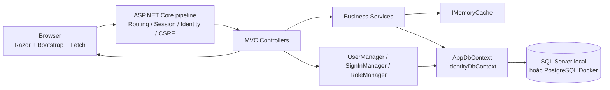
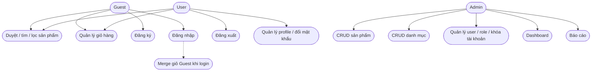
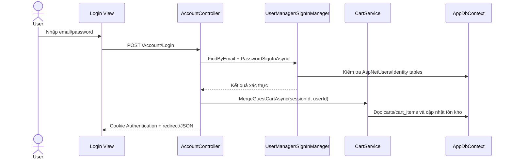
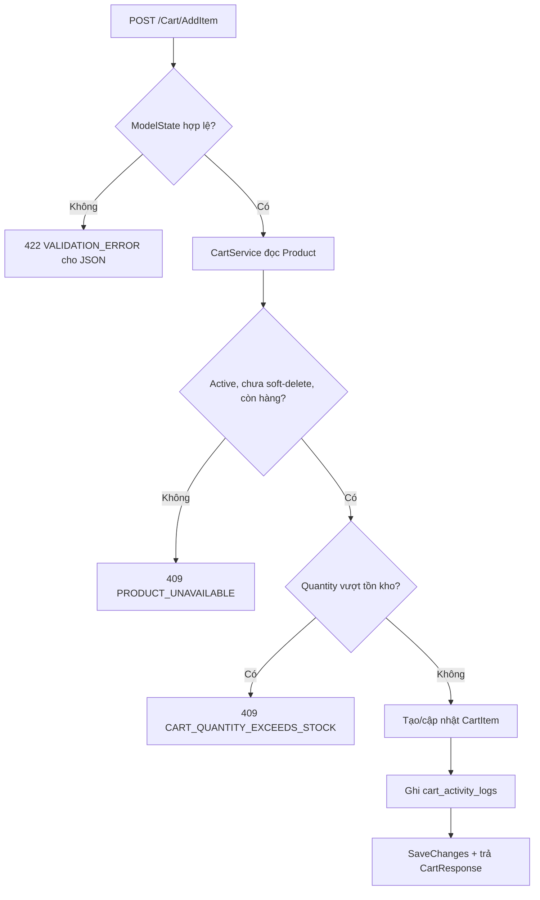
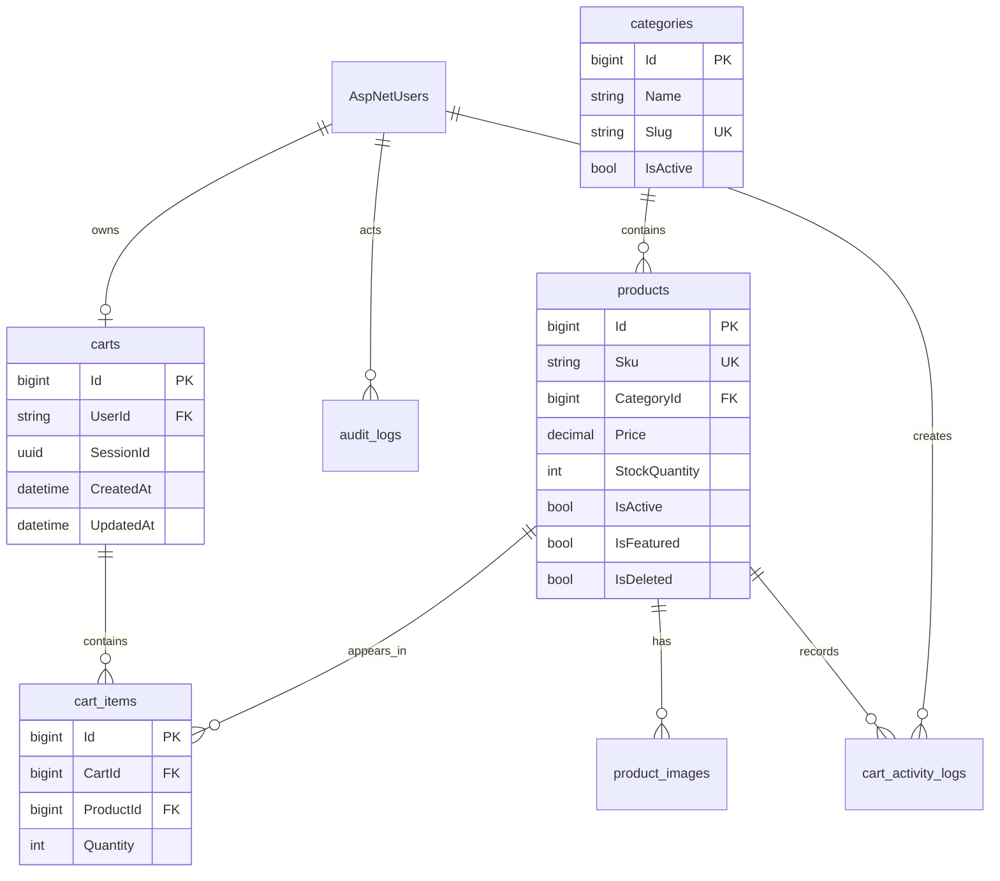

# BÁO CÁO ĐỒ ÁN — COUPPA
## Website giới thiệu sản phẩm và giỏ hàng bằng ASP.NET Core MVC

| Thông tin | Chi tiết |
|---|---|
| Đề tài | Đề tài 8 — Website giới thiệu sản phẩm và giỏ hàng đơn giản |
| Tên hệ thống | Couppa |
| Tài liệu yêu cầu đối chiếu | [`docs/SRS.md`](docs/SRS.md), phiên bản 1.0 ngày 07/09/2026 |
| Ngày cập nhật báo cáo | 10/09/2026 |
| Project chính | `src/Couppa.Api` |
| Project kiểm thử | `src/Couppa.Api.Tests` |

> Báo cáo này mô tả source code hiện tại, không mô tả một hệ thống giả định.
> Các chức năng SRS chưa có bằng chứng trong source được ghi rõ là
> `NOT IMPLEMENTED` hoặc `CANNOT VERIFY`.

---

## 1. Phạm vi và phương pháp đối chiếu

Việc phân tích được thực hiện theo thứ tự:

1. Đọc `docs/SRS.md` để xác định Actors, Functional Requirements (FR),
   Business Rules (BR), Non-functional Requirements (NFR), API và database.
2. Kiểm tra cây thư mục, project file, `Program.cs`, `AppDbContext`,
   entity, request/response model, service, controller, view, JavaScript,
   migration và test.
3. Đối chiếu từng nhóm yêu cầu với bằng chứng code.

Các trạng thái sử dụng trong báo cáo:

| Trạng thái | Ý nghĩa |
|---|---|
| `IMPLEMENTED` | Có code tương ứng và đã xác định được đường đi chính. |
| `PARTIALLY IMPLEMENTED` | Có một phần chức năng nhưng chưa đủ toàn bộ SRS. |
| `NOT IMPLEMENTED` | SRS yêu cầu nhưng chưa tìm thấy code thực hiện. |
| `MISMATCH` | Code có nhưng khác yêu cầu hoặc công nghệ được mô tả trong SRS. |
| `EXTRA IMPLEMENTATION` | Có trong code nhưng không phải yêu cầu bắt buộc của SRS. |
| `CANNOT VERIFY` | Không đủ bằng chứng để kết luận, thường cần kiểm thử thủ công hoặc môi trường triển khai. |

---

## 2. Tổng quan hệ thống

### 2.1. Mục tiêu

Couppa là website giới thiệu sản phẩm công nghệ, cho phép Guest/User duyệt
sản phẩm và sử dụng giỏ hàng. Admin quản lý sản phẩm, danh mục, người dùng,
dashboard và báo cáo hoạt động giỏ hàng.

SRS quy định ứng dụng là một project ASP.NET Core MVC duy nhất. Code hiện tại
đúng với quyết định này: Razor View được render bởi MVC Controller; các thao
tác tương tác trả JSON và được gọi bằng Fetch API, không có frontend SPA riêng.

### 2.2. Actors

| Actor | Chức năng thực tế |
|---|---|
| Guest | Xem/tìm/lọc sản phẩm, xem chi tiết, thêm và quản lý giỏ hàng qua `ISession` định danh. |
| User | Toàn bộ chức năng Guest, đăng nhập, quản lý profile, đổi mật khẩu và duy trì giỏ hàng theo User ID. |
| Admin | Chức năng User và các action dưới `/Admin/**`: sản phẩm, danh mục, người dùng, dashboard, báo cáo. |
| System | ASP.NET Core Identity, middleware xử lý lỗi, cache và `GuestCartCleanupService`. |

### 2.3. Công nghệ thực tế

| Thành phần | Bằng chứng thực tế |
|---|---|
| Runtime | .NET 8 (`TargetFramework net8.0`) |
| Web framework | ASP.NET Core MVC (`Microsoft.NET.Sdk.Web`) |
| ORM | Entity Framework Core 8.0.10 |
| Authentication | ASP.NET Core Identity Cookie Authentication |
| Database local | SQL Server/SQL Server Express, provider chọn bằng `Database:Provider` |
| Database Docker | PostgreSQL 16, cấu hình trong `appsettings.Docker.json` |
| UI | Razor `.cshtml`, Bootstrap 5.3.3 từ CDN, Bootstrap Icons |
| Client interaction | JavaScript Fetch API tại `wwwroot/js/cart-ajax.js`, `admin-ajax.js` |
| Cache | `IMemoryCache` qua `MemoryCacheService` |
| Test | xUnit, Moq, EF Core InMemory, `WebApplicationFactory` |

SRS đề xuất PostgreSQL là database chính. Code hiện tại hỗ trợ PostgreSQL cho
Docker và có thêm chế độ SQL Server local để sử dụng database `IT38`; phần
SQL Server là thích nghi môi trường, không phải một database thứ ba.

---

## 3. Cấu trúc project thực tế

```text
docs/
└── SRS.md

src/
├── Couppa.Api/
│   ├── Controllers/
│   │   ├── AccountController.cs
│   │   ├── CartController.cs
│   │   ├── CategoryController.cs
│   │   ├── HomeController.cs
│   │   ├── ProductController.cs
│   │   ├── UserController.cs
│   │   └── Admin/
│   │       ├── AdminCategoryController.cs
│   │       ├── AdminDashboardController.cs
│   │       ├── AdminProductController.cs
│   │       ├── AdminReportController.cs
│   │       └── AdminUserController.cs
│   ├── Data/
│   │   ├── AppDbContext.cs
│   │   ├── Entities/
│   │   ├── Migrations/
│   │   └── Seed/DbSeeder.cs
│   ├── Infrastructure/ApiModelStateValidationFilter.cs
│   ├── Middleware/
│   │   ├── AppException.cs
│   │   └── ExceptionHandlingMiddleware.cs
│   ├── Models/
│   │   ├── Requests/
│   │   ├── Responses/
│   │   └── ViewModels/
│   ├── Services/
│   ├── Views/
│   ├── wwwroot/
│   ├── Program.cs
│   ├── appsettings.json
│   └── appsettings.Docker.json
└── Couppa.Api.Tests/
    ├── Integration/
    └── Services/
```

Không có `Areas/` hoặc `Repositories/`. Admin được tổ chức bằng namespace
`Controllers.Admin` và attribute route, còn truy cập dữ liệu dùng trực tiếp
`AppDbContext` trong Service.

---

## 4. Kiến trúc MVC và luồng hệ thống

### 4.1. Sơ đồ kiến trúc



Luồng View thông thường:

```text
Browser
  ↓
Routing
  ↓
Controller Action
  ↓
Service / Identity
  ↓
AppDbContext + EF Core
  ↓
Database
  ↓
ViewModel hoặc Response
  ↓
Razor View / JSON
```

### 4.2. `Program.cs`

`src/Couppa.Api/Program.cs` thực hiện các nhiệm vụ:

- Chọn `UseSqlServer` hoặc `UseNpgsql` theo `Database:Provider`.
- Đăng ký CORS với origin cụ thể và credentials.
- Đăng ký Distributed Memory Cache và ASP.NET Core Session.
- Đăng ký `AddIdentity<ApplicationUser, IdentityRole>`.
- Cấu hình cookie `couppa.auth`, login path `/Account/Login` và access denied path.
- Cấu hình password policy, Identity Lockout và rate limit login 5 lần/phút/IP.
- Đăng ký antiforgery cookie `couppa.csrf`.
- Đăng ký toàn bộ Service và `GuestCartCleanupService`.
- Đăng ký `ApiModelStateValidationFilter`.
- Đặt `ExceptionHandlingMiddleware` trước pipeline MVC.
- Dùng `EnsureCreatedAsync()` cho SQL Server; dùng `MigrateAsync()` cho database
  relational không phải SQL Server, gồm môi trường Docker PostgreSQL.
- Seed role, Admin, categories và products trong Development/Docker.

### 4.3. Controller và View

| Controller | Action chính | Kết quả |
|---|---|---|
| `HomeController` | `GET /Home/Index` | `Views/Home/Index.cshtml` |
| `ProductController` | `Index`, `Detail` | Razor View |
| `ProductController` | `Search`, `Filter`, `Sort`, `Page`, `Featured`, `Latest` | JSON cho Fetch |
| `CategoryController` | `GET /Category/GetActive` | JSON |
| `CartController` | `Index` | Razor View |
| `CartController` | `AddItem`, `UpdateItem`, `RemoveItem`, `Clear` | JSON |
| `AccountController` | `Login`, `Register`, `Logout` | View hoặc JSON tùy request |
| `UserController` | `Profile` | Razor View |
| `UserController` | `UpdateProfile`, `ChangePassword` | JSON |
| `AdminProductController` | `Index`, `Detail` | Admin View |
| `AdminProductController` | `Create`, `Edit`, `Delete`, `ToggleStatus` | JSON |
| `AdminCategoryController` | `Index` | Admin View |
| `AdminCategoryController` | `Create`, `Edit`, `Delete`, `ToggleStatus` | JSON |
| `AdminUserController` | `Index`, `Detail` | Admin View |
| `AdminUserController` | `Lock`, `ChangeRole` | JSON |
| `AdminDashboardController` | `Index` | Dashboard View |
| `AdminDashboardController` | `Summary` | JSON |
| `AdminReportController` | `Index`, `CartTopProducts` | View hoặc JSON |
| `AdminReportController` | `Summary` | JSON |

Các action ghi dữ liệu đều có `[ValidateAntiForgeryToken]`. Những action Admin
đều có `[Authorize(Policy = "RequireAdmin")]`.

---

## 5. Use Case

### 5.1. Sơ đồ Use Case



### 5.2. Luồng đăng nhập và merge cart



### 5.3. Luồng thêm sản phẩm vào giỏ



---

## 6. Model, ViewModel, Request và Response

### 6.1. Entity

| Entity | Vai trò |
|---|---|
| `ApplicationUser` | Mở rộng `IdentityUser`, thêm `FullName`, `Phone`, `IsLocked`, `CreatedAt`, navigation `Cart`. |
| `Category` | Danh mục sản phẩm, có `Name`, `Slug`, `IsActive`. |
| `Product` | Sản phẩm, giá, tồn kho, trạng thái, soft delete và cờ featured. |
| `ProductImage` | Nhiều ảnh cho một sản phẩm, `IsPrimary`, `SortOrder`. |
| `Cart` | Một cart thuộc User hoặc Guest Session. |
| `CartItem` | Sản phẩm và số lượng trong cart. |
| `CartActivityLog` | Log add/remove để báo cáo top sản phẩm. |
| `AuditLog` | Log hành động nghiệp vụ và JSON chi tiết. |

### 6.2. Request model và validation

Các request model chính nằm trong `Models/Requests`:

- `RegisterRequest`, `LoginRequest`.
- `CreateProductRequest`, `UpdateProductRequest`, `ChangeProductStatusRequest`.
- `CreateCategoryRequest`, `UpdateCategoryRequest`, `ChangeCategoryStatusRequest`.
- `AddCartItemRequest`, `UpdateCartItemRequest`.
- `UpdateProfileRequest`, `ChangePasswordRequest`.
- `LockUserRequest`, `ChangeUserRoleRequest`.
- `ProductListQuery`, `AdminProductListQuery`.

Validation thực tế gồm `[Required]`, `[EmailAddress]`, `[MaxLength]`,
`[MinLength]`, `[Range]`, `DataType` và validation bổ sung trong Service.
JSON request lỗi model binding được `ApiModelStateValidationFilter` trả về
HTTP 422 với code `VALIDATION_ERROR`; form Razor được trả lại View và
`ModelState`.

### 6.3. Response

`Models/Responses` có các response chính:

- `ApiResponse<T>` và `ApiError` cho JSON contract.
- `PagedResult<T>` cho phân trang.
- `ProductResponse`, `ProductSummaryResponse`, `ProductImageResponse`.
- `CategoryResponse`.
- `CartResponse`, `CartItemResponse`.
- `UserResponse`, `UserDetailResponse`.
- `DashboardSummaryResponse`, `ReportSummaryResponse`,
  `CartTopProductResponse`.

Response user không chứa `PasswordHash`. Cart item không khả dụng vẫn được
trả về với `IsAvailable = false`, nhưng không tính vào `TotalQuantity` và
`Subtotal`.

---

## 7. Service và business logic

| Service | Business logic thực tế |
|---|---|
| `ProductService` | Public/admin list, search/filter/sort, detail, CRUD, soft delete, validate SKU/price/stock/category, image list, invalidate cache. |
| `CategoryService` | Public active list, admin list, CRUD, unique name/slug, chặn xóa category còn product, invalidate cache. |
| `CartService` | Tạo/đọc cart theo User hoặc Session, add/update/remove/clear, kiểm tra tồn kho, ghi activity log, merge 4 trường hợp. |
| `UserService` | Profile, đổi password, danh sách/chi tiết admin, lock/unlock, change role, chặn Admin tự khóa mình. |
| `DashboardService` | 5 số liệu tổng hợp, sản phẩm theo category, 5 sản phẩm mới; cache 5 phút. |
| `ReportService` | In-stock/out-of-stock, users/new users, products by category, top 10 add logs theo khoảng thời gian. |
| `AuditLogService` | Lưu actor, action, entity, entity ID và `DetailJson`; không ghi password. |
| `CurrentUserService` | Đọc `ClaimTypes.NameIdentifier`, role Admin và tạo Guest session ID. |
| `MemoryCacheService` | Đọc/tạo cache theo TTL và xóa key khi CUD. |
| `GuestCartCleanupService` | Hosted service chạy theo chu kỳ một giờ, xóa Guest cart không hoạt động quá cấu hình (mặc định 7 ngày). |

Không có Repository layer riêng; `AppDbContext` là abstraction truy cập dữ
liệu được Service sử dụng trực tiếp.

---

## 8. Thiết kế database và EF Core

### 8.1. DbContext

`AppDbContext : IdentityDbContext<ApplicationUser>` có các `DbSet`:

```text
Categories
Products
ProductImages
Carts
CartItems
CartActivityLogs
AuditLogs
```

Ngoài bảy bảng nghiệp vụ trên, Identity tạo các bảng `AspNetUsers`,
`AspNetRoles`, `AspNetUserClaims`, `AspNetUserLogins`, `AspNetUserRoles`,
`AspNetUserTokens`, `AspNetRoleClaims`.

### 8.2. Bảng nghiệp vụ

| Bảng | Khóa chính | Quan hệ và ràng buộc chính |
|---|---|---|
| `categories` | `Id` | Unique `Name`, `Slug`; index `IsActive`. |
| `products` | `Id` | FK `CategoryId` với `Restrict`; unique `Sku`; check `Price >= 0`, `StockQuantity >= 0`; global filter `!IsDeleted`. |
| `product_images` | `Id` | FK `ProductId` với `Cascade`; index `ProductId`. |
| `carts` | `Id` | FK User; unique filtered index User/Session; check XOR User/Session. |
| `cart_items` | `Id` | FK Cart `Cascade`, FK Product `Restrict`; unique `(CartId, ProductId)`; check `Quantity > 0`. |
| `cart_activity_logs` | `Id` | FK Product/User; index ProductId/CreatedAt; action `add` hoặc `remove`. |
| `audit_logs` | `Id` | FK `ActorUserId` với `SetNull`; index entity và CreatedAt; cột `detail` lưu JSON. |

### 8.3. ERD



### 8.4. Provider và migration

- `appsettings.json` hiện đặt `Database:Provider = SqlServer` và database
  `IT38` trên `localhost\SQLEXPRESS`.
- `appsettings.Docker.json` đặt `Database:Provider = PostgreSql` và kết nối
  service `postgres`.
- `Program.cs` dùng `EnsureCreatedAsync()` cho SQL Server local, không áp
  dụng migration PostgreSQL lên database SQL Server.
- Docker PostgreSQL dùng thư mục `Data/Migrations`.
- Bảng nghiệp vụ được đặt tên dạng snake_case, nhưng các property column
  chính trong model hiện vẫn theo convention EF (`Price`, `StockQuantity`,
  `UserId`, ...). Đây là điểm khác với naming convention column snake_case
  đầy đủ được mô tả trong Chương 13 SRS (`MISMATCH` cần lưu ý khi triển khai
  PostgreSQL mới).

---

## 9. Authentication, authorization và security

### 9.1. Authentication

`AccountController` sử dụng trực tiếp:

- `UserManager<ApplicationUser>` để tạo và tìm user.
- `RoleManager<IdentityRole>` để tạo/gán role.
- `SignInManager<ApplicationUser>` để login/logout.

Identity tự hash password bằng `PasswordHasher` mặc định của ASP.NET Core.
Code không tham chiếu package BCrypt.

Cookie thực tế:

```text
Name: couppa.auth
HttpOnly: true
ExpireTimeSpan: 30 phút
SlidingExpiration: true
LoginPath: /Account/Login
AccessDeniedPath: /Account/Login
```

Password policy:

```text
Tối thiểu 8 ký tự
Có chữ số
Có chữ hoa
Không bắt buộc ký tự đặc biệt
```

Identity Lockout được bật với 5 lần thất bại và thời gian khóa mặc định
5 phút. Ngoài Lockout, `ApplicationUser.IsLocked` là trạng thái khóa thủ
công do Admin quản lý.

### 9.2. Authorization

`Program.cs` đăng ký policy `RequireAdmin` yêu cầu role `Admin`.
Toàn bộ controller Admin có `[Authorize(Policy = "RequireAdmin")]`.
`UserController` có `[Authorize]`.

Khi request dạng JSON/AJAX:

- Chưa đăng nhập: trả HTTP 401.
- Đã đăng nhập nhưng thiếu quyền: trả HTTP 403.

### 9.3. CSRF, validation và lỗi

- Các POST ghi dữ liệu có `[ValidateAntiForgeryToken]`.
- `GET /Account/AntiForgeryToken` cấp request token cho JavaScript.
- `cart-ajax.js` và `admin-ajax.js` gửi token qua header
  `RequestVerificationToken`.
- `ExceptionHandlingMiddleware` chuẩn hóa `AppException` và lỗi hệ thống.
- Lỗi hệ thống trả code `INTERNAL_ERROR`, không trả stack trace.
- EF Core dùng parameterized LINQ query, không nối chuỗi SQL tùy ý.

---

## 10. Giao diện và Fetch API

### 10.1. Razor Views thực tế

| Nhóm | View |
|---|---|
| Layout | `Views/Shared/_Layout.cshtml`, `_ValidationScriptsPartial.cshtml` |
| Public | `Home/Index`, `Product/Index`, `Product/Detail`, `Cart/Index` |
| Account | `Account/Login`, `Account/Register` |
| User | `User/Profile` |
| Admin | `AdminProduct/Index`, `AdminCategory/Index`, `AdminUser/Index`, `AdminUser/Detail`, `AdminDashboard/Index`, `AdminReport/CartTopProducts` |

Layout dùng Bootstrap CDN, Bootstrap Icons, Google Fonts và
`wwwroot/css/site.css`. Grid Bootstrap `col-lg`, `col-md`, `col-sm` được
dùng cho giao diện responsive.

### 10.2. JavaScript

- `cart-ajax.js`: add/update/remove/clear cart và cập nhật tổng tiền không
  reload trang.
- `admin-ajax.js`: helper POST JSON cho CRUD Admin.
- `site.js`: đóng alert sau 5 giây.

Search/filter/sort/page sản phẩm gọi các action JSON của
`ProductController`; không có `apiClient.js` hoặc API prefix `/api` riêng.

---

## 11. API và routing

Ứng dụng dùng conventional route mặc định:

```text
{controller=Home}/{action=Index}/{id?}
```

Admin dùng attribute route:

```text
/Admin/Product/{action}
/Admin/Category/{action}
/Admin/User/{action}
/Admin/Dashboard/{action}
/Admin/Report/{action}
```

### 11.1. Public và account

| Method | URL | Kết quả |
|---|---|---|
| GET | `/` hoặc `/Home/Index` | Trang chủ |
| GET | `/Product/Index` | Danh sách có query `category`, `search`, `minPrice`, `maxPrice`, `sort`, `page`, `pageSize` |
| GET | `/Product/Detail/{id}` | Chi tiết sản phẩm |
| GET | `/Product/Search` | JSON search |
| GET | `/Product/Filter` | JSON filter |
| GET | `/Product/Sort` | JSON sort |
| GET | `/Product/Page` | JSON pagination |
| GET | `/Product/Featured` | JSON sản phẩm nổi bật |
| GET | `/Product/Latest` | JSON sản phẩm mới nhất |
| GET | `/Category/GetActive` | JSON danh mục active |
| GET/POST | `/Account/Login` | Login View hoặc JSON |
| GET/POST | `/Account/Register` | Register View hoặc JSON |
| POST | `/Account/Logout` | Đăng xuất |
| GET | `/Account/AntiForgeryToken` | Cấp CSRF request token |

### 11.2. Cart và User

| Method | URL | Kết quả |
|---|---|---|
| GET | `/Cart/Index` | Trang giỏ hàng |
| POST | `/Cart/AddItem` | Thêm item, JSON `CartResponse` |
| POST | `/Cart/UpdateItem/{id}` | Cập nhật số lượng |
| POST | `/Cart/RemoveItem/{id}` | Xóa item |
| POST | `/Cart/Clear` | Xóa toàn bộ item |
| GET/POST | `/User/Profile` | Xem/cập nhật profile |
| POST | `/User/UpdateProfile` | JSON cập nhật profile |
| POST | `/User/ChangePassword` | JSON đổi mật khẩu |

### 11.3. Admin

| Nhóm | GET View | POST/GET JSON |
|---|---|---|
| Product | `/Admin/Product/Index`, `/Admin/Product/Detail/{id}` | `Create`, `Edit`, `Delete`, `ToggleStatus` |
| Category | `/Admin/Category/Index` | `Create`, `Edit`, `Delete`, `ToggleStatus` |
| User | `/Admin/User/Index`, `/Admin/User/Detail/{id}` | `Lock`, `ChangeRole` |
| Dashboard | `/Admin/Dashboard/Index` | `/Admin/Dashboard/Summary` |
| Report | `/Admin/Report/Index`, `/Admin/Report/CartTopProducts` | `/Admin/Report/Summary`, JSON `CartTopProducts` |

---

## 12. Business Rules và đối chiếu code

| ID | Quy tắc SRS | Bằng chứng code | Trạng thái |
|---|---|---|---|
| BR-01 | Không thêm sản phẩm inactive/hết hàng | `Product.IsAvailableForCart`, `CartService.AddItemAsync` | `IMPLEMENTED` |
| BR-02 | Cart quantity không vượt stock | `CartService` add/update và test | `IMPLEMENTED` |
| BR-03 | Không xóa category còn product | `CategoryService.DeleteAsync`, FK Restrict | `IMPLEMENTED` |
| BR-04 | Email duy nhất | Identity `RequireUniqueEmail`, `CreateAsync` | `IMPLEMENTED` |
| BR-05 | SKU duy nhất | unique index + `EnsureSkuUniqueAsync` | `IMPLEMENTED` |
| BR-06 | Password >= 8, hoa, số | Identity options | `IMPLEMENTED` |
| BR-07 | User bị `IsLocked` không login | `AccountController.Login` | `IMPLEMENTED` |
| BR-08 | Chỉ Admin truy cập `/Admin/**` | `RequireAdmin` trên 5 Admin controller | `IMPLEMENTED` |
| BR-09 | Price >= 0 | Data Annotation, Service, DB check | `IMPLEMENTED` |
| BR-10 | Stock >= 0 | Data Annotation, Service, DB check | `IMPLEMENTED` |
| BR-11 | Cart item sản phẩm inactive/delete vẫn giữ và đánh dấu | `CartService.BuildResponseAsync`, `IsAvailable` | `IMPLEMENTED` |
| BR-12 | Cart có đúng một owner User hoặc Session | check constraint `ck_carts_owner_xor` | `IMPLEMENTED` |
| BR-13 | Merge Guest/User, cộng và giới hạn theo stock | `CartService.MergeGuestCartAsync` với 4 trường hợp | `IMPLEMENTED` |
| BR-14 | Admin không tự khóa mình | `UserService.LockUserAsync` | `IMPLEMENTED` |
| BR-15 | Category inactive không public, Admin vẫn thấy | `CategoryService.GetActiveListAsync` và admin list | `IMPLEMENTED` |

---

## 13. Kiểm thử

### 13.1. Test hiện có

| File | Số test |
|---|---:|
| `AuthCartFlowIntegrationTests.cs` | 1 |
| `CachingIntegrationTests.cs` | 6 |
| `CartServiceTests.cs` | 11 |
| `CategoryServiceTests.cs` | 6 |
| `DashboardServiceTests.cs` | 4 |
| `ProductServiceTests.cs` | 11 |
| `ReportServiceTests.cs` | 4 |
| `UserServiceTests.cs` | 3 |
| **Tổng** | **46** |

Kiểu test:

- Unit/service test dùng EF Core InMemory.
- Cache integration test dùng `MemoryCacheService` và `MemoryCache` thật.
- Integration test dùng `WebApplicationFactory<Program>`, test luồng
  Register → Login → Add to Cart → View Cart.

Kết quả kiểm tra gần nhất:

```text
Build succeeded.
Passed! - Failed: 0, Passed: 46, Skipped: 0, Total: 46
```

Con số `81/81` từng xuất hiện trong báo cáo cũ không có bằng chứng ở project
hiện tại và đã được loại bỏ.

### 13.2. Các nhóm chưa có test tự động đầy đủ

Các yêu cầu sau có code nhưng chưa có test bao phủ đầy đủ trong danh sách test
hiện tại; không suy diễn thành đã đạt 100%:

- Toàn bộ Admin controller authorization theo từng endpoint.
- Toàn bộ response validation 422 và tất cả mã lỗi middleware.
- Manual responsive test trên Desktop/Tablet/Mobile.
- Benchmark NFR `< 500ms`.
- Kiểm thử PostgreSQL Docker thực tế trong lần chạy hiện tại.

Trạng thái các mục này: `CANNOT VERIFY` nếu cần môi trường/manual test.

---

## 14. Traceability — SRS ↔ Code

| Nhóm requirement | Controller / Service | Database / View | Trạng thái |
|---|---|---|---|
| FR-AUTH-001..006 | `AccountController`, Identity | `AspNetUsers`, Account Views | `IMPLEMENTED` |
| FR-AUTHZ-001..003 | Admin controllers, `RequireAdmin`, `UserController` | Identity roles/cookie | `IMPLEMENTED` |
| FR-PRODUCT-001..006 | `AdminProductController`, `ProductService` | `products`, `product_images`, Admin Product View | `IMPLEMENTED` |
| FR-PRODUCT-007 | Request image URLs, `ProductImage` | `product_images` | `PARTIALLY IMPLEMENTED` — ảnh đầu tiên tự primary, chưa có action chọn lại ảnh đại diện |
| FR-PRODUCT-008..010 | `ProductService`, AppDbContext | unique/check constraints | `IMPLEMENTED` |
| FR-CATEGORY-001..007 | `AdminCategoryController`, `CategoryController`, `CategoryService` | `categories` | `IMPLEMENTED` |
| FR-BROWSE-001..006 | `HomeController`, `ProductController`, `ProductService` | public Product/Home Views | `IMPLEMENTED` |
| FR-BROWSE-007 | `Product.IsAvailableForCart`, Product Views | disable nút khi hết hàng, inactive bị loại public | `IMPLEMENTED` theo nhánh hiển thị/disable của SRS |
| FR-CART-001..008 | `CartController`, `CartService`, cleanup Hosted Service | `carts`, `cart_items`, `cart_activity_logs`, Cart View | `IMPLEMENTED` |
| FR-USER-001..009 | `AdminUserController`, `UserController`, `UserService` | `AspNetUsers`, User Views | `IMPLEMENTED` |
| FR-DASH-001..002 | `AdminDashboardController`, `DashboardService` | Dashboard View + cache | `IMPLEMENTED` |
| FR-DASH-003 | `DashboardService` trả `ProductsByCategory` | View hiển thị bảng, chưa có chart component | `PARTIALLY IMPLEMENTED` |
| FR-DASH-004 | `DashboardService` lấy 5 recent products | Dashboard View | `IMPLEMENTED` |
| FR-REPORT-001..004 | `AdminReportController`, `ReportService` | `products`, `categories`, `AspNetUsers`, `cart_activity_logs` | `IMPLEMENTED` |
| FR-ADMIN-001..002 | Admin controllers + policy | `/Admin/**` | `IMPLEMENTED` |

### 14.1. NFR và điểm khác SRS

| NFR / yêu cầu | Đối chiếu |
|---|---|
| PostgreSQL làm database đề xuất | Docker thực hiện; local còn hỗ trợ SQL Server `IT38` — `EXTRA IMPLEMENTATION`/thích nghi môi trường |
| PostgreSQL naming convention toàn bộ column snake_case | Table đã snake_case nhưng column property chính còn PascalCase — `MISMATCH` |
| Password hash BCrypt cost >= 10 | Code dùng Identity `PasswordHasher`, không có package BCrypt — `MISMATCH` |
| JSON error format | Có middleware/filter cho JSON; form MVC trả lại View/ModelState — `PARTIALLY IMPLEMENTED` nếu hiểu “mọi lỗi” là JSON |
| Cache categories/featured/latest/dashboard | `MemoryCacheService`, đúng key và TTL cấu hình — `IMPLEMENTED` |
| Logging/Audit | `AuditLogService` cho login/logout/product/category/user; application log qua `ILogger` — `IMPLEMENTED` |
| Responsive 3 breakpoint | Bootstrap grid có hỗ trợ layout; chưa có browser test tự động — `CANNOT VERIFY` |
| Response dưới 500 ms | Không có benchmark trong source/test — `CANNOT VERIFY` |
| HTTPS production | Có HTTPS launch profile; cấu hình production certificate/deployment — `CANNOT VERIFY` |

### 14.2. Code có nhưng SRS không yêu cầu bắt buộc

- Provider SQL Server và cấu hình database `IT38` cho local.
- `GET /Account/AntiForgeryToken` để Fetch lấy token.
- CORS policy cụ thể.
- `GuestCartCleanupService` chạy nền theo chu kỳ.
- JSON alias action trong `AccountController` cho request `application/json`.

Đây là các bổ sung kỹ thuật hỗ trợ yêu cầu hiện có, không làm thay đổi phạm vi
nghiệp vụ sản phẩm/giỏ hàng của SRS.

---

## 15. Các lỗi mô tả cũ đã được sửa trong báo cáo

Các nội dung sau của bản báo cáo cũ không phản ánh source và đã được thay:

- `AuthController`/`AuthService` → thực tế là `AccountController` dùng trực
  tiếp `UserManager`, `RoleManager`, `SignInManager`.
- BCrypt → thực tế là Identity PasswordHasher.
- `81/81` test → thực tế 46 test và đã kiểm tra `46/46 PASS`.
- `/api/...`, `apiClient.js` → thực tế là MVC route và JSON action không có
  prefix `/api`, dùng `cart-ajax.js`/`admin-ajax.js`.
- Admin Area và `_AdminLayout` → project không có `Areas/`, Admin dùng namespace
  controller và layout chung.
- User/Role custom tables → thực tế dùng Identity tables `AspNetUsers`,
  `AspNetRoles` và các bảng liên quan.
- Mô tả database chỉ có SQL Server → thực tế code hỗ trợ SQL Server local và
  PostgreSQL Docker.
- Entity `CartItem.UnitPrice`, `AuditLog.IpAddress` → các property này không
  tồn tại trong entity hiện tại.

---

## 16. Đánh giá

### 16.1. Điểm đạt được

- Đúng kiến trúc một project ASP.NET Core MVC.
- Controller, Service, Data, Model và View được tách rõ.
- Identity Cookie và role Admin được tích hợp ở backend.
- Business rule cart, merge cart, tồn kho, soft delete và category restriction
  được đặt trong Service và có constraint database tương ứng.
- Có cache với invalidation cho category/product.
- Có exception middleware, JSON error contract, antiforgery và rate limit login.
- Có unit/service test và integration test thực tế.
- Đã khởi chạy thành công với SQL Server database `IT38`.

### 16.2. Hạn chế được xác nhận

- Password hashing chưa dùng BCrypt như câu NFR-SEC-01 của SRS.
- Dashboard trả dữ liệu theo category nhưng View hiện hiển thị bảng, chưa có
  biểu đồ Chart.js.
- Quản lý ảnh hỗ trợ danh sách URL và tự chọn ảnh đầu tiên, chưa có thao tác
  chọn lại ảnh đại diện độc lập.
- Naming convention column PostgreSQL chưa được mapping snake_case đầy đủ.
- Chưa có benchmark performance, browser automation hoặc kiểm thử Docker
  PostgreSQL trong bộ test hiện tại.
- Chưa có order/payment/shipping; các phần này nằm ngoài phạm vi SRS.

---

## 17. Hướng phát triển phù hợp SRS

Các hạng mục dưới đây chỉ là hướng phát triển, không được xem là chức năng đã
triển khai:

1. Thống nhất mapping column snake_case cho PostgreSQL và tạo migration tương
   ứng, đồng thời kiểm tra tương thích với SQL Server local.
2. Nếu phải đáp ứng đúng NFR-SEC-01, đánh giá thay đổi password hasher theo
   yêu cầu BCrypt và migration password hash an toàn.
3. Thêm UI chart cho `ProductsByCategory`.
4. Thêm action quản lý/chọn ảnh đại diện rõ ràng.
5. Bổ sung integration test cho Admin authorization, error contract và
   PostgreSQL Docker.
6. Bổ sung benchmark và kiểm thử responsive thủ công theo ba breakpoint.

Các chức năng thanh toán, vận chuyển, order lifecycle, microservices, AI,
loyalty và đa ngôn ngữ vẫn nằm ngoài phạm vi SRS.

---

## 18. Kết luận

Code hiện tại đã triển khai phần lớn nhóm Must-have trong SRS: MVC/Razor,
Identity, role Admin, CRUD sản phẩm/danh mục, browsing, cart Guest/User và
merge cart, dashboard, report, cache, validation, antiforgery và error
handling. Bản báo cáo này giữ nguyên các điểm chưa hoàn thiện thay vì ghi
nhận quá mức.

Các điểm cần chú ý khi nghiệm thu là password hasher BCrypt, chart dashboard,
quản lý ảnh đại diện và naming convention column PostgreSQL. Những yêu cầu
này đã được đánh dấu đúng trạng thái trong ma trận đối chiếu ở trên.
