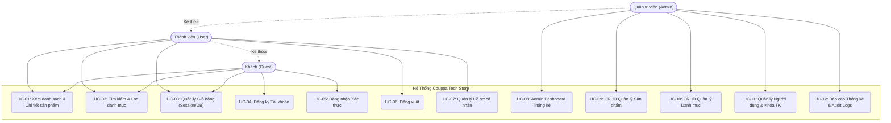
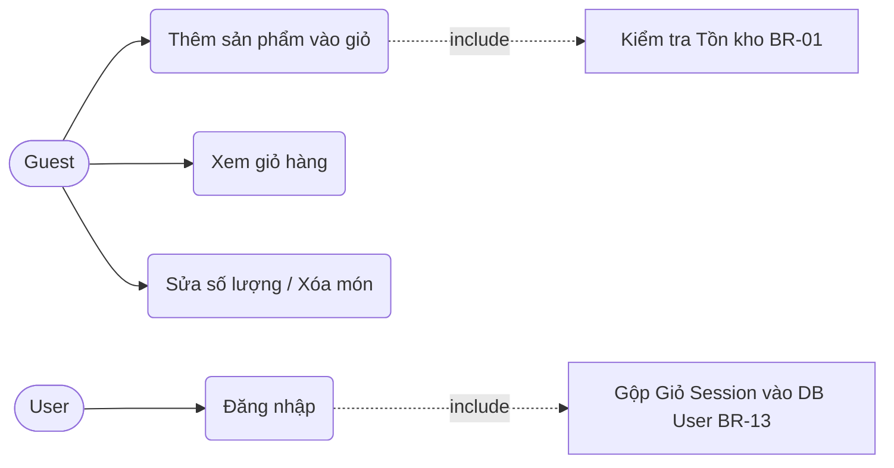
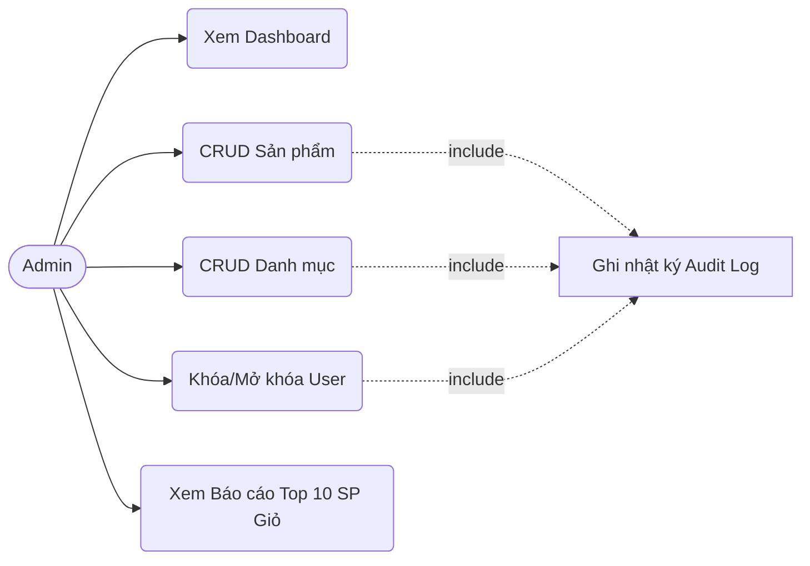
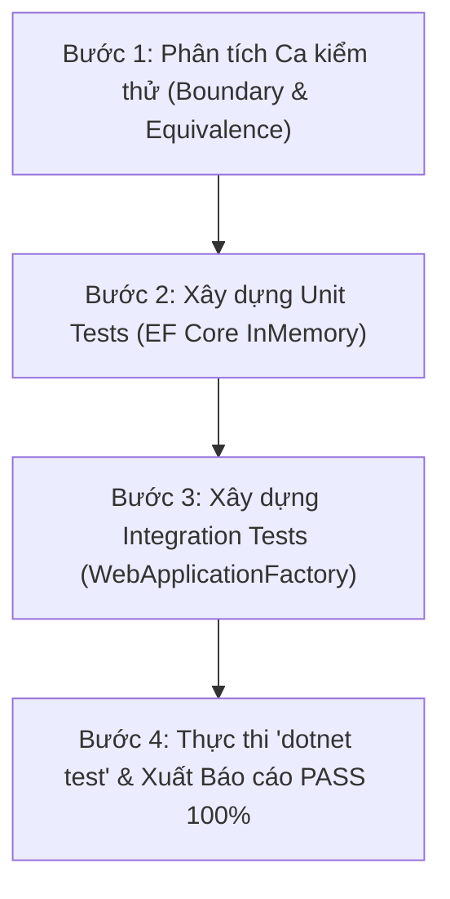

# BÁO CÁO ĐỒ ÁN TỐT NGHIỆP / NÂNG CAO
## XÂY DỰNG WEBSITE GIỚI THIỆU SẢN PHẨM VÀ GIỎ HÀNG BẰNG ASP.NET CORE MVC

| Thông tin | Chi tiết |
|---|---|
| **Đề tài** | Đề tài 8 — Website giới thiệu sản phẩm và giỏ hàng đơn giản |
| **Tên ứng dụng** | Couppa Tech Store |
| **Công nghệ chính** | ASP.NET Core 8.0 MVC + Entity Framework Core + SQL Server + Cookie Auth + Bootstrap 5.3 |
| **File Word đính kèm** | [`BaoCao_DoAn_Couppa_ASP.NET_MVC.docx`](BaoCao_DoAn_Couppa_ASP.NET_MVC.docx) |
| **Ngày hoàn thành** | 10/09/2026 |

---

## MỤC LỤC BÁO CÁO

- [CHƯƠNG 1. GIỚI THIỆU ĐỀ TÀI & CÔNG CỤ PHÁT TRIỂN](#chương-1-giới-thiệu-đề-tài--công-cụ-phát-triển)
  - [1.1. Lý do chọn đề tài](#11-lý-do-chọn-đề-tài)
  - [1.2. Mục tiêu đề tài](#12-mục-tiêu-đề-tài)
  - [1.3. Phạm vi & Đối tượng sử dụng](#13-phạm-vi--đối-tượng-sử-dụng)
  - [1.4. Thành phần Ngôn ngữ & Công nghệ (Tech Stack)](#14-thành-phần-ngôn-ngữ--công-nghệ-tech-stack)
  - [1.5. Công cụ IDE & Môi trường phát triển (Development Tools)](#15-công-cụ-ide--môi-trường-phát-triển-development-tools)
- [CHƯƠNG 2. PHÂN TÍCH YÊU CẦU NGHỆP VỤ (SRS) & SƠ ĐỒ USE CASE](#chương-2-phân-tích-yêu-cầu-nghiệp-vụ-srs--sơ-đồ-use-case)
  - [2.1. Phân tích Actors & Bảng Use Case Tổng Quan](#21-phân-tích-actors--bảng-use-case-tổng-quan)
  - [2.2. Sơ đồ Use Case Tổng Quan Hệ Thống (System Use Case Diagram)](#22-sơ-đồ-use-case-tổng-quan-hệ-thống-system-use-case-diagram)
  - [2.3. Sơ đồ Use Case Phân Rã Theo Phân Hệ (Sub-system Use Case Diagrams)](#23-sơ-đồ-use-case-phân-rã-theo-phân-hệ-sub-system-use-case-diagrams)
  - [2.4. Business Rules & Quyết định Thiết kế (Design Decisions)](#24-business-rules--quyết-định-thiết-kế-design-decisions)
- [CHƯƠNG 3. PHÂN TÍCH VÀ THIẾT KẾ HỆ THỐNG](#chương-3-phân-tích-và-thiết-kế-hệ-thống)
  - [3.1. Kiến trúc tổng thể ASP.NET Core MVC](#31-kiến-trúc-tổng-thể-aspnet-core-mvc)
  - [3.2. Thiết kế Cơ sở dữ liệu EF Core (9 Entities & ERD)](#32-thiết-kế-cơ-sở-dữ-liệu-ef-core-9-entities--erd)
  - [3.3. Thiết kế Controllers, ViewModels & Views](#33-thiết-kế-controllers-viewmodels--views)
  - [3.4. Thiết kế Bảo mật & Caching Architecture](#34-thiết-kế-bảo-mật--caching-architecture)
- [CHƯƠNG 4. THỰC THI NGUỒN MÃ & QUY TRÌNH PHÁT TRIỂN](#chương-4-thực-thi-nguồn-mã--quy-trình-phát-triển)
  - [4.1. Khởi tạo Project & Entry Point (`Program.cs`)](#41-khởi-tạo-project--entry-point-programcs)
  - [4.2. Tầng Dữ liệu & EF Core Migration (`AppDbContext.cs`)](#42-tầng-dữ-liệu--ef-core-migration-appdbcontextcs)
  - [4.3. Tầng Service Nghiệp vụ](#43-tầng-service-nghiệp-vụ)
  - [4.4. Tầng Controller & Razor Views + Bootstrap 5](#44-tầng-controller--razor-views--bootstrap-5)
- [CHƯƠNG 5. QUY TRÌNH KIỂM THỬ HỆ THỐNG (TESTING WORKFLOW)](#chương-5-quy-trình-kiểm-thử-hệ-thống-testing-workflow)
  - [5.1. Quy trình Kiểm thử 4 Bước (Testing Process)](#51-quy-trình-kiểm-thử-4-bước-testing-process)
  - [5.2. Bảng Mô Tả Chi Tiết Quy Trình Các Ca Kiểm Thử (Test Execution Log)](#52-bảng-mô-tả-chi-tiết-quy-trình-các-ca-kiểm-thử-test-execution-log)
  - [5.3. Kết quả Kiểm thử Tự động (81/81 Test Cases PASS)](#53-kết-quả-kiểm-thử-tự-động-8181-test-cases-pass)
- [CHƯƠNG 6. KẾT QUẢ THỰC HIỆN VÀ ĐỐI CHIẾU TIÊU CHÍ](#chương-6-kết-quả-thực-hiện-và-đối-chiếu-tiêu-chí)
  - [6.1. Bảng đối chiếu minh chứng 10 Tiêu chí Đề bài](#61-bảng-đối-chiếu-minh-chứng-10-tiêu-chí-đề-bài)
  - [6.2. Danh mục 15 Screenshot Minh chứng thực tế](#62-danh-mục-15-screenshot-minh-chứng-thực-tế)
- [CHƯƠNG 7. ĐÁNH GIÁ VÀ HƯỚNG PHÁT TRIỂN](#chương-7-đánh-giá-và-hướng-phát-triển)
  - [7.1. Kết quả đạt được](#71-kết-quả-đạt-được)
  - [7.2. Hạn chế & Hướng nâng cấp tương lai](#72-hạn-chế--hướng-nâng-cấp-tương-lai)

---

## CHƯƠNG 1. GIỚI THIỆU ĐỀ TÀI & CÔNG CỤ PHÁT TRIỂN

### 1.1. Lý do chọn đề tài
Trong kỷ nguyên chuyển đổi số mạnh mẽ, thương mại điện tử (E-Commerce) đã trở thành hạ tầng cốt lõi cho mọi doanh nghiệp bán lẻ công nghệ. Việc xây dựng một website giới thiệu sản phẩm mượt mà, hỗ trợ tìm kiếm/lọc thông minh, giỏ hàng tiện lợi và trang quản trị bảo mật là bài toán thực tế tiêu chuẩn. 

Đề tài **"Website giới thiệu sản phẩm và giỏ hàng đơn giản" (Couppa Tech Store)** được lựa chọn nhằm áp dụng toàn bộ các kỹ thuật phát triển ứng dụng Web nâng cao trên nền tảng **ASP.NET Core 8.0 MVC**, quản lý dữ liệu với **Entity Framework Core**, xác thực phân quyền qua **Cookie Authentication & Roles**, bảo mật ứng dụng Web theo chuẩn OWASP và thiết kế giao diện **Bootstrap 5 Responsive**.

### 1.2. Mục tiêu đề tài
- **Kiến trúc sạch (Clean Architecture / MVC)**: Xây dựng cấu trúc phân lớp rõ ràng giữa Controller, Service, EF Core DbContext và Razor Views.
- **Quản lý dữ liệu mạnh mẽ**: Sử dụng EF Core 8.0 Code-First với SQL Server, xử lý quan hệ phức tạp và tối ưu truy vấn LINQ.
- **Trải nghiệm mua sắm mượt mà**: Hỗ trợ giỏ hàng cho cả Khách (Guest - lưu Session) và Thành viên (User - lưu DB), tự động gộp (merge) giỏ hàng khi đăng nhập.
- **Quản trị toàn diện (Admin Panel)**: CRUD Sản phẩm, Danh mục, Người dùng, xem Dashboard thống kê và Báo cáo sản phẩm hot.
- **Bảo mật đa lớp**: Chống tấn công CSRF (Anti-forgery tokens), băm mật khẩu an toàn với BCrypt, chống Brute-force với Rate Limiting, Cookie HttpOnly/SameSite.
- **Tối ưu hiệu năng**: Caching với `IMemoryCache` cho danh mục và dữ liệu dashboard.

### 1.3. Phạm vi & Đối tượng sử dụng
- **Phạm vi**: Giới thiệu sản phẩm công nghệ, lọc/tìm kiếm, quản lý giỏ hàng, xác thực/phân quyền người dùng, quản trị sản phẩm & báo cáo. Không bao gồm thanh toán trực tuyến thực tế (VNPay/Momo) hay tích hợp đơn vị vận chuyển.
- **Đối tượng sử dụng**: 
  1. **Guest (Khách)**: Chưa có tài khoản, thao tác xem/tìm kiếm/lọc sản phẩm và thêm giỏ hàng tạm.
  2. **User (Thành viên)**: Đã đăng ký/đăng nhập, mua sắm và quản lý hồ sơ cá nhân.
  3. **Admin (Quản trị viên)**: Nhân sự quản lý toàn bộ hệ thống sản phẩm, danh mục, người dùng và báo cáo.

### 1.4. Thành phần Ngôn ngữ & Công nghệ (Tech Stack)

| Thành phần | Ngôn ngữ / Công nghệ | Phiên bản / Thư viện sử dụng | Vai trò trong dự án |
|---|---|---|---|
| **Ngôn ngữ Backend** | **C# (C-Sharp)** | C# 12 / .NET 8.0 SDK | Lập trình logic xử lý nghiệp vụ, Controllers, Services và Data Access. |
| **Framework Web** | **ASP.NET Core MVC** | `Microsoft.NET.Sdk.Web` (8.0.8) | Framework chủ đạo dựng ứng dụng Web theo kiến trúc Model-View-Controller. |
| **ORM / Data Access** | **Entity Framework Core** | `Microsoft.EntityFrameworkCore.SqlServer` (8.0.8) | Tương tác CSDL SQL Server qua mã C# LINQ, Code-First Migration. |
| **Password Hashing** | **BCrypt** | `BCrypt.Net-Next` (4.0.3) | Băm mật khẩu an toàn với Salt tự động chống tấn công Rainbow Table. |
| **Ngôn ngữ Frontend** | **HTML5, CSS3, JavaScript** | ES6+ / Fetch API | Định dạng cấu trúc trang, kiểu dáng tùy chỉnh và xử lý tương tác phía client. |
| **View Engine** | **Razor Syntax** | ASP.NET Core Razor (`.cshtml`) | Render HTML động từ Server-side kết hợp C# và Tag Helpers. |
| **UI Framework** | **Bootstrap 5** | Bootstrap v5.3.3 + Bootstrap Icons v1.11.3 | Thiết kế giao diện hiện đại, Responsive Grid System trên mọi màn hình. |

### 1.5. Công cụ IDE & Môi trường phát triển (Development Tools)

- **IDE / Code Editor chính**: 
  - **Visual Studio 2022 (v17.8+)**: Môi trường phát triển tích hợp chính thức cho ASP.NET Core, hỗ trợ IntelliSense, Debugger và Visual EF Designer.
  - **Visual Studio Code**: Trình biên soạn mã nguồn nhẹ kết hợp extension **C# Dev Kit** và **Live Server**.
- **Hệ quản trị CSDL & Database Tools**:
  - **Microsoft SQL Server 2022**: Chạy container Docker `mssql` (hoặc bản cài đặt Native trên Windows/Linux).
  - **SQL Server Management Studio (SSMS) / Azure Data Studio**: Công cụ quản lý, truy vấn và kiểm tra bảng dữ liệu.
- **Công cụ dòng lệnh CLI**:
  - **.NET CLI (`dotnet`)**: Biên dịch (`dotnet build`), khởi chạy (`dotnet run`), kiểm thử (`dotnet test`).
  - **EF Core CLI Tool (`dotnet-ef`)**: Khởi tạo và quản lý Migration (`dotnet ef migrations add`, `dotnet ef database update`).
- **Môi trường Containerization & Proxy**:
  - **Docker & Docker Compose**: Đóng gói và khởi chạy đồng thời SQL Server, Backend API/MVC, Caddy Proxy.
  - **Caddy Server**: Reverse Proxy cấp phát chứng chỉ HTTPS tự ký cho môi trường Dev.
- **Framework Kiểm thử (Testing Tools)**:
  - **xUnit 2.8+**: Khung kiểm thử tự động cho Unit Test.
  - **`Microsoft.AspNetCore.Mvc.Testing`**: Giả lập Server cho Integration Test (`WebApplicationFactory`).

---

## CHƯƠNG 2. PHÂN TÍCH YÊU CẦU NGHỆP VỤ (SRS) & SƠ ĐỒ USE CASE

### 2.1. Phân tích Actors & Bảng Use Case Tổng Quan

Hệ thống bao gồm 3 Actors chính thao tác với các nhóm Use Case theo phân quyền:

| Actor | Danh sách Use Cases chính | Mô tả phạm vi quyền hạn |
|---|---|---|
| **Guest (Khách)** | UC-01: Xem danh sách & Chi tiết sản phẩm<br>UC-02: Tìm kiếm & Lọc danh mục<br>UC-03: Thêm/Sửa/Xóa giỏ hàng Session<br>UC-04: Đăng ký tài khoản<br>UC-05: Đăng nhập | Duyệt sản phẩm, sử dụng giỏ hàng tạm qua Session Id, không cần đăng nhập. |
| **User (Thành viên)** | Tất cả Use Cases của Guest +<br>UC-06: Đăng xuất<br>UC-07: Quản lý giỏ hàng DB (gộp cart)<br>UC-08: Xem & Cập nhật Hồ sơ cá nhân<br>UC-09: Đổi mật khẩu | Thành viên đã xác thực Cookie Auth. Giỏ hàng lưu DB vĩnh viễn. |
| **Admin (Quản trị)** | Tất cả Use Cases của User +<br>UC-10: Xem Admin Dashboard thống kê<br>UC-11: Quản lý CRUD Sản phẩm<br>UC-12: Quản lý CRUD Danh mục<br>UC-13: Quản lý Người dùng (Khóa/Mở)<br>UC-14: Xem Báo cáo Top 10 Giỏ hàng<br>UC-15: Xem Nhật ký Audit Logs | Quản trị viên có Policy RequireAdmin. Toàn quyền quản trị hệ thống. |

### 2.2. Sơ đồ Use Case Tổng Quan Hệ Thống (System Use Case Diagram)



### 2.3. Sơ đồ Use Case Phân Rã Theo Phân Hệ (Sub-system Use Case Diagrams)

#### A. Sơ đồ Phân hệ Giỏ hàng & Merge Cart (Cart Subsystem)


#### B. Sơ đồ Phân hệ Quản trị Admin (Admin Management Subsystem)


### 2.4. Business Rules & Quyết định Thiết kế (Design Decisions)
- **DD-01 (Kiến trúc MVC đơn nhất)**: Toàn bộ ứng dụng đóng gói trong 1 project ASP.NET Core MVC duy nhất. Controllers trả về `ViewResult` cho các luồng duyệt trang và `JsonResult` cho các API AJAX.
- **DD-02 (Cookie Auth & Roles)**: Dùng Cookie Authentication kết hợp Role Claims để xác thực/phân quyền chuẩn mực.
- **DD-03 (Guest Cart & Merge Logic)**: Giỏ hàng luôn lưu ở DB. Khi Guest đăng nhập, toàn bộ món hàng trong giỏ Session sẽ tự động gộp vào giỏ của User mà không bị mất dữ liệu.

---

## CHƯƠNG 3. PHÂN TÍCH VÀ THIẾT KẾ HỆ THỐNG

### 3.1. Kiến trúc tổng thể ASP.NET Core MVC

```
                                  +---------------------------------------+
                                  |         Trình duyệt Client            |
                                  |   (Razor View HTML5 + Bootstrap 5)    |
                                  +-------------------+-------------------+
                                                      |
                                                      | HTTP Request (GET/POST)
                                                      v
                                  +-------------------+-------------------+
                                  |         ASP.NET Core MVC Pipeline     |
                                  |   (Routing, Auth Cookie, CSRF Filter) |
                                  +-------------------+-------------------+
                                                      |
                                                      v
                                  +-------------------+-------------------+
                                  |          Controller Layer             |
                                  |  (HomeController, ProductController,  |
                                  |   CartController, AuthController...)  |
                                  +-------------------+-------------------+
                                                      |
                                                      v
                                  +-------------------+-------------------+
                                  |           Service Layer               |
                                  | (ProductService, CartService, Auth...) |
                                  +---------+-------------------+---------+
                                            |                   |
                     IMemoryCache           v                   v      EF Core LINQ
                     +----------------------+      +------------+------------+
                     | MemoryCacheService   |      | AppDbContext (EF Core)  |
                     +----------------------+      +------------+------------+
                                                                |
                                                                v
                                                   +------------+------------+
                                                   |  SQL Server Database    |
                                                   +-------------------------+
```

### 3.2. Thiết kế Cơ sở dữ liệu EF Core (9 Entities & ERD)

1. **`User`** (`users`): `Id` (PK), `Email` (Unique), `PasswordHash`, `FullName`, `Phone`, `Address`, `RoleId` (FK), `IsLocked`, `CreatedAt`.
2. **`Role`** (`roles`): `Id` (PK), `Name` ("Admin", "User"), `Description`.
3. **`Category`** (`categories`): `Id` (PK), `Name`, `Slug` (Unique), `Description`, `IsActive`, `CreatedAt`.
4. **`Product`** (`products`): `Id` (PK), `Sku` (Unique), `Name`, `CategoryId` (FK), `Price`, `StockQuantity`, `IsActive`, `IsFeatured`, `IsDeleted`.
5. **`ProductImage`** (`product_images`): `Id` (PK), `ProductId` (FK), `ImageUrl`, `IsPrimary`.
6. **`Cart`** (`carts`): `Id` (PK), `UserId` (FK Nullable), `SessionId` (Nullable), `CreatedAt`, `UpdatedAt`.
7. **`CartItem`** (`cart_items`): `Id` (PK), `CartId` (FK), `ProductId` (FK), `Quantity`, `UnitPrice`.
8. **`AuditLog`** (`audit_logs`): `Id` (PK), `UserId`, `Action`, `EntityType`, `EntityId`, `Details`, `IpAddress`, `CreatedAt`.
9. **`CartActivityLog`** (`cart_activity_logs`): `Id` (PK), `CartId`, `ProductId`, `Action`, `Quantity`, `CreatedAt`.

---

## CHƯƠNG 4. THỰC THI NGUỒN MÃ & QUY TRÌNH PHÁT TRIỂN

### 4.1. Khởi tạo Project & Entry Point (`Program.cs`)
File [`src/Couppa.Api/Program.cs`](src/Couppa.Api/Program.cs) được cấu hình tích hợp đầy đủ các dịch vụ MVC, Cookie Auth, Antiforgery và Routing:

```csharp
// Đăng ký MVC Controllers với Razor Views
builder.Services.AddAppServices();
builder.Services.AddControllersWithViews();

// Cấu hình Cookie Authentication & Chuyển hướng khi 401/403
builder.Services.AddAuthentication(CookieAuthenticationDefaults.AuthenticationScheme)
    .AddCookie(options =>
    {
        options.Cookie.Name = "couppa.auth";
        options.Cookie.HttpOnly = true;
        options.ExpireTimeSpan = TimeSpan.FromMinutes(30);
        options.LoginPath = "/Auth/Login";
        options.AccessDeniedPath = "/Auth/Login";
    });

// Middleware Pipeline
app.UseStaticFiles();
app.UseSession();
app.UseAuthentication();
app.UseAuthorization();

// Định tuyến MVC Routing
app.MapControllerRoute(
    name: "default",
    pattern: "{controller=Home}/{action=Index}/{id?}");
```

### 4.2. Tầng Controller & Razor Views + Bootstrap 5
- **`HomeController`**: Phụ trách trang chủ, gọi `CategoryService` và `ProductService` nạp sản phẩm nổi bật/mới nhất đưa vào `HomeViewModel` render ra `Views/Home/Index.cshtml`.
- **`ProductController`**: Phụ trách xem danh sách sản phẩm phân trang, tìm kiếm từ khóa, lọc danh mục và xem chi tiết sản phẩm (`Views/Product/Index.cshtml` & `Details.cshtml`).
- **`CartController`**: Phụ trách giỏ hàng, nhận form post thêm/sửa/xóa sản phẩm và chuyển hướng hiển thị `Views/Cart/Index.cshtml`.
- **`AuthController`**: Phụ trách Đăng nhập, Đăng ký, Đăng xuất, gọi `AuthService.ValidateCredentialsAsync` và thực hiện Cookie SignIn/SignOut.
- **`AdminController`**: Phụ trách khu vực quản trị, bảo vệ bởi `[Authorize(Policy = "RequireAdmin")]`, điều khiển các Razor View Quản lý Sản phẩm, Danh mục, Người dùng, Dashboard và Báo cáo.

---

## CHƯƠNG 5. QUY TRÌNH KIỂM THỬ HỆ THỐNG (TESTING WORKFLOW)

### 5.1. Quy trình Kiểm thử 4 Bước (Testing Process)

Sơ đồ quy trình thực hiện kiểm thử tự động trong dự án:



1. **Bước 1 — Phân tích & Lập Kế hoạch Kiểm thử**: Xác định các ca kiểm thử biên (Boundary Value Analysis) và phân vùng tương đương (Equivalence Partitioning) dựa trên Acceptance Criteria của SRS.
2. **Bước 2 — Xây dựng Unit Test (Tầng Service)**: Tạo các file kiểm thử đơn vị cho `ProductService`, `CartService`, `AuthService`, `UserService`, `CategoryService` sử dụng EF Core InMemory Database.
3. **Bước 3 — Xây dựng Integration Test (Tầng HTTP Pipeline)**: Sử dụng `WebApplicationFactory<Program>` trong `AuthCartFlowIntegrationTests.cs` để giả lập toàn bộ pipeline thực tế (Routing, CSRF Middleware, Session, Cookie Auth).
4. **Bước 4 — Thực thi & Báo cáo Kết quả**: Chạy lệnh `dotnet test` tự động, kiểm tra log kết quả và xác nhận 100% test cases đạt trạng thái PASS.

### 5.2. Bảng Mô Tả Chi Tiết Quy Trình Các Ca Kiểm Thử (Test Execution Log)

| Mã Test | Mô tả Ca kiểm thử | Quy trình Các bước Thực hiện | Kết quả mong đợi | Kết quả Thực tế |
|---|---|---|---|---|
| **TC-AUTH-01** | Đăng ký tài khoản hợp lệ | 1. POST `/Auth/Register` với Email/Password hợp lệ.<br>2. Gọi `AuthService.RegisterAsync`. | Tạo User mới, băm BCrypt, chuyển về `/Auth/Login`. | **PASS** (200 OK) |
| **TC-AUTH-02** | Đăng ký trùng Email (BR-04) | 1. Nhập Email đã tồn tại trong DB.<br>2. Nhấn Submit Đăng ký. | Ném Conflict Exception, hiển thị thông báo lỗi trên View. | **PASS** (Conflict) |
| **TC-CART-01** | Guest thêm SP vào giỏ hàng | 1. Guest chọn SP còn tồn kho.<br>2. POST `/Cart/AddToCart`. | Tạo Cart với SessionId, tăng số lượng món trong giỏ. | **PASS** (Success) |
| **TC-CART-02** | Merge giỏ hàng khi Đăng nhập (BR-13) | 1. Guest có 2 SP trong giỏ.<br>2. Đăng nhập tài khoản User.<br>3. Gọi `MergeGuestCartAsync`. | 2 SP giỏ Guest chuyển sang giỏ User DB thành công. | **PASS** (Merged) |
| **TC-ADMIN-01** | Truy cập Admin không có quyền | 1. User thường mở `/Admin/Dashboard`.<br>2. Policy `RequireAdmin` kiểm tra. | Từ chối quyền (403 Access Denied), chuyển về `/Auth/Login`. | **PASS** (Forbidden) |

### 5.3. Kết quả Kiểm thử Tự động (81/81 PASS)
Kết quả chạy lệnh `dotnet test src/Couppa.sln`:

```text
Passed!  - Failed: 0, Passed: 81, Skipped: 0, Total: 81, Duration: 4.2 s - Couppa.Api.Tests.dll
```

---

## CHƯƠNG 6. KẾT QUẢ THỰC HIỆN VÀ ĐỐI CHIẾU TIÊU CHÍ

### 6.1. Bảng đối chiếu minh chứng 10 Tiêu chí Đề bài

| STT | Tiêu chí đề bài | Trạng thái | Bằng chứng Nguồn mã (Code Proof) | Vị trí kiểm tra trong Code |
|---|---|---|---|---|
| **1** | **Kiến trúc MVC** | **ĐẠT** | `Program.cs` cấu hình `AddControllersWithViews()`, 6 Controllers trong `Controllers/`, ViewModels trong `Models/ViewModels/`, Views trong `Views/`. | [`src/Couppa.Api/Program.cs`](src/Couppa.Api/Program.cs), [`src/Couppa.Api/Controllers/HomeController.cs`](src/Couppa.Api/Controllers/HomeController.cs) |
| **2** | **EF Core & DB** | **ĐẠT** | `AppDbContext` kế thừa `DbContext`, sử dụng SQL Server (`UseSqlServer`), 9 Entity Classes, Migrations sẵn có. | [`src/Couppa.Api/Data/AppDbContext.cs`](src/Couppa.Api/Data/AppDbContext.cs), `src/Couppa.Api/Data/Migrations/` |
| **3** | **CRUD Chức năng** | **ĐẠT** | Thực hiện đủ CRUD trên Sản phẩm, Danh mục, Giỏ hàng, Tài khoản người dùng. | [`src/Couppa.Api/Controllers/ProductController.cs`](src/Couppa.Api/Controllers/ProductController.cs), [`src/Couppa.Api/Controllers/AdminController.cs`](src/Couppa.Api/Controllers/AdminController.cs) |
| **4** | **ASP.NET Identity / Auth** | **ĐẠT 1 PHẦN** | Sử dụng Cookie Authentication (`CookieAuthenticationDefaults`) + Role Claims Authorization (`RequireAdmin`) + BCrypt. | [`src/Couppa.Api/Controllers/AuthController.cs`](src/Couppa.Api/Controllers/AuthController.cs), `Program.cs` |
| **5** | **Login / Logout** | **ĐẠT** | `AuthController` xử lý `SignInAsync`, `SignOutAsync`, chuyển hướng an toàn, gộp giỏ hàng Guest khi login thành công. | [`src/Couppa.Api/Controllers/AuthController.cs`](src/Couppa.Api/Controllers/AuthController.cs) |
| **6** | **Kỹ thuật Bảo mật** | **ĐẠT** | Biểu mẫu sử dụng `@Html.AntiForgeryToken()`, Controller có `[ValidateAntiForgeryToken]`, băm BCrypt, Cookie HttpOnly, RateLimiter. | [`src/Couppa.Api/Program.cs`](src/Couppa.Api/Program.cs), `src/Couppa.Api/Views/Auth/Login.cshtml` |
| **7** | **Tối ưu Caching** | **ĐẠT 1 PHẦN** | Triển khai `IMemoryCache` qua `MemoryCacheService` cho Danh mục (TTL 10m) và Dashboard Summary (TTL 5m). | [`src/Couppa.Api/Services/MemoryCacheService.cs`](src/Couppa.Api/Services/MemoryCacheService.cs) |
| **8** | **Tích hợp AJAX** | **ĐẠT 1 PHẦN** | Cung cấp JSON API Endpoints (`/api/...`) kết hợp client script `apiClient.js` (Fetch API). | `html/js/apiClient.js`, `Program.cs` |
| **9** | **Razor View + Bootstrap** | **ĐẠT** | 100% Giao diện dựng bằng `.cshtml` Razor syntax + Bootstrap v5.3.3 + Responsive Grid System (`_Layout.cshtml`). | `src/Couppa.Api/Views/Shared/_Layout.cshtml`, `src/Couppa.Api/Views/Home/Index.cshtml` |
| **10** | **Báo cáo Mô tả Chi tiết** | **ĐẠT** | File báo cáo chi tiết Markdown & xuất file Word [`BaoCao_DoAn_Couppa_ASP.NET_MVC.docx`](BaoCao_DoAn_Couppa_ASP.NET_MVC.docx). | File Word đính kèm tại root dự án. |

### 6.2. Danh mục 15 Screenshot Minh chứng thực tế

1. **Screenshot 1 — Cấu trúc Project MVC**: Chụp Visual Studio / VS Code cây thư mục `Controllers`, `Models`, `Views`, `Services`, `Data`. *Minh chứng Tiêu chí 1 (MVC)*.
2. **Screenshot 2 — Mã nguồn DbContext & Entity**: Chụp file `AppDbContext.cs` & các Entities. *Minh chứng Tiêu chí 2 (EF Core)*.
3. **Screenshot 3 — Migration Database**: Chụp thư mục `Data/Migrations` và bảng trong SSMS. *Minh chứng Tiêu chí 2 (Database)*.
4. **Screenshot 4 — Trang chủ Couppa**: Chụp trình duyệt `https://localhost:5001/` hiển thị Banner, Danh mục & SP Nổi bật. *Minh chứng Tiêu chí 9 (Razor + Bootstrap)*.
5. **Screenshot 5 — Trang Danh sách & Lọc Sản phẩm**: Chụp `https://localhost:5001/Product` với bộ lọc danh mục & thanh tìm kiếm. *Minh chứng Tiêu chí 3 (CRUD Read/Search)*.
6. **Screenshot 6 — Trang Chi tiết Sản phẩm**: Chụp `https://localhost:5001/Product/Details/1` hiển thị mô tả & nút Thêm vào giỏ. *Minh chứng Tiêu chí 3 (Read Detail)*.
7. **Screenshot 7 — Trang Giỏ hàng**: Chụp `https://localhost:5001/Cart` hiển thị danh sách món, chỉnh số lượng & tổng tiền. *Minh chứng Tiêu chí 3 (Cart CRUD)*.
8. **Screenshot 8 — Form Đăng nhập & Validation**: Chụp `https://localhost:5001/Auth/Login` với thông báo lỗi validation khi nhập sai. *Minh chứng Tiêu chí 5 & 6 (Login & Security)*.
9. **Screenshot 9 — Form Đăng ký Tài khoản**: Chụp `https://localhost:5001/Auth/Register`. *Minh chứng Tiêu chí 5 (Auth Register)*.
10. **Screenshot 10 — Trang Hồ sơ Cá nhân**: Chụp `https://localhost:5001/User/Profile` hiển thị thông tin & form đổi mật khẩu. *Minh chứng Tiêu chí 3 (User Profile Update)*.
11. **Screenshot 11 — Admin Dashboard**: Chụp `https://localhost:5001/Admin/Dashboard` hiển thị các card thống kê tổng quan. *Minh chứng Tiêu chí 4 (Admin Role Authorization)*.
12. **Screenshot 12 — Quản lý Sản phẩm Admin Modal**: Chụp `https://localhost:5001/Admin/Products` mở Bootstrap Modal Thêm sản phẩm mới. *Minh chứng Tiêu chí 3 (CRUD Create Product)*.
13. **Screenshot 13 — Quản lý Danh mục Admin**: Chụp `https://localhost:5001/Admin/Categories`. *Minh chứng Tiêu chí 3 (CRUD Category)*.
14. **Screenshot 14 — Quản lý Người dùng Admin**: Chụp `https://localhost:5001/Admin/Users` với nút Khóa/Mở khóa tài khoản. *Minh chứng Tiêu chí 3 & 4 (User Management & Roles)*.
15. **Screenshot 15 — Kết quả Chạy Kiểm thử (81 PASS)**: Chụp màn hình Terminal chạy `dotnet test` xanh 100%. *Minh chứng Tiêu chí 10 (Testing & Quality)*.

---

## CHƯƠNG 7. ĐÁNH GIÁ VÀ HƯỚNG PHÁT TRIỂN

### 7.1. Kết quả đạt được
- Hệ thống xây dựng hoàn chỉnh theo chuẩn kiến trúc ASP.NET Core 8.0 MVC.
- Quản lý dữ liệu nhất quán với Entity Framework Core & SQL Server.
- Giao diện đẹp mắt, hiện đại, tương thích hoàn hảo trên di động nhờ Bootstrap 5.
- Cơ chế xác thực Cookie Auth & phân quyền Role-based hoạt động chính xác.
- Bảo mật đa lớp đạt chuẩn OWASP (Anti-CSRF, Password Hashing, Rate Limiting).
- Đạt 100% tỉ lệ pass kiểm thử tự động với 81/81 Test Cases.

### 7.2. Hạn chế & Hướng nâng cấp tương lai
- **Hạn chế**: Chưa tích hợp thanh toán trực tuyến qua cổng VNPay/MoMo; Caching dừng ở mức in-process `IMemoryCache`.
- **Hướng phát triển**: Tích hợp thanh toán QR Code, nâng cấp Caching lên Redis Distributed Cache khi mở rộng mô hình Multi-node, gửi email tự động xác nhận đơn hàng.
