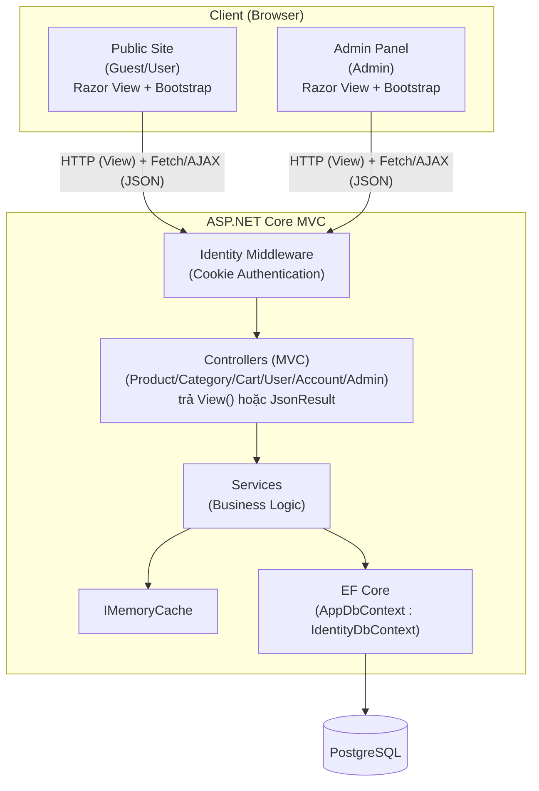
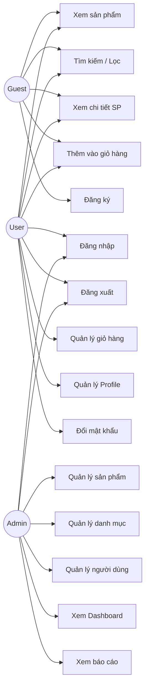
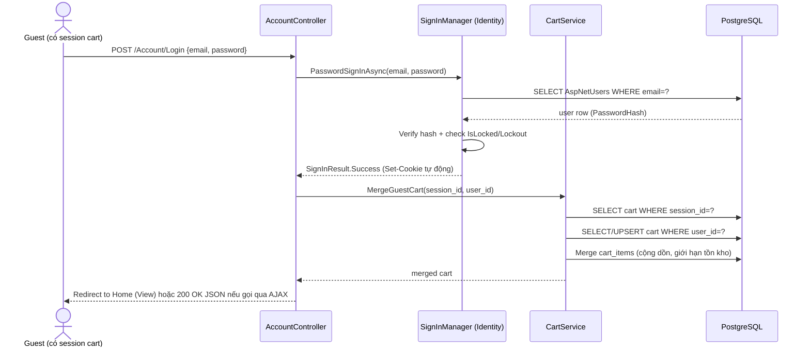
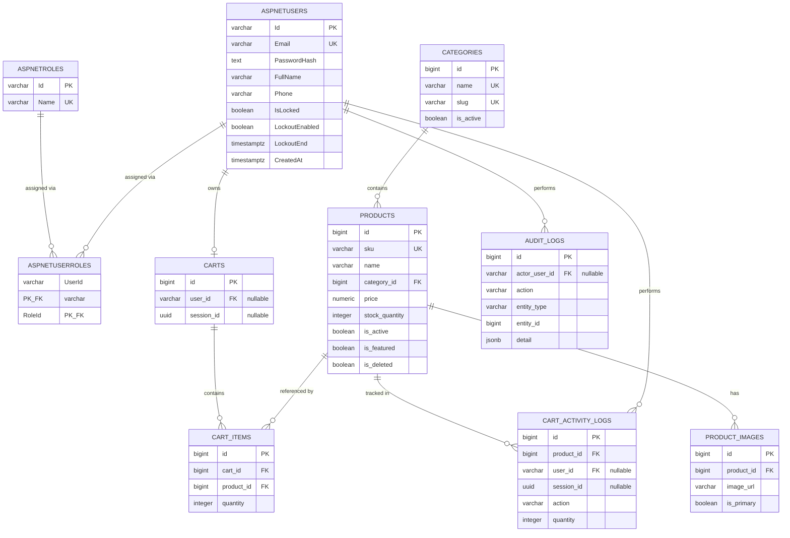
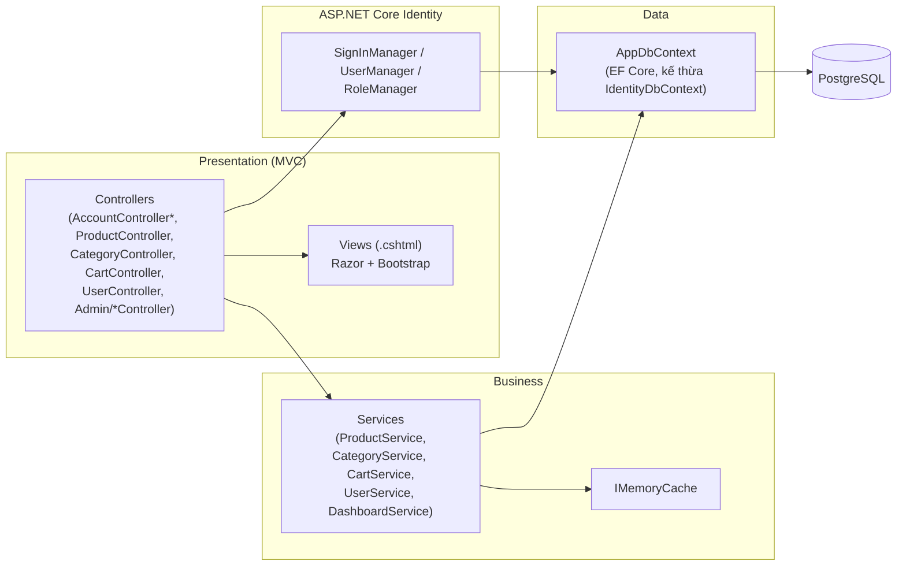
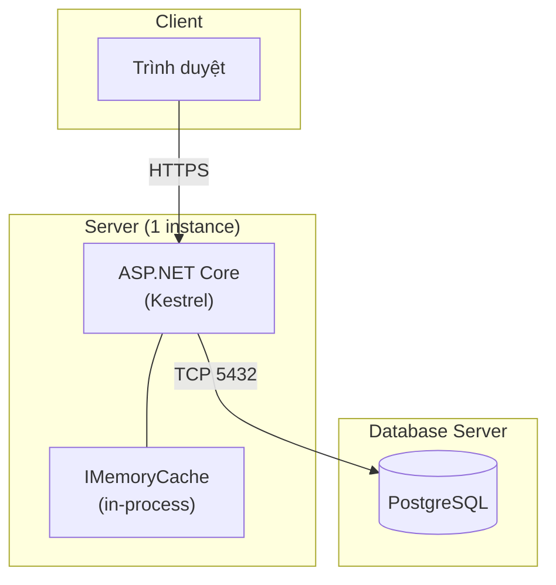

# Software Requirements Specification (SRS)

## Website Giới Thiệu Sản Phẩm và Giỏ Hàng Đơn Giản

| | |
|---|---|
| **Đề tài** | Đề tài 8 — Website giới thiệu sản phẩm và giỏ hàng đơn giản |
| **Phiên bản** | 1.0 |
| **Ngày** | 2026-09-07 |
| **Loại tài liệu** | SRS phục vụ đồ án tốt nghiệp |
| **Stack đề xuất** | ASP.NET Core MVC (C#) + EF Core + ASP.NET Core Identity + PostgreSQL + IMemoryCache + Bootstrap |

---

## Mục lục

1. [Introduction](#1-introduction)
2. [Overall Description](#2-overall-description)
3. [System Overview](#3-system-overview)
4. [Actors](#4-actors)
5. [Functional Requirements](#5-functional-requirements)
6. [Business Rules](#6-business-rules)
7. [Use Case Specification](#7-use-case-specification)
8. [Non-Functional Requirements](#8-non-functional-requirements)
9. [Authentication & Authorization](#9-authentication--authorization)
10. [Security Requirements](#10-security-requirements)
11. [Caching Requirements](#11-caching-requirements)
12. [AJAX / Fetch API Requirements](#12-ajax--fetch-api-requirements)
13. [Database Requirements](#13-database-requirements)
14. [ERD](#14-erd)
15. [API Specification](#15-api-specification)
16. [UI/UX Requirements](#16-uiux-requirements)
17. [Responsive Requirements](#17-responsive-requirements)
18. [Dashboard & Reporting](#18-dashboard--reporting)
19. [Error Handling](#19-error-handling)
20. [Logging & Monitoring](#20-logging--monitoring)
21. [Permission Matrix](#21-permission-matrix)
22. [Data Validation](#22-data-validation)
23. [System Architecture](#23-system-architecture)
24. [Deployment Architecture](#24-deployment-architecture)
25. [Testing Requirements](#25-testing-requirements)
26. [Acceptance Criteria](#26-acceptance-criteria)
27. [Traceability Matrix](#27-traceability-matrix)
28. [Scope / Out of Scope](#28-scope--out-of-scope)
29. [Future Enhancements](#29-future-enhancements)
30. [Phụ lục A — Feature List](#phụ-lục-a--feature-list)
31. [Phụ lục B — Development Task Breakdown](#phụ-lục-b--development-task-breakdown)
32. [Phụ lục C — MVP](#phụ-lục-c--mvp)

---

## Ghi chú về Design Decisions quan trọng

Tài liệu này giải quyết các điểm mâu thuẫn/chưa rõ trong yêu cầu gốc, đã được xác nhận với chủ đầu tư đồ án:

> **DD-01 (Kiến trúc trình bày):** Đề bài yêu cầu "kiến trúc MVC rõ ràng" và "giao diện trình bày bằng Razor View + Bootstrap". Quyết định: hệ thống là **1 project ASP.NET Core MVC duy nhất** (không tách Backend API riêng/Frontend SPA riêng). Controller xử lý request theo đúng vòng đời MVC: action trả `View()` (Razor + Bootstrap) cho các trang điều hướng chính (trang chủ, danh sách/chi tiết sản phẩm, giỏ hàng, khu vực quản trị); action trả `JsonResult` cho các thao tác gọi qua AJAX/Fetch (thêm giỏ hàng, tìm kiếm/lọc/sắp xếp không reload, CRUD trong modal ở Admin Panel) — xem Chương 12.

> **DD-02 (Authentication & Authorization):** Đề bài yêu cầu "áp dụng Identity để quản lý người dùng và phân quyền" đồng thời "thực hiện xác thực đăng nhập/đăng xuất" và kỹ thuật bảo mật "Cookie/Session". Quyết định: dùng **ASP.NET Core Identity** (`IdentityUser`, `IdentityRole`, `UserManager`, `SignInManager`) làm cơ chế quản lý người dùng/phân quyền chuẩn của framework. Identity mặc định xác thực bằng **Cookie Authentication**, nên vừa đáp ứng đúng tên gọi "Identity", vừa thể hiện đầy đủ Session/Cookie như đề bài yêu cầu — không cần tự dựng cơ chế Cookie/Session thủ công.

> **DD-03 (Giỏ hàng Guest):** Đề bài liệt kê bảng `carts`/`cart_items` (ngụ ý lưu DB) nhưng đồng thời yêu cầu Guest dùng Session/Cookie. Quyết định: **giỏ hàng luôn lưu ở DB** (kể cả của Guest), Session (`ISession` của ASP.NET Core, độc lập với Cookie Authentication của Identity) chỉ dùng để **định danh** giỏ hàng của Guest (giữ `session_id`). Khi Guest đăng nhập, giỏ hàng Session được **merge** vào giỏ hàng của User. Cách này vừa cho phép thống kê "sản phẩm được thêm giỏ nhiều nhất" (mục 2.9), vừa thể hiện đúng kỹ thuật Session/Cookie.

Toàn bộ các điểm chưa được đặc tả rõ trong yêu cầu gốc được đánh dấu **[Assumption]** hoặc **[Recommendation]** xuyên suốt tài liệu — đây là đề xuất hợp lý của SA, không phải yêu cầu bắt buộc.

---

## 1. Introduction

### 1.1 Purpose

Tài liệu này đặc tả yêu cầu phần mềm (SRS) cho hệ thống **Website Giới thiệu Sản phẩm và Giỏ hàng Đơn giản**, phục vụ mục đích đồ án tốt nghiệp. Tài liệu cung cấp đủ chi tiết để một lập trình viên có thể đọc, hiểu và triển khai hệ thống mà không cần thêm thông tin nghiệp vụ bổ sung.

### 1.2 Scope

Xem chi tiết tại [Chương 28 — Scope / Out of Scope](#28-scope--out-of-scope). Tóm tắt: hệ thống quản lý sản phẩm, danh mục, giỏ hàng, authentication/authorization, dashboard và báo cáo cơ bản. **Không** xử lý thanh toán thực tế, vận chuyển, hay các nghiệp vụ e-commerce phức tạp.

### 1.3 Definitions, Acronyms, Abbreviations

| Thuật ngữ | Giải thích |
|---|---|
| SRS | Software Requirements Specification |
| FR | Functional Requirement |
| NFR | Non-Functional Requirement |
| CRUD | Create, Read, Update, Delete |
| JWT | JSON Web Token |
| TTL | Time To Live (thời gian sống của cache) |
| CSRF | Cross-Site Request Forgery |
| XSS | Cross-Site Scripting |
| SKU | Stock Keeping Unit (mã sản phẩm) |
| Guest | Người dùng chưa đăng nhập |
| Soft delete | Đánh dấu xóa logic (`is_deleted = true`), không xóa vật lý khỏi DB |

### 1.4 References

- Đề bài gốc: "Đề tài 8: Website giới thiệu sản phẩm và giỏ hàng đơn giản"
- ASP.NET Core Documentation (Microsoft)
- OWASP Top 10 (2021)

### 1.5 Intended Audience

- Sinh viên thực hiện đồ án (developer)
- Giảng viên hướng dẫn / hội đồng chấm (reviewer)
- QA/Tester tự kiểm thử theo Acceptance Criteria

---

## 2. Overall Description

### 2.1 Product Perspective

Đây là hệ thống web độc lập (standalone), kiến trúc **MVC (Model-View-Controller)**, 1 project ASP.NET Core MVC duy nhất, không phụ thuộc hệ thống ngoài nào:
- **Model**: các entity EF Core (`Product`, `Category`, `Cart`, `CartItem`, `ApplicationUser`...) + ViewModel/DTO cho từng View/action.
- **View**: Razor View (`.cshtml`) + Bootstrap, dùng chung `_Layout.cshtml` cho Public Site và layout riêng cho Admin Panel.
- **Controller**: nhận request, gọi Service xử lý business logic, trả `View()` (điều hướng trang) hoặc `JsonResult` (cho AJAX/Fetch — xem Chương 12).

### 2.2 Product Functions

Tóm tắt các nhóm chức năng chính (chi tiết ở Chương 5):
1. Quản lý sản phẩm (CRUD, tồn kho, trạng thái, hình ảnh)
2. Quản lý danh mục sản phẩm
3. Hiển thị & tìm kiếm/lọc/sắp xếp sản phẩm cho khách truy cập
4. Giỏ hàng (thêm/sửa/xóa/xem)
5. Authentication (đăng ký, đăng nhập, đăng xuất)
6. Authorization (phân quyền Guest/User/Admin)
7. Quản lý người dùng
8. Dashboard quản trị
9. Báo cáo thống kê cơ bản

### 2.3 User Classes and Characteristics

| Lớp người dùng | Đặc điểm |
|---|---|
| **Guest** | Không cần tài khoản, dùng trình duyệt phổ thông, thao tác xem/tìm/lọc/thêm giỏ hàng |
| **User** | Đã đăng ký, thao tác mua sắm cá nhân hóa, quản lý giỏ hàng bền vững |
| **Admin** | Nhân sự vận hành hệ thống, thao tác qua khu vực quản trị riêng, am hiểu nghiệp vụ sản phẩm |

### 2.4 Operating Environment

- Server: Linux hoặc Windows, .NET 8+ runtime
- Database: PostgreSQL 14+
- Trình duyệt hỗ trợ: Chrome, Edge, Firefox, Safari (2 phiên bản gần nhất)
- Không yêu cầu cài đặt phía client ngoài trình duyệt

### 2.5 Constraints

- Đồ án sinh viên: giới hạn thời gian, không triển khai hạ tầng phức tạp (không microservices, không message queue)
- Không tích hợp cổng thanh toán thật
- Caching giới hạn ở mức in-process (IMemoryCache), không bắt buộc Redis
- Một instance backend duy nhất (không load-balancing nhiều node) — **[Assumption]**

### 2.6 Assumptions and Dependencies

- **[Assumption]** Hệ thống chạy trên 1 server/1 instance duy nhất trong suốt vòng đời đồ án và demo
- **[Assumption]** Không có yêu cầu đa ngôn ngữ (chỉ tiếng Việt)
- **[Assumption]** Không có yêu cầu đa tiền tệ (chỉ VNĐ)
- **[Assumption]** Dữ liệu demo được seed sẵn (không cần import hàng loạt)

---

## 3. System Overview

Hệ thống gồm 3 nhóm giao diện chính:



Luồng xử lý chuẩn: **Client → Controller (MVC) → Service (business logic + cache check) → EF Core → PostgreSQL → View/JsonResult**. Không dùng Repository pattern riêng vì EF Core `DbContext` đã đóng vai trò abstraction layer đủ dùng cho quy mô đồ án.

---

## 4. Actors

| Actor | Mô tả |
|---|---|
| **Guest** | Khách truy cập chưa đăng nhập. Có `session_id` do server cấp qua cookie. |
| **User** | Tài khoản đã đăng ký, đăng nhập bằng email/password. |
| **Admin** | Tài khoản có role Admin, toàn quyền quản trị hệ thống. |
| **System** | Actor kỹ thuật: các tiến trình nền (cleanup job giỏ hàng hết hạn, cache eviction) — **[Assumption]** chạy dạng Hosted Service định kỳ, không cần message queue. |

---

## 5. Functional Requirements

> Định dạng: mỗi FR có ID, Description, Actor, Priority (Must/Should/Could — MoSCoW), Acceptance Criteria tóm tắt (chi tiết Given/When/Then đầy đủ ở Chương 26).
> Priority: **M**=Must have, **S**=Should have, **C**=Could have.

### 5.1 Authentication (FR-AUTH)

| ID | Mô tả | Actor | Priority |
|---|---|---|---|
| FR-AUTH-001 | Đăng ký tài khoản mới bằng email + password + tên hiển thị | Guest | M |
| FR-AUTH-002 | Đăng nhập bằng email/password qua ASP.NET Core Identity, tạo Cookie Authentication | Guest | M |
| FR-AUTH-003 | Đăng xuất, hủy Cookie Authentication hiện tại (`SignInManager.SignOutAsync`) | User, Admin | M |
| FR-AUTH-004 | Mật khẩu phải được hash (Identity `PasswordHasher`) trước khi lưu DB | System | M |
| FR-AUTH-005 | Hệ thống từ chối đăng nhập nếu tài khoản bị khóa (`IsLocked = true`) | System | M |
| FR-AUTH-006 | Hệ thống khóa tạm thời sau N lần đăng nhập sai liên tiếp (Identity Lockout) | System | S |

### 5.2 Authorization (FR-AUTHZ)

| ID | Mô tả | Actor | Priority |
|---|---|---|---|
| FR-AUTHZ-001 | Mọi action dưới `/Admin/**` yêu cầu role = Admin, kiểm tra ở backend (`[Authorize(Roles="Admin")]`) | System | M |
| FR-AUTHZ-002 | User không có quyền Admin bị từ chối với HTTP 403 khi gọi action quản trị | System | M |
| FR-AUTHZ-003 | Guest bị từ chối với HTTP 401 khi gọi action yêu cầu đăng nhập | System | M |

### 5.3 Product Management (FR-PRODUCT)

| ID | Mô tả | Actor | Priority |
|---|---|---|---|
| FR-PRODUCT-001 | Admin thêm sản phẩm mới (tên, mã SP, danh mục, giá, tồn kho, mô tả, hình ảnh) | Admin | M |
| FR-PRODUCT-002 | Admin xem danh sách sản phẩm có phân trang, lọc, sắp xếp | Admin | M |
| FR-PRODUCT-003 | Admin xem chi tiết 1 sản phẩm | Admin | M |
| FR-PRODUCT-004 | Admin cập nhật thông tin sản phẩm | Admin | M |
| FR-PRODUCT-005 | Admin xóa sản phẩm (soft delete) | Admin | M |
| FR-PRODUCT-006 | Admin thay đổi trạng thái sản phẩm (Active/Inactive) | Admin | M |
| FR-PRODUCT-007 | Admin quản lý nhiều hình ảnh cho 1 sản phẩm, chọn ảnh đại diện | Admin | S |
| FR-PRODUCT-008 | Mã sản phẩm (SKU) phải là duy nhất trong hệ thống | System | M |
| FR-PRODUCT-009 | Giá sản phẩm không được là số âm | System | M |
| FR-PRODUCT-010 | Số lượng tồn kho không được là số âm | System | M |

### 5.4 Category Management (FR-CATEGORY)

| ID | Mô tả | Actor | Priority |
|---|---|---|---|
| FR-CATEGORY-001 | Admin thêm danh mục mới | Admin | M |
| FR-CATEGORY-002 | Admin sửa danh mục | Admin | M |
| FR-CATEGORY-003 | Admin xóa danh mục (chỉ khi không còn sản phẩm liên kết) | Admin | M |
| FR-CATEGORY-004 | Admin xem danh sách danh mục | Admin | M |
| FR-CATEGORY-005 | Admin bật/tắt trạng thái danh mục | Admin | M |
| FR-CATEGORY-006 | Guest/User lọc sản phẩm theo danh mục | Guest, User | M |
| FR-CATEGORY-007 | Danh mục inactive không hiển thị ở trang public | System | M |

### 5.5 Product Browsing (FR-BROWSE)

| ID | Mô tả | Actor | Priority |
|---|---|---|---|
| FR-BROWSE-001 | Xem trang chủ (sản phẩm nổi bật, mới nhất) | Guest, User | M |
| FR-BROWSE-002 | Xem danh sách sản phẩm có phân trang | Guest, User | M |
| FR-BROWSE-003 | Xem chi tiết 1 sản phẩm | Guest, User | M |
| FR-BROWSE-004 | Tìm kiếm sản phẩm theo tên (từ khóa) qua Fetch API | Guest, User | M |
| FR-BROWSE-005 | Lọc sản phẩm theo danh mục, khoảng giá | Guest, User | M |
| FR-BROWSE-006 | Sắp xếp theo giá tăng/giảm, mới nhất | Guest, User | M |
| FR-BROWSE-007 | Sản phẩm Inactive/hết hàng không hiển thị (hoặc hiển thị nhưng disable nút thêm giỏ) — **[Recommendation]** hiển thị kèm badge "Hết hàng" thay vì ẩn hoàn toàn, tốt cho trải nghiệm | Guest, User | S |

### 5.6 Cart (FR-CART)

| ID | Mô tả | Actor | Priority |
|---|---|---|---|
| FR-CART-001 | Thêm sản phẩm vào giỏ hàng (sản phẩm phải Active và còn tồn kho) | Guest, User | M |
| FR-CART-002 | Xem giỏ hàng hiện tại (danh sách item, tổng số lượng, tạm tính) | Guest, User | M |
| FR-CART-003 | Tăng số lượng 1 item trong giỏ (không vượt tồn kho) | Guest, User | M |
| FR-CART-004 | Giảm số lượng 1 item trong giỏ (tối thiểu 1, giảm về 0 → xóa item) | Guest, User | M |
| FR-CART-005 | Xóa 1 item khỏi giỏ hàng | Guest, User | M |
| FR-CART-006 | Xóa toàn bộ giỏ hàng | Guest, User | M |
| FR-CART-007 | Khi Guest đăng nhập, giỏ hàng Session được merge vào giỏ hàng User (DD-02) | System | M |
| FR-CART-008 | Giỏ hàng Guest tự động dọn dẹp sau 7 ngày không hoạt động — **[Assumption]** | System | S |

### 5.7 User Management (FR-USER)

| ID | Mô tả | Actor | Priority |
|---|---|---|---|
| FR-USER-001 | Admin xem danh sách người dùng, phân trang | Admin | M |
| FR-USER-002 | Admin xem chi tiết 1 người dùng | Admin | M |
| FR-USER-003 | Admin tìm kiếm người dùng theo email/tên | Admin | S |
| FR-USER-004 | Admin khóa/mở khóa tài khoản | Admin | M |
| FR-USER-005 | Admin thay đổi role của User | Admin | S |
| FR-USER-006 | User xem thông tin cá nhân | User | M |
| FR-USER-007 | User cập nhật thông tin cá nhân (tên, số điện thoại) | User | M |
| FR-USER-008 | User đổi mật khẩu (yêu cầu nhập mật khẩu cũ) | User | M |
| FR-USER-009 | Admin không thể tự khóa chính tài khoản mình đang dùng | System | S |

### 5.8 Dashboard (FR-DASH)

| ID | Mô tả | Actor | Priority |
|---|---|---|---|
| FR-DASH-001 | Xem tổng số sản phẩm, danh mục, người dùng | Admin | M |
| FR-DASH-002 | Xem số sản phẩm đang Active / hết hàng | Admin | M |
| FR-DASH-003 | Xem biểu đồ số lượng sản phẩm theo danh mục | Admin | S |
| FR-DASH-004 | Xem danh sách 5-10 sản phẩm mới thêm gần đây | Admin | S |

### 5.9 Reports (FR-REPORT)

| ID | Mô tả | Actor | Priority |
|---|---|---|---|
| FR-REPORT-001 | Thống kê số lượng sản phẩm theo danh mục | Admin | M |
| FR-REPORT-002 | Thống kê số lượng sản phẩm còn hàng/hết hàng | Admin | M |
| FR-REPORT-003 | Thống kê tổng số người dùng, số user mới trong kỳ | Admin | S |
| FR-REPORT-004 | Thống kê Top 10 sản phẩm được thêm vào giỏ hàng nhiều nhất (dựa trên `cart_activity_logs`) | Admin | S |

### 5.10 Admin (FR-ADMIN)

| ID | Mô tả | Actor | Priority |
|---|---|---|---|
| FR-ADMIN-001 | Đăng nhập khu vực quản trị dùng chung cơ chế Cookie Auth, kiểm tra role = Admin | Admin | M |
| FR-ADMIN-002 | Truy cập trực tiếp URL `/Admin/**` khi chưa đủ quyền → 401/403, không lộ dữ liệu | System | M |

---

## 6. Business Rules

| ID | Quy tắc |
|---|---|
| BR-01 | Không cho thêm sản phẩm đã Inactive hoặc hết hàng vào giỏ hàng |
| BR-02 | Số lượng trong giỏ không được vượt quá tồn kho hiện tại của sản phẩm |
| BR-03 | Không cho xóa Category đang có sản phẩm liên kết (dù Active hay Inactive) — phải chuyển sản phẩm sang danh mục khác trước |
| BR-04 | Email đăng ký phải là duy nhất trong hệ thống |
| BR-05 | Mã sản phẩm (SKU) phải là duy nhất trong hệ thống |
| BR-06 | Password tối thiểu 8 ký tự, có ít nhất 1 chữ hoa, 1 chữ số |
| BR-07 | User bị khóa (`is_locked = true`) không thể đăng nhập, kể cả khi biết đúng password |
| BR-08 | Chỉ role Admin được truy cập các Controller/action dưới `/Admin/**` |
| BR-09 | Giá sản phẩm phải >= 0 |
| BR-10 | Số lượng tồn kho phải >= 0 |
| BR-11 | Khi sản phẩm bị xóa (soft delete) hoặc chuyển Inactive, các `cart_items` tham chiếu tới sản phẩm đó vẫn giữ nguyên trong DB nhưng bị đánh dấu "không khả dụng" khi hiển thị giỏ hàng; User phải tự xóa item đó, hệ thống không tự xóa (tránh mất dữ liệu ngoài ý muốn) — **[Recommendation]** |
| BR-12 | Một giỏ hàng (`cart`) chỉ thuộc về đúng 1 trong 2: 1 User hoặc 1 Session Guest, không thể đồng thời cả hai |
| BR-13 | Khi Guest (có giỏ hàng) đăng nhập vào 1 tài khoản User đã có giỏ hàng sẵn, hệ thống merge theo `product_id`: cộng dồn số lượng, giới hạn theo tồn kho hiện tại |
| BR-14 | Admin không được tự khóa tài khoản đang đăng nhập của chính mình |
| BR-15 | Danh mục Inactive không hiển thị ở trang public nhưng sản phẩm thuộc danh mục đó vẫn tồn tại trong hệ thống (Admin vẫn thấy) |

---

## 7. Use Case Specification

### 7.1 Use Case Diagram



### 7.2 UC-01: Xem / Tìm kiếm / Lọc sản phẩm (Guest)

| | |
|---|---|
| **Actor** | Guest |
| **Goal** | Xem danh sách sản phẩm phù hợp với nhu cầu |
| **Preconditions** | Không cần đăng nhập |
| **Main Flow** | 1. Guest truy cập trang danh sách sản phẩm<br>2. Hệ thống render View `GET /Product/Index` (Razor) trả về danh sách phân trang<br>3. Guest nhập từ khóa tìm kiếm hoặc chọn bộ lọc (danh mục, giá)<br>4. Frontend gọi AJAX `GET /Product/Search?keyword=...` hoặc `/Product/Filter?category=...` (không reload trang)<br>5. Hệ thống trả kết quả phù hợp |
| **Alternative Flow** | 3a. Guest chọn sắp xếp theo giá/mới nhất → gọi AJAX `/Product/Sort?sort=` tương ứng |
| **Exception Flow** | Không tìm thấy kết quả → hiển thị danh sách rỗng kèm thông báo "Không tìm thấy sản phẩm" |
| **Postconditions** | Danh sách sản phẩm được hiển thị đúng bộ lọc |

### 7.3 UC-02: Thêm sản phẩm vào giỏ hàng (Guest/User)

| | |
|---|---|
| **Actor** | Guest, User |
| **Goal** | Thêm 1 sản phẩm vào giỏ hàng |
| **Preconditions** | Sản phẩm đang Active và còn tồn kho > 0 |
| **Main Flow** | 1. Actor chọn sản phẩm, nhấn "Thêm vào giỏ"<br>2. Frontend gọi AJAX `POST /Cart/AddItem`<br>3. Nếu Guest chưa có Session/cart, backend tạo mới `session_id` + `cart` record<br>4. Backend kiểm tra tồn kho, thêm/cập nhật `cart_items`<br>5. Backend ghi 1 dòng vào `cart_activity_logs`<br>6. Trả về giỏ hàng đã cập nhật |
| **Alternative Flow** | Sản phẩm đã có trong giỏ → cộng dồn số lượng (không vượt tồn kho) |
| **Exception Flow** | Sản phẩm Inactive/hết hàng → HTTP 409, thông báo "Sản phẩm hiện không khả dụng" |
| **Postconditions** | `cart_items` được cập nhật, tổng số lượng giỏ hàng hiển thị mới |

### 7.4 UC-03: Đăng ký (Guest → User)

| | |
|---|---|
| **Actor** | Guest |
| **Goal** | Tạo tài khoản mới |
| **Preconditions** | Email chưa tồn tại trong hệ thống |
| **Main Flow** | 1. Guest nhập email, password, tên hiển thị trên Form `GET /Account/Register`<br>2. Frontend validate cơ bản (định dạng email, độ dài password)<br>3. Submit `POST /Account/Register`<br>4. Backend validate lại (server-side là quyết định cuối cùng), Identity hash password (`UserManager.CreateAsync`), gán role User<br>5. Tạo record `AspNetUsers`<br>6. Trả về thành công, chuyển hướng trang đăng nhập |
| **Alternative Flow** | Không có |
| **Exception Flow** | Email đã tồn tại → HTTP 409 Conflict; password không đạt policy → HTTP 422 |
| **Postconditions** | Tài khoản User mới được tạo, chưa tự động đăng nhập — **[Recommendation]** yêu cầu đăng nhập thủ công lần đầu |

### 7.5 UC-04: Đăng nhập (User/Admin)

| | |
|---|---|
| **Actor** | User, Admin |
| **Goal** | Đăng nhập vào hệ thống |
| **Preconditions** | Tài khoản tồn tại và không bị khóa |
| **Main Flow** | 1. Actor nhập email/password trên Form `GET /Account/Login`<br>2. Submit `POST /Account/Login`<br>3. Backend gọi `SignInManager.PasswordSignInAsync` — kiểm tra email tồn tại, so khớp password hash<br>4. Identity kiểm tra `IsLocked = false` (và Lockout built-in)<br>5. Identity tạo Cookie Authentication (HttpOnly, Secure, SameSite=Lax)<br>6. Nếu có giỏ hàng Guest (session cũ) → merge vào giỏ hàng User (BR-13)<br>7. Trả về thông tin user (không gồm password) |
| **Alternative Flow** | Không có |
| **Exception Flow** | Sai email/password → HTTP 401, thông báo chung "Email hoặc mật khẩu không đúng" (không tiết lộ email tồn tại hay không); tài khoản bị khóa → HTTP 403 "Tài khoản đã bị khóa" |
| **Postconditions** | Cookie Authentication của Identity được set trên trình duyệt |

### 7.6 UC-05: Quản lý sản phẩm (Admin — CRUD)

| | |
|---|---|
| **Actor** | Admin |
| **Goal** | Thêm/sửa/xóa/xem sản phẩm |
| **Preconditions** | Đã đăng nhập với role Admin |
| **Main Flow** | 1. Admin mở trang quản lý sản phẩm `GET /Admin/Product/Index` (phân trang, Razor View)<br>2. Admin thêm mới → `POST /Admin/Product/Create` (AJAX, modal); sửa → `POST /Admin/Product/Edit/{id}`; xóa → `POST /Admin/Product/Delete/{id}` (soft delete)<br>3. Backend validate (SKU unique, giá >= 0, tồn kho >= 0)<br>4. Backend invalidate cache liên quan (danh sách sản phẩm, sản phẩm nổi bật) |
| **Alternative Flow** | Đổi trạng thái nhanh (Active/Inactive) qua AJAX `POST /Admin/Product/ToggleStatus/{id}` |
| **Exception Flow** | SKU trùng → HTTP 409; thiếu trường bắt buộc → HTTP 422; không tìm thấy sản phẩm → HTTP 404 |
| **Postconditions** | Dữ liệu sản phẩm được cập nhật, cache liên quan bị invalidate |

### 7.7 UC-06: Xem Dashboard (Admin)

| | |
|---|---|
| **Actor** | Admin |
| **Goal** | Xem tổng quan hệ thống |
| **Preconditions** | Đã đăng nhập với role Admin |
| **Main Flow** | 1. Admin mở trang Dashboard `GET /Admin/Dashboard/Index`<br>2. Số liệu ban đầu render kèm View; refresh qua AJAX `GET /Admin/Dashboard/Summary`<br>3. Backend đọc cache (nếu có) hoặc tính toán và cache lại (TTL 5 phút)<br>4. Trả về các số liệu tổng hợp |
| **Alternative Flow** | Không có |
| **Exception Flow** | Không có dữ liệu (hệ thống mới) → trả về giá trị 0, không lỗi |
| **Postconditions** | Không thay đổi dữ liệu |

---

## 8. Non-Functional Requirements

| ID | Nhóm | Yêu cầu |
|---|---|---|
| NFR-PERF-01 | Performance | API danh sách sản phẩm phản hồi trong < 500ms với tập dữ liệu demo (≤ 5,000 sản phẩm) |
| NFR-PERF-02 | Performance | Trang chủ/danh mục dùng cache để giảm tải truy vấn DB lặp lại |
| NFR-SEC-01 | Security | Toàn bộ password lưu dạng hash (BCrypt, cost factor ≥ 10), không lưu plaintext |
| NFR-SEC-02 | Security | Toàn bộ input từ client phải được validate ở backend, không tin dữ liệu validate phía frontend |
| NFR-AVAIL-01 | Availability | Hệ thống chạy ổn định trong phiên demo liên tục ≥ 30 phút không cần restart |
| NFR-SCALE-01 | Scalability | **[Assumption]** Không yêu cầu scale ngang; thiết kế cho phép nâng cấp lên nhiều instance sau này (state không lưu in-process ngoài cache) |
| NFR-MAINT-01 | Maintainability | Code tuân thủ 1 coding convention nhất quán (ví dụ .editorconfig), tổ chức theo layer rõ ràng (Controller/Service/Data) |
| NFR-USE-01 | Usability | Thao tác thêm giỏ hàng, tìm kiếm không yêu cầu reload trang (dùng Fetch API) |
| NFR-RESP-01 | Responsive | Giao diện hiển thị đúng trên 3 breakpoint: Desktop (≥1024px), Tablet (768-1023px), Mobile (<768px) |
| NFR-COMPAT-01 | Compatibility | Hoạt động đúng trên Chrome, Edge, Firefox bản mới nhất |
| NFR-LOG-01 | Logging | Mọi thao tác ghi/sửa/xóa dữ liệu quan trọng (sản phẩm, danh mục, user) đều được ghi log |
| NFR-ERR-01 | Error Handling | Mọi lỗi trả về theo format JSON thống nhất (xem Chương 19), không lộ stack trace |
| NFR-CACHE-01 | Caching | Cache áp dụng cho danh mục, sản phẩm nổi bật/mới nhất, số liệu dashboard — không cache dữ liệu cá nhân hóa (giỏ hàng, thông tin user) |

---

## 9. Authentication & Authorization

### 9.1 Authentication Mechanism (theo DD-02)

- Cơ chế: **ASP.NET Core Identity** (`AddIdentity<ApplicationUser, IdentityRole>`), xác thực bằng **Cookie Authentication** (Identity tự cấu hình `IdentityConstants.ApplicationScheme` dưới nền)
- `ApplicationUser : IdentityUser` mở rộng thêm các trường nghiệp vụ: `FullName`, `Phone`, `IsLocked` (xem Chương 13.2)
- Đăng nhập: dùng `SignInManager<ApplicationUser>.PasswordSignInAsync(email, password, isPersistent, lockoutOnFailure: true)` — Identity tự tạo Cookie xác thực (`HttpOnly`, `Secure` trên production, `SameSite=Lax`) và `ClaimsPrincipal` chứa `user_id`, `role`
- Mỗi request tiếp theo: Identity Middleware đọc Cookie → xác thực → gắn `ClaimsPrincipal` cho `HttpContext.User`
- Cookie timeout: **[Recommendation]** cấu hình `CookieAuthenticationOptions.ExpireTimeSpan = 30 phút`, `SlidingExpiration = true`
- Đăng xuất: `SignInManager.SignOutAsync()` — Identity tự xóa Cookie xác thực

### 9.2 Guest Session (theo DD-03)

- Guest chưa đăng nhập không dùng Cookie Authentication của Identity, mà dùng **ASP.NET Core Session** (`ISession`, `AddSession` + `AddDistributedMemoryCache`) chỉ để giữ `session_id` định danh giỏ hàng
- Cookie tương ứng: `couppa.session` (HttpOnly, không chứa thông tin nhạy cảm, chỉ là GUID ngẫu nhiên) — độc lập với Cookie Authentication của Identity
- Khi Guest đăng nhập, `session_id` cũ được dùng 1 lần để merge giỏ hàng (BR-13), sau đó Session Guest không còn cần thiết (đã có Cookie Authentication của Identity)

### 9.3 Authorization Model

- Role-based dùng **ASP.NET Core Identity Role** (`IdentityRole`), 2 role cố định: `User`, `Admin`, seed sẵn qua `RoleManager<IdentityRole>` (lưu ở bảng `AspNetRoles`, gán cho user qua `AspNetUserRoles`)
- Kiểm tra quyền bằng `[Authorize]` / `[Authorize(Roles = "Admin")]` ở tầng Controller — **backend luôn là điểm quyết định cuối cùng**, frontend chỉ ẩn/hiện UI để trải nghiệm tốt hơn, không được xem là lớp bảo mật
- Toàn bộ Controller/action dưới khu vực `Admin/**` (route `/Admin/**`) bắt buộc `[Authorize(Roles = "Admin")]`
- Action thao tác giỏ hàng/profile cho phép cả Guest (session) và User (đăng nhập) tùy loại — xem chi tiết Chương 15

### 9.4 Sequence Diagram — Login + Cart Merge



---

## 10. Security Requirements

| ID | Kỹ thuật | Mô tả áp dụng |
|---|---|---|
| SEC-01 | Password Hashing | ASP.NET Core Identity `PasswordHasher<ApplicationUser>` (mặc định khi dùng Identity), không tự implement thuật toán hash |
| SEC-02 | Authentication | Identity Cookie Authentication, không truyền credentials qua query string |
| SEC-03 | Authorization | Kiểm tra role ở Controller/Middleware backend (`[Authorize(Roles=...)]`) cho mọi action nhạy cảm |
| SEC-04 | Session Security | Cookie xác thực của Identity `HttpOnly=true`, `Secure=true` (production, HTTPS), `SameSite=Lax`; Identity tự regenerate Cookie sau khi đăng nhập (chống Session Fixation) |
| SEC-05 | Cookie Security | Không lưu thông tin nhạy cảm (password, token) trực tiếp trong cookie; Cookie Authentication của Identity chỉ chứa `ClaimsPrincipal` đã mã hóa, Cookie Session Guest chỉ chứa Session ID |
| SEC-06 | Input Validation | Validate cả frontend (UX) lẫn backend (Data Annotations / FluentValidation) — backend là bắt buộc |
| SEC-07 | CSRF Protection | Dùng Anti-forgery token của ASP.NET Core MVC (`[ValidateAntiForgeryToken]` + `@Html.AntiForgeryToken()` trong Razor Form; với request AJAX gửi kèm header `RequestVerificationToken`) cho mọi request thay đổi trạng thái (POST/PUT/PATCH/DELETE) |
| SEC-08 | XSS Protection | Output encoding mặc định của Razor (`@` tự HTML-encode); sanitize mọi input hiển thị lại (tên sản phẩm, mô tả); áp dụng CSP header cơ bản |
| SEC-09 | SQL Injection Prevention | Dùng EF Core với parameterized query, không nối chuỗi SQL thủ công |
| SEC-10 | Backend Authorization Check | Không tin bất kỳ `role`/`user_id` nào gửi từ client; luôn lấy từ `ClaimsPrincipal` (`User.Identity`) đã xác thực bởi Identity |
| SEC-11 | Rate Limiting | Giới hạn số lần đăng nhập sai (ví dụ 5 lần/phút/IP) chống brute-force — dùng `Lockout` built-in của Identity (`lockoutOnFailure: true`) kết hợp `Microsoft.AspNetCore.RateLimiting` — **[Recommendation]** |
| SEC-12 | Sensitive Data Exposure | View/JsonResult không bao giờ trả `PasswordHash`; lỗi 500 không trả stack trace cho client |
| SEC-13 | Safe Error Handling | Middleware bắt exception toàn cục, trả về format lỗi chuẩn hóa (Chương 19), log chi tiết ở server |

**Phân biệt Frontend vs Backend Validation:**

| | Frontend Validation | Backend Validation |
|---|---|---|
| Mục đích | UX tức thời, giảm round-trip không cần thiết | Đảm bảo tính toàn vẹn & bảo mật dữ liệu |
| Có thể bị bỏ qua? | Có (dev tools, gọi API trực tiếp) | Không — luôn thực thi |
| Vai trò | Gợi ý, cảnh báo sớm | **Quyết định cuối cùng** về hợp lệ & quyền truy cập |

---

## 11. Caching Requirements

Cơ chế: **ASP.NET Core `IMemoryCache`** (in-process). Redis được ghi nhận ở [Chương 29 — Future Enhancements] khi cần scale nhiều instance.

| Dữ liệu cache | Cache Key | TTL | Tạo khi | Đọc khi | Invalidate khi |
|---|---|---|---|---|---|
| Danh sách danh mục active | `categories:active` | 15 phút | Lần đầu có request lấy danh mục sau khi cache miss/hết hạn | Mọi request tải danh mục (Layout menu, `GET /Category/GetActive` cho dropdown lọc sản phẩm) | Admin thêm/sửa/xóa/đổi trạng thái danh mục |
| Sản phẩm nổi bật | `products:featured` | 10 phút | Request đầu tiên tới trang chủ sau khi cache miss | `GET /Home/Index`, `GET /Product/Featured` (AJAX) | Admin thêm/sửa/xóa sản phẩm có cờ `is_featured`, hoặc đổi trạng thái |
| Sản phẩm mới nhất | `products:latest` | 5 phút | Request đầu tiên tới trang chủ sau khi cache miss | `GET /Home/Index`, `GET /Product/Latest` (AJAX) | Admin tạo sản phẩm mới |
| Dashboard summary | `admin:dashboard:summary` | 5 phút | Admin mở Dashboard lần đầu sau khi cache miss | `GET /Admin/Dashboard/Index` | Không invalidate chủ động — để tự hết hạn theo TTL (số liệu tổng hợp không cần realtime tuyệt đối) — **[Recommendation]** |

**Quy tắc invalidation cụ thể:**
- **Thêm/Sửa/Xóa sản phẩm** → xóa key `products:featured`, `products:latest` (nếu sản phẩm liên quan cờ đó); không cần xóa cache danh mục
- **Thêm/Sửa/Xóa/Đổi trạng thái danh mục** → xóa key `categories:active`
- Danh sách sản phẩm có **filter/search/sort** (`GET /Product/Index?...`) **không cache** — vì tổ hợp tham số quá nhiều, chi phí cache > lợi ích (đúng tinh thần "không thiết kế caching quá phức tạp")
- Giỏ hàng và thông tin cá nhân **không bao giờ cache** — dữ liệu riêng tư theo từng người dùng

---

## 12. AJAX / Fetch API Requirements

Hệ thống là ASP.NET Core MVC: các trang điều hướng chính (trang chủ, danh sách/chi tiết sản phẩm, giỏ hàng, các trang trong Admin Panel) render bằng **Razor View** (full page load lần đầu). Trên các View đó, các thao tác tương tác sau **bắt buộc dùng Fetch API gọi vào action MVC trả `JsonResult`** (không reload trang):

| Chức năng | Action (MVC) | Trigger |
|---|---|---|
| Tìm kiếm sản phẩm | `GET /Product/Search?keyword=` | Debounce 300ms khi gõ, hoặc submit form search |
| Lọc theo danh mục/giá | `GET /Product/Filter?category=&minPrice=&maxPrice=` | Khi chọn filter |
| Sắp xếp | `GET /Product/Sort?sort=` | Khi đổi dropdown sort |
| Phân trang | `GET /Product/Page?page=&pageSize=` | Khi bấm nút trang / infinite scroll |
| Thêm vào giỏ hàng | `POST /Cart/AddItem` | Khi bấm "Thêm vào giỏ" |
| Cập nhật số lượng giỏ hàng | `POST /Cart/UpdateItem/{id}` | Khi bấm +/- trong giỏ hàng |
| Xóa sản phẩm khỏi giỏ | `POST /Cart/RemoveItem/{id}` | Khi bấm icon xóa |
| CRUD sản phẩm (Admin) | `POST /Admin/Product/Create`, `POST /Admin/Product/Edit/{id}`, `POST /Admin/Product/Delete/{id}` | Submit form trong modal, không reload trang danh sách |
| CRUD danh mục (Admin) | `POST /Admin/Category/Create`, `POST /Admin/Category/Edit/{id}`, `POST /Admin/Category/Delete/{id}` | Tương tự |
| Đổi trạng thái sản phẩm/danh mục | `POST /Admin/Product/ToggleStatus/{id}` | Toggle switch trong bảng |
| Dashboard statistics | `GET /Admin/Dashboard/Summary` | Khi mở trang Dashboard (refresh số liệu không reload) |

**Quy ước Request/Response chung:**
- Mọi request AJAX: `Content-Type: application/json`, `credentials: 'include'` (để gửi Cookie Authentication của Identity)
- Request POST/PUT/PATCH/DELETE bắt buộc kèm Anti-forgery token (`RequestVerificationToken` header, lấy từ `@Html.AntiForgeryToken()` — xem SEC-07 Chương 10)
- Response thành công: `{ "success": true, "data": { ... } }`
- Response lỗi: theo format thống nhất ở Chương 19
- Danh sách có phân trang trả kèm metadata:
```json
{
  "success": true,
  "data": {
    "items": [ ... ],
    "page": 1,
    "pageSize": 20,
    "totalItems": 134,
    "totalPages": 7
  }
}
```

---

## 13. Database Requirements

Database: **PostgreSQL**. Naming convention cho bảng nghiệp vụ tự định nghĩa: `snake_case`, khóa chính `id` kiểu `BIGSERIAL` — **[Recommendation]** đủ dùng cho đồ án. Riêng các bảng do **ASP.NET Core Identity** tự sinh qua migration (13.1, 13.2) giữ nguyên naming convention mặc định của Identity (`PascalCase`, khóa chính `Id` kiểu `TEXT`/`VARCHAR(450)` chứa GUID dạng chuỗi) — không đổi tên để tương thích với `UserManager`/`SignInManager`/`RoleManager` sẵn có của framework.

### 13.1 Bảng `AspNetRoles` (Identity — tự sinh)

| Column | Type | PK | FK | Nullable | Default | Unique | Ghi chú |
|---|---|---|---|---|---|---|---|
| Id | VARCHAR(450) | ✓ | | ✗ | | | GUID dạng chuỗi |
| Name | VARCHAR(256) | | | ✓ | | ✓ | 'User' / 'Admin' |
| NormalizedName | VARCHAR(256) | | | ✓ | | ✓ | Identity tự chuẩn hóa (UPPER) |
| ConcurrencyStamp | TEXT | | | ✓ | | | |

Seed sẵn 2 role `User`, `Admin` qua `RoleManager<IdentityRole>` khi khởi tạo DB.

### 13.2 Bảng `AspNetUsers` (Identity — tự sinh, mở rộng qua `ApplicationUser : IdentityUser`)

| Column | Type | PK | FK | Nullable | Default | Unique | Ghi chú |
|---|---|---|---|---|---|---|---|
| Id | VARCHAR(450) | ✓ | | ✗ | | | GUID dạng chuỗi |
| Email | VARCHAR(256) | | | ✓ | | ✓ | (BR-04) |
| NormalizedEmail | VARCHAR(256) | | | ✓ | | ✓ | Identity tự chuẩn hóa |
| UserName | VARCHAR(256) | | | ✓ | | ✓ | **[Recommendation]** đồng bộ = Email |
| PasswordHash | TEXT | | | ✓ | | | Identity `PasswordHasher` sinh ra |
| LockoutEnabled | BOOLEAN | | | ✗ | true | | dùng cơ chế Lockout built-in của Identity |
| LockoutEnd | TIMESTAMPTZ | | | ✓ | NULL | | Identity tự set khi đăng nhập sai nhiều lần |
| SecurityStamp, ConcurrencyStamp, PhoneNumber, ... | — | | | | | | Các cột chuẩn khác của `IdentityUser`, không liệt kê chi tiết |
| **FullName** | VARCHAR(150) | | | ✗ | | | Cột mở rộng trong `ApplicationUser` |
| **Phone** | VARCHAR(20) | | | ✓ | NULL | | Cột mở rộng — tách riêng `PhoneNumber` chuẩn Identity nếu cần validate khác |
| **IsLocked** | BOOLEAN | | | ✗ | false | | Cột mở rộng — khóa thủ công bởi Admin (khác với `LockoutEnd` tự động của Identity), dùng cho FR-USER-004/BR-07 |
| **CreatedAt** | TIMESTAMPTZ | | | ✗ | now() | | Cột mở rộng |

Bảng liên kết `AspNetUserRoles` (`UserId`, `RoleId`) do Identity tự sinh, thể hiện quan hệ N-N User–Role (đồ án chỉ dùng đúng 1 role/user).

Index: các index mặc định của Identity (`EmailIndex`, `UserNameIndex`).

### 13.3 Bảng `categories`

| Column | Type | PK | FK | Nullable | Default | Unique | Ghi chú |
|---|---|---|---|---|---|---|---|
| id | BIGSERIAL | ✓ | | ✗ | | | |
| name | VARCHAR(100) | | | ✗ | | ✓ | |
| slug | VARCHAR(120) | | | ✗ | | ✓ | dùng cho URL thân thiện |
| description | TEXT | | | ✓ | NULL | | |
| is_active | BOOLEAN | | | ✗ | true | | |
| created_at | TIMESTAMPTZ | | | ✗ | now() | | |
| updated_at | TIMESTAMPTZ | | | ✗ | now() | | |

Index: `idx_categories_is_active`.

### 13.4 Bảng `products`

| Column | Type | PK | FK | Nullable | Default | Unique | Ghi chú |
|---|---|---|---|---|---|---|---|
| id | BIGSERIAL | ✓ | | ✗ | | | |
| sku | VARCHAR(50) | | | ✗ | | ✓ | Mã sản phẩm |
| name | VARCHAR(200) | | | ✗ | | | |
| category_id | BIGINT | | → categories.id | ✗ | | | |
| short_description | VARCHAR(500) | | | ✓ | NULL | | |
| description | TEXT | | | ✓ | NULL | | Mô tả chi tiết |
| price | NUMERIC(12,2) | | | ✗ | | | CHECK price >= 0 |
| stock_quantity | INTEGER | | | ✗ | 0 | | CHECK stock_quantity >= 0 |
| is_active | BOOLEAN | | | ✗ | true | | |
| is_featured | BOOLEAN | | | ✗ | false | | phục vụ "sản phẩm nổi bật" |
| is_deleted | BOOLEAN | | | ✗ | false | | soft delete (BR liên quan FR-PRODUCT-005) |
| created_at | TIMESTAMPTZ | | | ✗ | now() | | |
| updated_at | TIMESTAMPTZ | | | ✗ | now() | | |

Index: `idx_products_category_id`, `idx_products_is_active`, `idx_products_is_deleted`, `idx_products_name` (cho tìm kiếm — **[Recommendation]** dùng `pg_trgm` GIN index nếu cần tìm kiếm mờ).

### 13.5 Bảng `product_images` — **[Assumption A-02]**

| Column | Type | PK | FK | Nullable | Default | Unique | Ghi chú |
|---|---|---|---|---|---|---|---|
| id | BIGSERIAL | ✓ | | ✗ | | | |
| product_id | BIGINT | | → products.id (CASCADE DELETE) | ✗ | | | |
| image_url | VARCHAR(500) | | | ✗ | | | |
| is_primary | BOOLEAN | | | ✗ | false | | ảnh đại diện |
| sort_order | SMALLINT | | | ✗ | 0 | | |

Index: `idx_product_images_product_id`.

### 13.6 Bảng `carts` (theo DD-02)

| Column | Type | PK | FK | Nullable | Default | Unique | Ghi chú |
|---|---|---|---|---|---|---|---|
| id | BIGSERIAL | ✓ | | ✗ | | | |
| user_id | VARCHAR(450) | | → AspNetUsers.Id | ✓ | NULL | ✓ | duy nhất 1 cart/user khi không NULL |
| session_id | UUID | | | ✓ | NULL | ✓ | duy nhất 1 cart/session khi không NULL |
| created_at | TIMESTAMPTZ | | | ✗ | now() | | |
| updated_at | TIMESTAMPTZ | | | ✗ | now() | | dùng cho job dọn dẹp 7 ngày |

Constraint: `CHECK ((user_id IS NOT NULL AND session_id IS NULL) OR (user_id IS NULL AND session_id IS NOT NULL))` (BR-12).

### 13.7 Bảng `cart_items`

| Column | Type | PK | FK | Nullable | Default | Unique | Ghi chú |
|---|---|---|---|---|---|---|---|
| id | BIGSERIAL | ✓ | | ✗ | | | |
| cart_id | BIGINT | | → carts.id (CASCADE DELETE) | ✗ | | | |
| product_id | BIGINT | | → products.id | ✗ | | | |
| quantity | INTEGER | | | ✗ | 1 | | CHECK quantity > 0 |
| created_at | TIMESTAMPTZ | | | ✗ | now() | | |
| updated_at | TIMESTAMPTZ | | | ✗ | now() | | |

Unique constraint: `(cart_id, product_id)` — 1 sản phẩm chỉ có 1 dòng trong 1 giỏ.
Index: `idx_cart_items_cart_id`, `idx_cart_items_product_id`.

### 13.8 Bảng `cart_activity_logs` — **[Assumption A-03]**

Phục vụ FR-REPORT-004 (thống kê sản phẩm được thêm giỏ nhiều nhất), append-only, không update/delete.

| Column | Type | PK | FK | Nullable | Default | Unique | Ghi chú |
|---|---|---|---|---|---|---|---|
| id | BIGSERIAL | ✓ | | ✗ | | | |
| product_id | BIGINT | | → products.id | ✗ | | | |
| user_id | VARCHAR(450) | | → AspNetUsers.Id | ✓ | NULL | | NULL nếu Guest |
| session_id | UUID | | | ✓ | NULL | | NULL nếu User |
| action | VARCHAR(20) | | | ✗ | | | 'add' / 'remove' |
| quantity | INTEGER | | | ✗ | | | |
| created_at | TIMESTAMPTZ | | | ✗ | now() | | |

Index: `idx_cart_activity_logs_product_id`, `idx_cart_activity_logs_created_at`.

### 13.9 Bảng `audit_logs`

| Column | Type | PK | FK | Nullable | Default | Unique | Ghi chú |
|---|---|---|---|---|---|---|---|
| id | BIGSERIAL | ✓ | | ✗ | | | |
| actor_user_id | VARCHAR(450) | | → AspNetUsers.Id | ✓ | NULL | | NULL nếu hệ thống tự động |
| action | VARCHAR(50) | | | ✗ | | | vd 'PRODUCT_CREATE', 'USER_LOCK' |
| entity_type | VARCHAR(50) | | | ✗ | | | 'Product' / 'Category' / 'User' |
| entity_id | BIGINT | | | ✓ | NULL | | |
| detail | JSONB | | | ✓ | NULL | | dữ liệu thay đổi (không chứa password) |
| created_at | TIMESTAMPTZ | | | ✗ | now() | | |

Index: `idx_audit_logs_entity`, `idx_audit_logs_created_at`.

### 13.10 Quan hệ trọng tâm

- **User – Role**: N-1 (thể hiện qua `AspNetUserRoles` do Identity quản lý). Mỗi User thuộc đúng 1 Role trong đồ án này. Role không bị xóa (dữ liệu tĩnh, seed sẵn 2 dòng).
- **Category – Product**: 1-N. Mỗi Product thuộc đúng 1 Category (`ON DELETE RESTRICT` — không cho xóa Category còn Product, khớp BR-03).
- **Cart – Cart Item**: 1-N. Xóa Cart → xóa toàn bộ Cart Item (`ON DELETE CASCADE`).
- **Product – Cart Item**: 1-N. Xóa Product là soft delete nên không kích hoạt cascade; `cart_items` giữ nguyên `product_id`, tầng Service tự lọc sản phẩm không khả dụng khi hiển thị (BR-11).

---

## 14. ERD



---

## 15. API Specification (Controller / Action)

Theo kiến trúc MVC (DD-01): mỗi mục dưới đây ghi rõ action trả **View** (Razor, full page) hay **JSON** (gọi qua AJAX/Fetch — Chương 12). Định dạng response JSON & mã lỗi: xem Chương 19.

### 15.1 AccountController (Authentication — dùng Identity)

#### GET /Account/Register — **View**
- Hiển thị form đăng ký (Razor + Bootstrap)

#### POST /Account/Register — **View** (redirect) hoặc **JSON** nếu gọi qua AJAX
- **Auth required**: Không | **Role**: —
- **Request (form/JSON)**: `{ "email": "a@b.com", "password": "Abc12345", "fullName": "Nguyễn Văn A" }`
- Xử lý: `UserManager<ApplicationUser>.CreateAsync(user, password)`, gán role `User` qua `UserManager.AddToRoleAsync`
- **Thành công**: redirect `/Account/Login` kèm thông báo (hoặc `{ "success": true }` nếu AJAX)
- **Validation**: email đúng định dạng; password ≥ 8 ký tự, có hoa + số (BR-06, khớp `IdentityOptions.Password`); fullName bắt buộc
- **Error cases**: email đã tồn tại — BR-04 (hiển thị lỗi trên View hoặc trả 409 JSON), 422 (sai định dạng/thiếu trường)

#### GET /Account/Login — **View**
- Hiển thị form đăng nhập

#### POST /Account/Login — **View** (redirect) hoặc **JSON** nếu gọi qua AJAX
- **Auth required**: Không | **Role**: —
- **Request**: `{ "email": "a@b.com", "password": "Abc12345" }`
- Xử lý: `SignInManager<ApplicationUser>.PasswordSignInAsync(...)` — Identity tự set Cookie xác thực; sau đó gọi `CartService.MergeGuestCart` (FR-CART-007)
- **Thành công**: redirect trang chủ / trang trước đó (hoặc `{ "success": true, "data": { user, cart } }` nếu AJAX)
- **Error cases**: sai email/password → hiển thị lỗi chung "Email hoặc mật khẩu không đúng" (401 nếu AJAX); tài khoản bị khóa (`IsLocked=true` hoặc Identity Lockout) → 403 "Tài khoản đã bị khóa" (BR-07)

#### POST /Account/Logout
- **Auth required**: Có | **Role**: User, Admin
- Xử lý: `SignInManager.SignOutAsync()`
- **Thành công**: redirect trang chủ

### 15.1b HomeController

#### GET /Home/Index — **View**
- **Auth required**: Không | **Role**: — (public)
- Render trang chủ: sản phẩm nổi bật (đọc cache `products:featured`) + sản phẩm mới nhất (đọc cache `products:latest`) — khớp FR-BROWSE-001

### 15.2 ProductController (Public)

#### GET /Product/Index — **View**
- **Auth required**: Không | **Role**: — (public)
- **Query**: `search`, `category`, `minPrice`, `maxPrice`, `sort` (`price_asc`\|`price_desc`\|`newest`), `page`, `pageSize`
- Render danh sách phân trang (chỉ sản phẩm `IsActive=true, IsDeleted=false`) — load lần đầu (full page)
- **Error cases**: tham số phân trang không hợp lệ (vd `page < 1`) → dùng giá trị mặc định, không lỗi 400 cho View

#### GET /Product/Search, /Product/Filter, /Product/Sort, /Product/Page — **JSON** (AJAX, xem Chương 12)
- Cùng tham số như `/Product/Index`, trả `JsonResult` danh sách phân trang để cập nhật lại grid sản phẩm không reload

#### GET /Product/Featured — **JSON**
- **Response**: danh sách sản phẩm `IsFeatured=true` (đọc từ cache `products:featured`)

#### GET /Product/Latest — **JSON**
- **Response**: 10 sản phẩm mới nhất (đọc từ cache `products:latest`)

#### GET /Product/Detail/{id} — **View**
- **Auth required**: Không | **Role**: —
- Render chi tiết sản phẩm kèm `Images[]`
- **Error cases**: không tồn tại/đã xóa/Inactive với Guest,User → View 404 (Admin xem riêng qua `/Admin/Product/Detail/{id}`)

### 15.2b Admin\ProductController

#### GET /Admin/Product/Index — **View**
- **Auth required**: Có | **Role**: Admin
- **Query**: `search`, `category`, `status`, `page`, `pageSize` (bao gồm cả Inactive, không gồm `IsDeleted=true`)

#### POST /Admin/Product/Create — **JSON** (submit form trong modal, AJAX)
- **Auth required**: Có | **Role**: Admin
- **Request**: `{ "sku", "name", "categoryId", "shortDescription", "description", "price", "stockQuantity", "isFeatured", "imageUrls": [] }`
- **Response**: sản phẩm vừa tạo
- **Validation**: sku unique (BR-05), price ≥ 0 (BR-09), stockQuantity ≥ 0 (BR-10), categoryId phải tồn tại và active
- **Error cases**: 409 (sku trùng), 422 (thiếu/sai trường), 404 (categoryId không tồn tại)
- **Side effect**: invalidate cache `products:featured`, `products:latest`; ghi `audit_logs`

#### POST /Admin/Product/Edit/{id} — **JSON**
- **Auth required**: Có | **Role**: Admin
- **Request**: giống Create (full update)
- **Error cases**: 404 (không tồn tại), 409 (sku trùng với sản phẩm khác), 422
- **Side effect**: invalidate cache liên quan; ghi `audit_logs`

#### POST /Admin/Product/Delete/{id} — **JSON**
- **Auth required**: Có | **Role**: Admin
- **Response**: `{ "success": true }` (soft delete: `IsDeleted=true`)
- **Error cases**: 404
- **Side effect**: invalidate cache liên quan; ghi `audit_logs`

#### POST /Admin/Product/ToggleStatus/{id} — **JSON**
- **Auth required**: Có | **Role**: Admin
- **Request**: `{ "isActive": false }`
- **Error cases**: 404
- **Side effect**: invalidate cache liên quan; ghi `audit_logs`

### 15.3 CategoryController

#### GET /Category/GetActive — **JSON**
- **Auth required**: Không | **Role**: — (chỉ trả `IsActive=true`, đọc cache `categories:active`) — dùng cho menu/dropdown filter

### 15.3b Admin\CategoryController

#### GET /Admin/Category/Index — **View**
- **Auth required**: Có | **Role**: Admin (trả tất cả, kể cả Inactive)

#### POST /Admin/Category/Create — **JSON**
- **Request**: `{ "name", "slug", "description" }`
- **Validation**: name/slug unique | **Error**: 409 (trùng), 422
- **Side effect**: invalidate cache `categories:active`; ghi `audit_logs`

#### POST /Admin/Category/Edit/{id} — **JSON**
- **Error**: 404, 409, 422
- **Side effect**: invalidate cache `categories:active`; ghi `audit_logs`

#### POST /Admin/Category/Delete/{id} — **JSON**
- **Response**: `{ "success": true }`
- **Error cases**: 404, **409 nếu còn sản phẩm liên kết (BR-03)** — response kèm `{ "code": "CATEGORY_HAS_PRODUCTS", "productCount": 12 }`
- **Side effect**: invalidate cache `categories:active`; ghi `audit_logs`

#### POST /Admin/Category/ToggleStatus/{id} — **JSON**
- **Request**: `{ "isActive": true }` | **Error**: 404
- **Side effect**: invalidate cache `categories:active`

### 15.4 CartController

#### GET /Cart/Index — **View**
- **Auth required**: Không bắt buộc đăng nhập (Guest dùng Session cookie) | **Role**: Guest, User
- Render trang giỏ hàng: `{ "items": [...], "totalQuantity": 5, "subtotal": 1250000 }`

#### POST /Cart/AddItem — **JSON**
- **Auth required**: Không bắt buộc | **Role**: Guest, User
- **Request**: `{ "productId": 10, "quantity": 1 }`
- **Response**: giỏ hàng sau cập nhật
- **Validation**: quantity > 0; sản phẩm phải Active & còn tồn kho (BR-01, BR-02)
- **Error cases**: 404 (sản phẩm không tồn tại), 409 (sản phẩm Inactive/hết hàng, hoặc quantity vượt tồn kho)
- **Side effect**: ghi `cart_activity_logs` (action='add')

#### POST /Cart/UpdateItem/{id} — **JSON**
- **Request**: `{ "quantity": 3 }`
- **Response**: giỏ hàng sau cập nhật
- **Validation**: quantity ≥ 1 (giảm về 0 → dùng `RemoveItem`); không vượt tồn kho
- **Error cases**: 404 (item không tồn tại hoặc không thuộc giỏ hiện tại), 409 (vượt tồn kho)

#### POST /Cart/RemoveItem/{id} — **JSON**
- **Response**: giỏ hàng sau cập nhật
- **Error cases**: 404
- **Side effect**: ghi `cart_activity_logs` (action='remove')

#### POST /Cart/Clear — **JSON**
- **Response**: `{ "success": true }` (xóa toàn bộ `cart_items` của giỏ hiện tại)

### 15.5 UserController (Profile) & Admin\UserController

#### GET /User/Profile — **View**
- **Auth required**: Có | **Role**: User, Admin
- Hiển thị thông tin cá nhân (không gồm PasswordHash)

#### POST /User/UpdateProfile — **JSON**
- **Request**: `{ "fullName", "phone" }` | **Validation**: fullName bắt buộc
- **Error cases**: 422

#### POST /User/ChangePassword — **JSON**
- **Request**: `{ "oldPassword", "newPassword" }`
- Xử lý: `UserManager.ChangePasswordAsync(user, oldPassword, newPassword)`
- **Validation**: oldPassword đúng; newPassword đạt policy (BR-06)
- **Error cases**: 401 (oldPassword sai), 422 (newPassword không đạt policy)

#### GET /Admin/User/Index — **View**
- **Auth required**: Có | **Role**: Admin
- **Query**: `search`, `role`, `status`, `page`, `pageSize`

#### GET /Admin/User/Detail/{id} — **View**
- **Error**: 404

#### POST /Admin/User/Lock/{id} — **JSON**
- **Request**: `{ "isLocked": true }`
- **Error**: 404, **409 nếu Admin tự khóa chính mình (BR-14)**
- **Side effect**: ghi `audit_logs`

#### POST /Admin/User/ChangeRole/{id} — **JSON**
- **Request**: `{ "roleName": "Admin" }`
- Xử lý: `UserManager.RemoveFromRoleAsync` + `UserManager.AddToRoleAsync`
- **Error**: 404, 422 (role không tồn tại)
- **Side effect**: ghi `audit_logs`

### 15.6 Admin\DashboardController & Admin\ReportController

#### GET /Admin/Dashboard/Index — **View**
- **Auth required**: Có | **Role**: Admin
- Render trang dashboard, dữ liệu ban đầu đọc từ cache `admin:dashboard:summary` (TTL 5 phút)

#### GET /Admin/Dashboard/Summary — **JSON**
- **Auth required**: Có | **Role**: Admin
- **Response**:
```json
{
  "success": true,
  "data": {
    "totalProducts": 134,
    "totalCategories": 12,
    "totalUsers": 58,
    "activeProducts": 120,
    "outOfStockProducts": 14,
    "productsByCategory": [ { "categoryName": "Điện thoại", "count": 30 } ],
    "recentProducts": [ { "id": 99, "name": "...", "createdAt": "..." } ]
  }
}
```

#### GET /Admin/Report/CartTopProducts — **View** (kèm dữ liệu ban đầu) + **JSON** khi đổi khoảng thời gian qua AJAX
- **Auth required**: Có | **Role**: Admin
- **Query**: `from`, `to` (khoảng thời gian, mặc định 30 ngày gần nhất)
- **Response**: Top 10 sản phẩm theo số lần `action='add'` trong `cart_activity_logs`

---

## 16. UI/UX Requirements

Toàn bộ giao diện dựng bằng **Razor View (.cshtml) + Bootstrap**, dùng chung `_Layout.cshtml` (Public) và layout riêng cho khu vực Admin (`Areas/Admin/Views/Shared/_AdminLayout.cshtml` — **[Recommendation]** tổ chức Admin thành 1 Area riêng của ASP.NET Core MVC). Partial View/`ViewComponent` dùng cho các khối lặp lại (Product Card, Cart Badge, Pagination).

### 16.1 Public Site

- **Header** (`_Layout.cshtml`): Logo, thanh Search (submit form + AJAX gợi ý), icon Giỏ hàng (badge số lượng, cập nhật qua AJAX sau mỗi thao tác giỏ hàng), menu Đăng nhập/Đăng ký hoặc tên User (theo `User.Identity.IsAuthenticated`)
- **Navigation**: Danh sách danh mục (lấy từ cache `categories:active`, render trong `_Layout.cshtml` hoặc qua `ViewComponent`)
- **Product Listing** (`/Product/Index`): Grid sản phẩm (Bootstrap `row`/`col`), filter sidebar (danh mục, khoảng giá), dropdown sort, phân trang — filter/sort/phân trang cập nhật qua AJAX (Chương 12), không reload
- **Product Detail** (`/Product/Detail/{id}`): Ảnh (gallery nếu nhiều ảnh), tên, giá, mô tả, tồn kho, nút "Thêm vào giỏ" (disable nếu hết hàng/Inactive, gọi AJAX `/Cart/AddItem`)
- **Category Page**: Danh sách sản phẩm đã lọc theo danh mục (dùng lại View `/Product/Index` với query `category=`)
- **Cart Page** (`/Cart/Index`): Bảng item (ảnh, tên, đơn giá, số lượng +/-, thành tiền, nút xóa — thao tác qua AJAX), tổng tạm tính, nút "Xóa toàn bộ giỏ"
- **Footer**: Thông tin liên hệ, liên kết cơ bản

### 16.2 Admin Panel

- **Login**: Dùng chung View `/Account/Login` của Identity, sau khi đăng nhập kiểm tra role Admin để cho vào khu vực `/Admin/**`; truy cập `/Admin/**` khi chưa đủ quyền → chuyển hướng trang từ chối/403 (không lộ dữ liệu)
- **Dashboard** (`/Admin/Dashboard/Index`): Các thẻ số liệu (KPI card, Bootstrap Card) + biểu đồ (Chart.js hoặc tương đương) cho sản phẩm theo danh mục, số liệu refresh qua AJAX (`/Admin/Dashboard/Summary`)
- **Product Management** (`/Admin/Product/Index`): Bảng danh sách (Bootstrap Table) + modal thêm/sửa (Bootstrap Modal, submit qua AJAX, không reload trang danh sách), upload ảnh
- **Category Management** (`/Admin/Category/Index`): Bảng danh sách + modal thêm/sửa
- **User Management** (`/Admin/User/Index`): Bảng danh sách, filter theo role/trạng thái, nút khóa/mở khóa
- **Reports** (`/Admin/Report/CartTopProducts`): Biểu đồ + bảng số liệu (sản phẩm theo danh mục, top sản phẩm thêm giỏ)
- **Profile** (`/User/Profile`): Form xem/sửa thông tin cá nhân Admin, đổi mật khẩu

---

## 17. Responsive Requirements

| Breakpoint | Độ rộng | Yêu cầu hiển thị |
|---|---|---|
| Desktop | ≥ 1024px | Grid sản phẩm 4 cột, sidebar filter cố định bên trái, bảng admin đầy đủ cột |
| Tablet | 768px – 1023px | Grid sản phẩm 2-3 cột, sidebar filter thu gọn (collapsible), bảng admin scroll ngang nếu cần |
| Mobile | < 768px | Grid sản phẩm 1-2 cột, filter chuyển thành modal/drawer, menu chuyển hamburger, bảng admin chuyển dạng card |

**Nguyên tắc chung**: dùng CSS Flexbox/Grid + media query hoặc framework CSS có sẵn (Bootstrap/Tailwind — tùy chọn sinh viên); ảnh sản phẩm dùng `object-fit: cover` để không vỡ layout; test tối thiểu ở 3 kích thước: 375px (mobile), 768px (tablet), 1440px (desktop).

---

## 18. Dashboard & Reporting

Đã mô tả API ở mục 15.6. Bổ sung yêu cầu hiển thị:

- Dashboard hiển thị dữ liệu **gần đúng thời gian thực** (cache TTL 5 phút là đủ chấp nhận được cho đồ án — không cần real-time tuyệt đối)
- Biểu đồ tối thiểu 1 loại (bar chart hoặc pie chart) cho "số lượng sản phẩm theo danh mục" — **[Recommendation]** dùng Chart.js (nhẹ, dễ tích hợp)
- Không xây dựng báo cáo doanh thu (ngoài phạm vi — hệ thống không thanh toán)
- Report có thể export ra không? — **[Assumption]** Không bắt buộc; nếu còn thời gian có thể export CSV đơn giản (đánh dấu Could-have ở Phụ lục C)

---

## 19. Error Handling

### 19.1 Format lỗi thống nhất

```json
{
  "success": false,
  "error": {
    "code": "PRODUCT_OUT_OF_STOCK",
    "message": "Sản phẩm hiện không đủ tồn kho.",
    "details": null
  }
}
```

### 19.2 Bảng mã lỗi HTTP

| HTTP Status | Khi nào dùng | Ví dụ |
|---|---|---|
| 400 Bad Request | Request sai cú pháp, tham số không hợp lệ | `page=-1` |
| 401 Unauthorized | Chưa đăng nhập nhưng action yêu cầu | Gọi AJAX `/User/Profile` khi chưa login |
| 403 Forbidden | Đã đăng nhập nhưng không đủ quyền, hoặc tài khoản bị khóa | User gọi `/Admin/Product/Create` |
| 404 Not Found | Resource không tồn tại | `GET /Product/Detail/9999` |
| 409 Conflict | Vi phạm ràng buộc nghiệp vụ (trùng unique, xóa category còn sản phẩm) | SKU trùng |
| 422 Unprocessable Entity | Validation lỗi (sai định dạng, thiếu trường bắt buộc) | password quá ngắn |
| 429 Too Many Requests | Vượt rate limit | Đăng nhập sai quá 5 lần/phút |
| 500 Internal Server Error | Lỗi hệ thống không lường trước | Lỗi kết nối DB |

**Nguyên tắc bắt buộc**: response lỗi 500 **không bao giờ** trả message/stack trace gốc cho client — chỉ trả `"message": "Đã có lỗi xảy ra, vui lòng thử lại sau."` và log chi tiết ở server.

---

## 20. Logging & Monitoring

### 20.1 Sự kiện bắt buộc ghi log

| Sự kiện | Log Level | Ghi vào |
|---|---|---|
| Đăng nhập thành công | Information | `audit_logs` + application log |
| Đăng nhập thất bại | Warning | application log (kèm email, IP — không kèm password) |
| Đăng xuất | Information | application log |
| Tạo/Sửa/Xóa sản phẩm | Information | `audit_logs` |
| Tạo/Sửa/Xóa danh mục | Information | `audit_logs` |
| Thay đổi role user | Warning | `audit_logs` |
| Khóa/mở khóa tài khoản | Warning | `audit_logs` |
| Lỗi hệ thống (5xx) | Error | application log, kèm stack trace (server-side only) |

### 20.2 Nguyên tắc

- **Không** log password (plaintext hoặc hash), token, cookie value
- `audit_logs.detail` (JSONB) chỉ chứa các trường nghiệp vụ đã thay đổi, không chứa toàn bộ payload request
- **[Recommendation]** dùng `ILogger<T>` built-in của ASP.NET Core, ghi ra Console + file (Serilog nếu cần structured logging) — không bắt buộc hệ thống log tập trung (ELK/Grafana) vì ngoài phạm vi đồ án

---

## 21. Permission Matrix

| Function | Guest | User | Admin |
|---|---|---|---|
| Xem sản phẩm / chi tiết | ✓ | ✓ | ✓ |
| Tìm kiếm / Lọc / Sắp xếp | ✓ | ✓ | ✓ |
| Thêm vào giỏ hàng | ✓ | ✓ | ✓ |
| Xem giỏ hàng / sửa số lượng / xóa item | ✓ | ✓ | ✓ |
| Đăng ký | ✓ | — | — |
| Đăng nhập / Đăng xuất | — | ✓ | ✓ |
| Xem thông tin cá nhân | ✗ | ✓ | ✓ |
| Cập nhật thông tin cá nhân | ✗ | ✓ | ✓ |
| Đổi mật khẩu | ✗ | ✓ | ✓ |
| Quản lý sản phẩm (CRUD) | ✗ | ✗ | ✓ |
| Quản lý danh mục (CRUD) | ✗ | ✗ | ✓ |
| Quản lý người dùng (xem/khóa/đổi role) | ✗ | ✗ | ✓ |
| Xem Dashboard | ✗ | ✗ | ✓ |
| Xem báo cáo thống kê | ✗ | ✗ | ✓ |
| Truy cập `/Admin/**` | ✗ | ✗ | ✓ |

---

## 22. Data Validation

| Trường | Frontend Validation | Backend Validation |
|---|---|---|
| Email | Regex định dạng cơ bản | Regex + unique check trong DB (BR-04) |
| Password | Độ dài, has hoa/số (hiển thị gợi ý) | Bắt buộc lặp lại toàn bộ rule (BR-06) — không tin frontend |
| Product name | required, max length | required, max length, trim khoảng trắng thừa |
| SKU | required | required + unique check (BR-05) |
| Price | number, min=0 | `NUMERIC` + CHECK constraint ở DB (BR-09) |
| Stock quantity | number, min=0, integer | CHECK constraint ở DB (BR-10) |
| Category name/slug | required | required + unique check |
| Cart quantity | number, min=1 | so sánh với `stock_quantity` hiện tại tại thời điểm ghi (BR-02) |

Nguyên tắc: **Backend luôn validate lại toàn bộ**, kể cả khi Frontend đã validate — vì client có thể bị bypass (gọi trực tiếp API, sửa DevTools).

---

## 23. System Architecture

Kiến trúc **MVC** kết hợp 3-layer phía sau Controller (đúng nguyên tắc "không tạo Repository/Service không cần thiết" — ở đây Service là cần thiết vì có business logic thực sự: merge cart, cache invalidation, validate tồn kho):


*`AccountController` dùng trực tiếp `SignInManager`/`UserManager` của Identity thay vì 1 `AuthService` tự viết.

- **Controllers**: nhận request, validate model binding (Data Annotations), gọi Service (hoặc `SignInManager`/`UserManager` cho Authentication), trả `View()` hoặc `JsonResult`
- **Services**: chứa business logic (kiểm tra BR-01..BR-15), điều phối cache, gọi DbContext
- **AppDbContext**: EF Core, kế thừa `IdentityDbContext<ApplicationUser>` để tích hợp bảng Identity cùng các bảng nghiệp vụ; không cần Repository pattern riêng vì DbContext + LINQ đã đủ trừu tượng cho quy mô đồ án
- Cross-cutting: Middleware xử lý exception toàn cục (chương 19), Identity Middleware (Authentication/Authorization — chương 9)

---

## 24. Deployment Architecture



- **[Assumption]** Triển khai demo trên 1 máy/1 VM duy nhất (hoặc localhost khi bảo vệ đồ án), không dùng container orchestration (Kubernetes) — có thể dùng Docker Compose đơn giản để chạy PostgreSQL cho tiện demo
- HTTPS: dùng self-signed certificate hoặc `dotnet dev-certs` cho môi trường demo/local
- Không yêu cầu CDN, load balancer, hay multi-region

---

## 25. Testing Requirements

| Loại test | Phạm vi | Công cụ đề xuất |
|---|---|---|
| Unit Test | Business logic trong Services (đặc biệt: merge cart BR-13, validate tồn kho BR-02, tính tổng giỏ hàng) | xUnit + Moq |
| Integration Test | API endpoint quan trọng (login, CRUD product, cart flow) chạy với DB test | xUnit + `WebApplicationFactory` |
| Manual Test | Toàn bộ UI flow theo Acceptance Criteria (Chương 26) | Kiểm thử thủ công trên 3 breakpoint |

**Phạm vi tối thiểu bắt buộc** (đủ demo/bảo vệ đồ án — không yêu cầu coverage 100%):
- Unit test cho: `CartService.AddItem`, `CartService.MergeGuestCart`, `ProductService.Create` (validate SKU/price/stock)
- Integration test cho: luồng Register → Login → Add to Cart → View Cart
- Manual test checklist cho toàn bộ Permission Matrix (Chương 21)

---

## 26. Acceptance Criteria

Áp dụng Given/When/Then cho các nhóm chức năng chính.

**FR-CART-001 – Add Product To Cart**
> Given sản phẩm đang Active và còn tồn kho
> When User/Guest thêm sản phẩm vào giỏ
> Then hệ thống thêm sản phẩm vào cart và cập nhật cart quantity.

**FR-CART-001 (Exception)**
> Given sản phẩm Inactive hoặc hết hàng
> When User/Guest cố thêm sản phẩm vào giỏ
> Then hệ thống trả về 409 và không tạo/sửa cart_items.

**FR-CART-007 – Merge Cart On Login**
> Given Guest có giỏ hàng với 2 sản phẩm (session cart) và đăng nhập vào tài khoản User đã có sẵn 1 sản phẩm trùng trong giỏ
> When đăng nhập thành công
> Then giỏ hàng User sau merge có 3 dòng sản phẩm phân biệt, số lượng sản phẩm trùng được cộng dồn (không vượt tồn kho).

**FR-AUTH-002 – Login**
> Given tài khoản tồn tại, đúng password, không bị khóa
> When User submit form đăng nhập
> Then Identity tạo Cookie Authentication, trả về 200 kèm thông tin user.

**FR-AUTH-005 – Locked account**
> Given tài khoản có IsLocked = true
> When User đăng nhập đúng email/password
> Then hệ thống trả về 403 và không tạo Cookie Authentication.

**FR-PRODUCT-001 – Create Product**
> Given Admin đã đăng nhập, dữ liệu hợp lệ, SKU chưa tồn tại
> When Admin submit form thêm sản phẩm
> Then hệ thống tạo sản phẩm mới, trả 201, invalidate cache products:featured/latest.

**FR-CATEGORY-003 – Delete Category with products**
> Given category đang có ít nhất 1 sản phẩm liên kết
> When Admin xóa category đó
> Then hệ thống trả về 409 kèm số lượng sản phẩm liên quan, không xóa category.

**FR-AUTHZ-002 – Unauthorized access to admin action**
> Given User đã đăng nhập (role User, không phải Admin)
> When User gọi trực tiếp `POST /Admin/Product/Create`
> Then hệ thống trả về 403, không thực hiện thao tác.

**FR-DASH-001 – Dashboard summary cache**
> Given cache admin:dashboard:summary còn hiệu lực (chưa hết TTL 5 phút)
> When Admin mở lại trang Dashboard trong vòng 5 phút
> Then hệ thống trả dữ liệu từ cache, không truy vấn lại DB.

---

## 27. Traceability Matrix

| Requirement ID | Feature | Use Case | Controller / Action | Database | Test Case |
|---|---|---|---|---|---|
| FR-AUTH-001 | Đăng ký | UC-03 | POST /Account/Register | AspNetUsers | TC-AUTH-01 |
| FR-AUTH-002 | Đăng nhập | UC-04 | POST /Account/Login | AspNetUsers | TC-AUTH-02 |
| FR-AUTH-003 | Đăng xuất | UC-04 | POST /Account/Logout | — (Cookie Identity) | TC-AUTH-03 |
| FR-AUTHZ-001 | Kiểm tra quyền Admin | — | Mọi `/Admin/**` | AspNetUsers, AspNetRoles | TC-AUTHZ-01 |
| FR-PRODUCT-001..006 | Quản lý sản phẩm | UC-05 | `/Admin/Product/**` | products, product_images | TC-PRODUCT-01..06 |
| FR-CATEGORY-001..005 | Quản lý danh mục | UC-05 (tương tự) | `/Admin/Category/**` | categories | TC-CATEGORY-01..05 |
| FR-BROWSE-001..006 | Xem/tìm/lọc/sắp xếp | UC-01 | GET /Home/Index, /Product/Index, /Featured, /Latest | products, categories | TC-BROWSE-01..06 |
| FR-CART-001..006 | Giỏ hàng | UC-02 | `/Cart/**` | carts, cart_items | TC-CART-01..06 |
| FR-CART-007 | Merge giỏ hàng khi login | UC-04 | POST /Account/Login | carts, cart_items | TC-CART-07 |
| FR-USER-001..008 | Quản lý người dùng / profile | — | `/Admin/User/**`, `/User/**` | AspNetUsers | TC-USER-01..08 |
| FR-DASH-001..004 | Dashboard | UC-06 | GET /Admin/Dashboard/Summary | products, categories, AspNetUsers | TC-DASH-01..04 |
| FR-REPORT-001..004 | Báo cáo | — | `/Admin/Report/**` | products, cart_activity_logs | TC-REPORT-01..04 |

---

## 28. Scope / Out of Scope

### IN SCOPE

- Kiến trúc ASP.NET Core MVC (Razor View + Bootstrap), Product CRUD, Category CRUD
- User authentication/authorization qua ASP.NET Core Identity (Cookie Authentication), Role authorization (User/Admin)
- Product browsing, Search, Filter, Sort
- Cart (Guest qua Session-identified DB cart, User qua DB cart, merge khi login)
- AJAX/Fetch cho các thao tác tương tác (Chương 12)
- Caching cơ bản (IMemoryCache) cho danh mục, sản phẩm nổi bật/mới nhất, dashboard
- Dashboard + Basic statistics
- Responsive UI (Desktop/Tablet/Mobile)
- Bảo mật cơ bản (Chương 10)

### OUT OF SCOPE

- Thanh toán online thực tế (VNPay/MoMo/Stripe)
- Shipping / quản lý vận chuyển
- Quản lý kho hàng phức tạp (nhập/xuất kho, nhiều kho)
- ERP, Recommendation AI, Chatbot AI
- Microservices / Distributed system
- Quản lý đơn hàng đầy đủ (order lifecycle, trạng thái giao hàng)
- Loyalty / Coupon phức tạp
- Đa ngôn ngữ, đa tiền tệ

---

## 29. Future Enhancements

Các đề xuất **OPTIONAL**, không thuộc phạm vi bắt buộc của đồ án:

- Chuyển cache từ IMemoryCache sang **Redis** khi cần scale nhiều instance
- Thêm chức năng **Wishlist** (danh sách yêu thích)
- Export báo cáo ra CSV/Excel
- Đánh giá/review sản phẩm (rating)
- Thông báo real-time (SignalR) khi tồn kho thay đổi
- Tìm kiếm nâng cao (Elasticsearch) nếu dữ liệu sản phẩm lớn
- Đăng nhập qua Google/Facebook OAuth

---

## Phụ lục A — Feature List

### A.1 Module Authentication
- Đăng ký, Đăng nhập, Đăng xuất, Đổi mật khẩu

### A.2 Module Authorization
- Phân quyền Guest/User/Admin, kiểm tra role ở backend cho toàn bộ API admin

### A.3 Module Product
- CRUD sản phẩm, quản lý ảnh, quản lý trạng thái, quản lý giá/tồn kho

### A.4 Module Category
- CRUD danh mục, bật/tắt trạng thái

### A.5 Module Browsing
- Trang chủ, danh sách sản phẩm, chi tiết sản phẩm, tìm kiếm, lọc, sắp xếp

### A.6 Module Cart
- Thêm/sửa/xóa item, xem giỏ hàng, xóa toàn bộ giỏ, merge giỏ khi login

### A.7 Module User Management
- Danh sách user, khóa/mở khóa, đổi role, xem/sửa profile cá nhân

### A.8 Module Dashboard
- Tổng quan số liệu, biểu đồ sản phẩm theo danh mục, sản phẩm mới gần đây

### A.9 Module Reports
- Thống kê sản phẩm theo danh mục, còn hàng/hết hàng, top sản phẩm thêm giỏ

### A.10 Cross-cutting
- Caching (IMemoryCache), Logging/Audit, Error Handling chuẩn hóa, CSRF/XSS/SQLi protection, Responsive UI

---

## Phụ lục B — Development Task Breakdown

Thứ tự triển khai đề xuất cho developer:

1. **Database**: tạo schema PostgreSQL qua EF Core Migrations (bảng Identity tự sinh + 7 bảng nghiệp vụ, Chương 13), seed dữ liệu role User/Admin (qua `RoleManager`) + demo products/categories
2. **Backend foundation**: khởi tạo ASP.NET Core **MVC** project, cấu hình EF Core + `AppDbContext : IdentityDbContext<ApplicationUser>`, cấu hình Middleware exception handling (Chương 19)
3. **Identity/Authentication**: cấu hình `AddIdentity<ApplicationUser, IdentityRole>`, `ApplicationUser` mở rộng (FullName/Phone/IsLocked), `AccountController` (Register/Login/Logout) dùng `SignInManager`/`UserManager`
4. **Authorization**: áp dụng `[Authorize(Roles=...)]` cho toàn bộ Controller/action dưới `/Admin/**`
5. **Product**: `ProductController` + `Admin/ProductController`, `ProductService`, `product_images`, Razor View danh sách/chi tiết, validate SKU/price/stock
6. **Category**: `CategoryController` + `Admin/CategoryController`, `CategoryService`, validate xóa khi còn sản phẩm (BR-03)
7. **Cart**: `CartController`, `CartService` (bao gồm logic merge cart khi login — FR-CART-007), `cart_activity_logs`
8. **AJAX/Fetch**: tích hợp Fetch API trong các Razor View cho search/filter/pagination/cart actions/Admin CRUD modal (Chương 12)
9. **Caching**: áp dụng `IMemoryCache` cho categories/featured/latest/dashboard, cơ chế invalidation (Chương 11)
10. **Admin dashboard**: `Admin/DashboardController`, `DashboardService`, tính toán số liệu tổng hợp
11. **Reports**: `Admin/ReportController`, truy vấn `cart_activity_logs` cho top sản phẩm
12. **Frontend**: xây dựng Razor View + Bootstrap cho Public + Admin theo Chương 16, responsive theo Chương 17
13. **Security**: rà soát Anti-forgery token, input validation 2 lớp, Identity Lockout cho login (Chương 10)
14. **Testing**: viết unit test (Services) + integration test (luồng chính) theo Chương 25
15. **Deployment**: đóng gói, cấu hình HTTPS local, viết hướng dẫn chạy demo

---

## Phụ lục C — MVP

### Must-have (bắt buộc để bảo vệ đồ án)

- Kiến trúc ASP.NET Core MVC (Razor View + Bootstrap), Authentication/Authorization qua ASP.NET Core Identity: đăng ký, đăng nhập, đăng xuất (Cookie Authentication)
- Authorization: 2 role User/Admin, kiểm tra backend cho toàn bộ action admin
- Product CRUD đầy đủ (Admin)
- Category CRUD đầy đủ (Admin)
- Product browsing: danh sách, chi tiết, tìm kiếm, lọc theo danh mục
- Cart: thêm/xem/sửa số lượng/xóa item/xóa toàn bộ, hoạt động cho cả Guest và User
- Merge cart khi Guest đăng nhập
- Dashboard: 5 số liệu tổng quan cơ bản (FR-DASH-001, 002)
- Caching cho categories + products featured/latest (tối thiểu 2 loại cache có invalidation rõ ràng)
- Bảo mật cơ bản: Identity password hashing, backend validation, Anti-forgery token (CSRF), SQL injection prevention (qua EF Core)
- Responsive tối thiểu 2 breakpoint (Desktop + Mobile)
- Error handling format thống nhất

### Should-have (nên có nếu đủ thời gian)

- Rate limiting cho login
- Sắp xếp sản phẩm (giá, mới nhất)
- Biểu đồ dashboard (Chart.js)
- Báo cáo top sản phẩm thêm giỏ nhiều nhất
- Quản lý nhiều ảnh/sản phẩm
- Responsive đủ 3 breakpoint (thêm Tablet)
- Unit test cho các Service quan trọng

### Could-have (có thể bỏ nếu thiếu thời gian)

- Export báo cáo CSV
- Tìm kiếm nâng cao (full-text search)
- Rate limiting cho các endpoint khác ngoài login
- Integration test đầy đủ
- Audit log chi tiết cho mọi hành động (chỉ cần log các hành động Must-have)

---

*Hết tài liệu SRS.*
