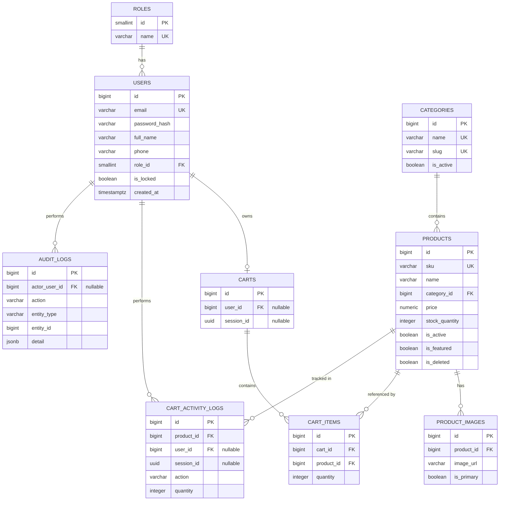

# Task 01 — Database

> Trích từ `docs/test/SRS.md`, Chương 13 (Database Requirements) và 14 (ERD).
> Nguồn tham chiếu: [Phụ lục B, mục 1](../SRS.md#phụ-lục-b--development-task-breakdown)

## Mục tiêu

Tạo schema PostgreSQL đầy đủ 9 bảng, seed dữ liệu `roles` + dữ liệu demo `products`/`categories`.

## Design Decisions liên quan

> **DD-02 (Giỏ hàng Guest):** giỏ hàng luôn lưu ở DB (kể cả của Guest); Session/Cookie chỉ dùng để **định danh** giỏ hàng của Guest (giữ `session_id`). Khi Guest đăng nhập, giỏ hàng Session được **merge** vào giỏ hàng của User.

## Database Requirements

Database: **PostgreSQL**. Naming convention: `snake_case`, khóa chính `id` (**[Recommendation]** dùng `BIGSERIAL` cho đơn giản, đủ dùng cho đồ án).

### Bảng `roles`

| Column | Type | PK | FK | Nullable | Default | Unique | Ghi chú |
|---|---|---|---|---|---|---|---|
| id | SMALLINT | ✓ | | ✗ | | | 1=User, 2=Admin |
| name | VARCHAR(20) | | | ✗ | | ✓ | 'User' / 'Admin' |

### Bảng `users`

| Column | Type | PK | FK | Nullable | Default | Unique | Ghi chú |
|---|---|---|---|---|---|---|---|
| id | BIGSERIAL | ✓ | | ✗ | | | |
| email | VARCHAR(255) | | | ✗ | | ✓ | |
| password_hash | VARCHAR(255) | | | ✗ | | | BCrypt hash |
| full_name | VARCHAR(150) | | | ✗ | | | |
| phone | VARCHAR(20) | | | ✓ | NULL | | |
| role_id | SMALLINT | | → roles.id | ✗ | 1 | | |
| is_locked | BOOLEAN | | | ✗ | false | | |
| created_at | TIMESTAMPTZ | | | ✗ | now() | | |
| updated_at | TIMESTAMPTZ | | | ✗ | now() | | |

Index: `idx_users_email` (unique, đã có qua constraint), `idx_users_role_id`.

### Bảng `categories`

| Column | Type | PK | FK | Nullable | Default | Unique | Ghi chú |
|---|---|---|---|---|---|---|---|
| id | BIGSERIAL | ✓ | | ✗ | | | |
| name | VARCHAR(100) | | | ✗ | | ✓ | |
| slug | VARCHAR(120) | | | ✗ | | ✓ | dùng cho URL thân thiện |
| description | TEXT | | | ✓ | NULL | | |
| is_active | BOOLEAN | | | ✗ | true | | |
| created_at | TIMESTAMPTZ | | | ✗ | now() | | |
| updated_at | TIMESTAMPTZ | | | ✗ | now() | | |

Index: `idx_categories_is_active`.

### Bảng `products`

| Column | Type | PK | FK | Nullable | Default | Unique | Ghi chú |
|---|---|---|---|---|---|---|---|
| id | BIGSERIAL | ✓ | | ✗ | | | |
| sku | VARCHAR(50) | | | ✗ | | ✓ | Mã sản phẩm |
| name | VARCHAR(200) | | | ✗ | | | |
| category_id | BIGINT | | → categories.id | ✗ | | | |
| short_description | VARCHAR(500) | | | ✓ | NULL | | |
| description | TEXT | | | ✓ | NULL | | Mô tả chi tiết |
| price | NUMERIC(12,2) | | | ✗ | | | CHECK price >= 0 |
| stock_quantity | INTEGER | | | ✗ | 0 | | CHECK stock_quantity >= 0 |
| is_active | BOOLEAN | | | ✗ | true | | |
| is_featured | BOOLEAN | | | ✗ | false | | phục vụ "sản phẩm nổi bật" |
| is_deleted | BOOLEAN | | | ✗ | false | | soft delete |
| created_at | TIMESTAMPTZ | | | ✗ | now() | | |
| updated_at | TIMESTAMPTZ | | | ✗ | now() | | |

Index: `idx_products_category_id`, `idx_products_is_active`, `idx_products_is_deleted`, `idx_products_name` (**[Recommendation]** dùng `pg_trgm` GIN index nếu cần tìm kiếm mờ).

### Bảng `product_images` — **[Assumption A-02]**

1 sản phẩm có nhiều ảnh (đề bài chỉ ghi "Hình ảnh" nên tách bảng riêng để rõ ràng).

| Column | Type | PK | FK | Nullable | Default | Unique | Ghi chú |
|---|---|---|---|---|---|---|---|
| id | BIGSERIAL | ✓ | | ✗ | | | |
| product_id | BIGINT | | → products.id (CASCADE DELETE) | ✗ | | | |
| image_url | VARCHAR(500) | | | ✗ | | | |
| is_primary | BOOLEAN | | | ✗ | false | | ảnh đại diện |
| sort_order | SMALLINT | | | ✗ | 0 | | |

Index: `idx_product_images_product_id`.

### Bảng `carts` (theo DD-02)

| Column | Type | PK | FK | Nullable | Default | Unique | Ghi chú |
|---|---|---|---|---|---|---|---|
| id | BIGSERIAL | ✓ | | ✗ | | | |
| user_id | BIGINT | | → users.id | ✓ | NULL | ✓ | duy nhất 1 cart/user khi không NULL |
| session_id | UUID | | | ✓ | NULL | ✓ | duy nhất 1 cart/session khi không NULL |
| created_at | TIMESTAMPTZ | | | ✗ | now() | | |
| updated_at | TIMESTAMPTZ | | | ✗ | now() | | dùng cho job dọn dẹp 7 ngày |

Constraint: `CHECK ((user_id IS NOT NULL AND session_id IS NULL) OR (user_id IS NULL AND session_id IS NOT NULL))` (BR-12: một cart chỉ thuộc đúng 1 trong 2, không thể cả hai).

### Bảng `cart_items`

| Column | Type | PK | FK | Nullable | Default | Unique | Ghi chú |
|---|---|---|---|---|---|---|---|
| id | BIGSERIAL | ✓ | | ✗ | | | |
| cart_id | BIGINT | | → carts.id (CASCADE DELETE) | ✗ | | | |
| product_id | BIGINT | | → products.id | ✗ | | | |
| quantity | INTEGER | | | ✗ | 1 | | CHECK quantity > 0 |
| created_at | TIMESTAMPTZ | | | ✗ | now() | | |
| updated_at | TIMESTAMPTZ | | | ✗ | now() | | |

Unique constraint: `(cart_id, product_id)` — 1 sản phẩm chỉ có 1 dòng trong 1 giỏ.
Index: `idx_cart_items_cart_id`, `idx_cart_items_product_id`.

### Bảng `cart_activity_logs` — **[Assumption A-03]**

Bảng bổ sung ngoài danh sách gốc của đề bài — bắt buộc để đáp ứng thống kê "sản phẩm được thêm giỏ nhiều nhất" (mục 2.9 đề bài / FR-REPORT-004). Append-only, không update/delete.

| Column | Type | PK | FK | Nullable | Default | Unique | Ghi chú |
|---|---|---|---|---|---|---|---|
| id | BIGSERIAL | ✓ | | ✗ | | | |
| product_id | BIGINT | | → products.id | ✗ | | | |
| user_id | BIGINT | | → users.id | ✓ | NULL | | NULL nếu Guest |
| session_id | UUID | | | ✓ | NULL | | NULL nếu User |
| action | VARCHAR(20) | | | ✗ | | | 'add' / 'remove' |
| quantity | INTEGER | | | ✗ | | | |
| created_at | TIMESTAMPTZ | | | ✗ | now() | | |

Index: `idx_cart_activity_logs_product_id`, `idx_cart_activity_logs_created_at`.

### Bảng `audit_logs`

| Column | Type | PK | FK | Nullable | Default | Unique | Ghi chú |
|---|---|---|---|---|---|---|---|
| id | BIGSERIAL | ✓ | | ✗ | | | |
| actor_user_id | BIGINT | | → users.id | ✓ | NULL | | NULL nếu hệ thống tự động |
| action | VARCHAR(50) | | | ✗ | | | vd 'PRODUCT_CREATE', 'USER_LOCK' |
| entity_type | VARCHAR(50) | | | ✗ | | | 'Product' / 'Category' / 'User' |
| entity_id | BIGINT | | | ✓ | NULL | | |
| detail | JSONB | | | ✓ | NULL | | dữ liệu thay đổi (không chứa password) |
| created_at | TIMESTAMPTZ | | | ✗ | now() | | |

Index: `idx_audit_logs_entity`, `idx_audit_logs_created_at`.

## Quan hệ trọng tâm

- **User – Role**: N-1. Mỗi User thuộc đúng 1 Role. Role không bị xóa (dữ liệu tĩnh, seed sẵn 2 dòng).
- **Category – Product**: 1-N. Mỗi Product thuộc đúng 1 Category (`ON DELETE RESTRICT` — không cho xóa Category còn Product, khớp BR-03).
- **Cart – Cart Item**: 1-N. Xóa Cart → xóa toàn bộ Cart Item (`ON DELETE CASCADE`).
- **Product – Cart Item**: 1-N. Xóa Product là soft delete nên không kích hoạt cascade; `cart_items` giữ nguyên `product_id`, tầng Service tự lọc sản phẩm không khả dụng khi hiển thị (BR-11).

## ERD

## Việc cần làm

1. Viết migration script tạo 9 bảng theo đúng thứ tự phụ thuộc FK: `roles` → `users` → `categories` → `products` → `product_images` → `carts` → `cart_items` → `cart_activity_logs` → `audit_logs`
2. Tạo toàn bộ CHECK constraint, UNIQUE constraint, FK constraint như mô tả ở trên
3. Tạo toàn bộ index đã liệt kê
4. Seed data: 2 dòng `roles` (User, Admin); ≥ 5 `categories`; ≥ 20 `products` demo (đủ để test tìm kiếm/lọc/sắp xếp/phân trang)

## Done khi

- [ ] Toàn bộ 9 bảng được tạo đúng schema, constraint, index
- [ ] Seed data chạy được, không lỗi FK
- [ ] Xóa thử 1 category có sản phẩm → bị chặn bởi `ON DELETE RESTRICT` (khớp BR-03)
- [ ] Insert thử 1 cart với cả `user_id` và `session_id` cùng khác NULL → bị chặn bởi CHECK constraint (khớp BR-12)
