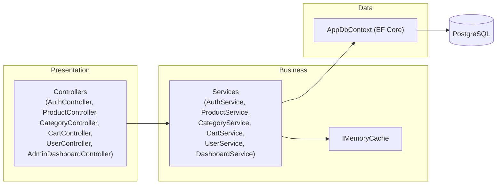

# Task 02 — Backend Foundation

> Trích từ `docs/test/SRS.md`, Chương 19 (Error Handling), 23 (System Architecture).
> Nguồn tham chiếu: [Phụ lục B, mục 2](../SRS.md#phụ-lục-b--development-task-breakdown)

## Mục tiêu

Khởi tạo ASP.NET Core Web API project, cấu hình EF Core + `AppDbContext`, cấu hình Middleware exception handling toàn cục. Đây là nền tảng để các task 03-15 dựng trên.

## System Architecture

Kiến trúc 3-layer đơn giản — **không tạo Repository pattern riêng** (EF Core `DbContext` đã đóng vai trò abstraction layer đủ dùng cho quy mô đồ án; chỉ tạo Service khi có business logic thực sự, đúng nguyên tắc "không tạo Repository/Service không cần thiết"):



- **Controllers**: nhận request, validate model binding (Data Annotations), gọi Service, map response
- **Services**: chứa business logic (kiểm tra toàn bộ Business Rules BR-01..BR-15), điều phối cache, gọi DbContext
- **AppDbContext**: EF Core, không cần Repository pattern riêng
- Cross-cutting: Middleware xử lý exception toàn cục, Middleware Authentication/Authorization (xem [Task 03](03-authentication.md), [Task 04](04-authorization.md))

Luồng xử lý chuẩn: **Client → Controller → Service (business logic + cache check) → EF Core → PostgreSQL**.

## Error Handling (áp dụng ngay từ tầng Middleware)

### Format lỗi thống nhất

```json
{
  "success": false,
  "error": {
    "code": "PRODUCT_OUT_OF_STOCK",
    "message": "Sản phẩm hiện không đủ tồn kho.",
    "details": null
  }
}
```

### Bảng mã lỗi HTTP

| HTTP Status | Khi nào dùng | Ví dụ |
|---|---|---|
| 400 Bad Request | Request sai cú pháp, tham số không hợp lệ | `page=-1` |
| 401 Unauthorized | Chưa đăng nhập nhưng endpoint yêu cầu | Gọi `/api/users/me` khi chưa login |
| 403 Forbidden | Đã đăng nhập nhưng không đủ quyền, hoặc tài khoản bị khóa | User gọi `/api/admin/products` |
| 404 Not Found | Resource không tồn tại | `GET /api/products/9999` |
| 409 Conflict | Vi phạm ràng buộc nghiệp vụ (trùng unique, xóa category còn sản phẩm) | SKU trùng |
| 422 Unprocessable Entity | Validation lỗi (sai định dạng, thiếu trường bắt buộc) | password quá ngắn |
| 429 Too Many Requests | Vượt rate limit | Đăng nhập sai quá 5 lần/phút |
| 500 Internal Server Error | Lỗi hệ thống không lường trước | Lỗi kết nối DB |

**Nguyên tắc bắt buộc**: response lỗi 500 **không bao giờ** trả message/stack trace gốc cho client — chỉ trả `"message": "Đã có lỗi xảy ra, vui lòng thử lại sau."` và log chi tiết ở server.

### Response thành công (quy ước dùng xuyên suốt toàn hệ thống)

```json
{ "success": true, "data": { ... } }
```

Danh sách có phân trang trả kèm metadata:
```json
{
  "success": true,
  "data": {
    "items": [ ... ],
    "page": 1,
    "pageSize": 20,
    "totalItems": 134,
    "totalPages": 7
  }
}
```

## Non-Functional Requirements liên quan

| ID | Nhóm | Yêu cầu |
|---|---|---|
| NFR-PERF-01 | Performance | API danh sách sản phẩm phản hồi trong < 500ms với tập dữ liệu demo (≤ 5,000 sản phẩm) |
| NFR-MAINT-01 | Maintainability | Code tuân thủ 1 coding convention nhất quán (ví dụ .editorconfig), tổ chức theo layer rõ ràng (Controller/Service/Data) |
| NFR-ERR-01 | Error Handling | Mọi lỗi trả về theo format JSON thống nhất, không lộ stack trace |

## Việc cần làm

1. Khởi tạo project ASP.NET Core Web API (.NET 8+)
2. Cấu hình EF Core, connection string PostgreSQL, `AppDbContext` map với 9 bảng ở [Task 01](01-database.md)
3. Cấu hình Middleware bắt exception toàn cục, map exception → format lỗi chuẩn hóa ở trên
4. Cấu hình cấu trúc thư mục: `Controllers/`, `Services/`, `Data/` (DbContext + entity), `Models/` (DTO request/response)
5. Cấu hình CORS nếu frontend chạy port riêng (development)

## Done khi

- [ ] Project chạy được, kết nối DB thành công
- [ ] Gọi 1 endpoint test ném exception → trả đúng format lỗi chuẩn hóa, không lộ stack trace
- [ ] Cấu trúc thư mục rõ ràng theo 3-layer, sẵn sàng cho các task tiếp theo
