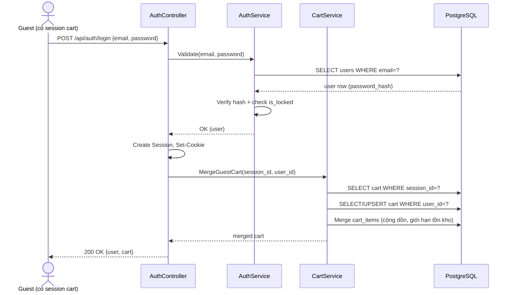

# Task 03 — Authentication

> Trích từ `docs/test/SRS.md`, Chương 5.1 (FR-AUTH), 6 (BR liên quan), 7.4-7.5 (UC-03, UC-04), 9 (Auth mechanism), 10 (Security), 15.1 (API), 26 (Acceptance Criteria).
> Nguồn tham chiếu: [Phụ lục B, mục 3](../SRS.md#phụ-lục-b--development-task-breakdown)

## Mục tiêu

`AuthController`, `AuthService`: Đăng ký, Đăng nhập (Cookie Authentication + Session), Đăng xuất, password hashing.

## Design Decision liên quan

> **DD-01 (Authentication):** dùng **ASP.NET Core Cookie Authentication + Distributed Session** (không JWT). Backend vẫn là Web API thuần (trả JSON), frontend gọi Fetch API với `credentials: 'include'`.

## Functional Requirements

| ID | Mô tả | Actor | Priority |
|---|---|---|---|
| FR-AUTH-001 | Đăng ký tài khoản mới bằng email + password + tên hiển thị | Guest | M |
| FR-AUTH-002 | Đăng nhập bằng email/password, tạo Cookie + Session | Guest | M |
| FR-AUTH-003 | Đăng xuất, hủy Session hiện tại | User, Admin | M |
| FR-AUTH-004 | Mật khẩu phải được hash (BCrypt/PBKDF2) trước khi lưu DB | System | M |
| FR-AUTH-005 | Hệ thống từ chối đăng nhập nếu tài khoản bị khóa (`is_locked = true`) | System | M |
| FR-AUTH-006 | Hệ thống khóa tạm thời sau N lần đăng nhập sai liên tiếp (rate limit) | System | S |

## Business Rules

| ID | Quy tắc |
|---|---|
| BR-04 | Email đăng ký phải là duy nhất trong hệ thống |
| BR-06 | Password tối thiểu 8 ký tự, có ít nhất 1 chữ hoa, 1 chữ số |
| BR-07 | User bị khóa (`is_locked = true`) không thể đăng nhập, kể cả khi biết đúng password |
| BR-13 | Khi Guest (có giỏ hàng) đăng nhập vào 1 tài khoản User đã có giỏ hàng sẵn, hệ thống merge theo `product_id`: cộng dồn số lượng, giới hạn theo tồn kho hiện tại (logic merge chi tiết thực hiện ở [Task 07 — Cart](07-cart.md), Task này chỉ cần gọi `CartService.MergeGuestCart`) |

## Use Case

### UC-03: Đăng ký (Guest → User)

| | |
|---|---|
| **Actor** | Guest |
| **Goal** | Tạo tài khoản mới |
| **Preconditions** | Email chưa tồn tại trong hệ thống |
| **Main Flow** | 1. Guest nhập email, password, tên hiển thị 2. Frontend validate cơ bản (định dạng email, độ dài password) 3. Gọi `POST /api/auth/register` 4. Backend validate lại (server-side là quyết định cuối cùng), hash password 5. Tạo record `users` với role User 6. Trả về thành công, chuyển hướng trang đăng nhập |
| **Alternative Flow** | Không có |
| **Exception Flow** | Email đã tồn tại → HTTP 409 Conflict; password không đạt policy → HTTP 422 |
| **Postconditions** | Tài khoản User mới được tạo, chưa tự động đăng nhập — **[Recommendation]** yêu cầu đăng nhập thủ công lần đầu |

### UC-04: Đăng nhập (User/Admin)

| | |
|---|---|
| **Actor** | User, Admin |
| **Goal** | Đăng nhập vào hệ thống |
| **Preconditions** | Tài khoản tồn tại và không bị khóa |
| **Main Flow** | 1. Actor nhập email/password 2. Gọi `POST /api/auth/login` 3. Backend kiểm tra email tồn tại, so khớp password hash 4. Backend kiểm tra `is_locked = false` 5. Tạo Session, set Cookie (HttpOnly, Secure, SameSite=Lax) 6. Nếu có giỏ hàng Guest (session cũ) → merge vào giỏ hàng User (BR-13) 7. Trả về thông tin user (không gồm password) |
| **Alternative Flow** | Không có |
| **Exception Flow** | Sai email/password → HTTP 401, thông báo chung "Email hoặc mật khẩu không đúng" (không tiết lộ email tồn tại hay không); tài khoản bị khóa → HTTP 403 "Tài khoản đã bị khóa" |
| **Postconditions** | Session được tạo, Cookie set trên trình duyệt |

## Authentication Mechanism

- Cơ chế: **ASP.NET Core Cookie Authentication** kết hợp **Session** (`AddSession` + `AddDistributedMemoryCache` hoặc tương đương)
- Khi đăng nhập thành công: server tạo Session, ghi `user_id`, `role` vào Session store; set Cookie `couppa.auth` (HttpOnly, Secure trên production, SameSite=Lax)
- Mỗi request tiếp theo: middleware đọc Cookie → xác thực Session còn hiệu lực → gắn `ClaimsPrincipal` cho request
- Session timeout: **[Recommendation]** 30 phút idle timeout
- Đăng xuất: xóa Session server-side + xóa Cookie client-side (`Set-Cookie` với `Max-Age=0`)

### Guest Session (nền tảng cho merge cart — chi tiết ở Task 07)

- Guest chưa đăng nhập vẫn được cấp 1 Session (không cần đăng nhập) chỉ để giữ `session_id` định danh giỏ hàng
- Cookie tương ứng: `couppa.session` (HttpOnly, không chứa thông tin nhạy cảm, chỉ là GUID ngẫu nhiên)
- Khi Guest đăng nhập, `session_id` cũ được dùng 1 lần để merge giỏ hàng (BR-13), sau đó Cookie session được thay bằng Cookie auth

### Sequence Diagram — Login + Cart Merge

## Security Requirements áp dụng cho module này

| ID | Kỹ thuật | Mô tả áp dụng |
|---|---|---|
| SEC-01 | Password Hashing | BCrypt (hoặc ASP.NET Core `PasswordHasher<T>`), không tự implement thuật toán hash |
| SEC-02 | Authentication | Cookie Authentication, không truyền credentials qua query string |
| SEC-04 | Session Security | Cookie `HttpOnly=true`, `Secure=true` (production, HTTPS), `SameSite=Lax`; Session ID được regenerate sau khi đăng nhập (chống Session Fixation) |
| SEC-05 | Cookie Security | Không lưu thông tin nhạy cảm (password, token) trực tiếp trong cookie; chỉ lưu Session ID |
| SEC-11 | Rate Limiting | Giới hạn số lần gọi `/api/auth/login` (ví dụ 5 lần/phút/IP) chống brute-force — **[Recommendation]** dùng `Microsoft.AspNetCore.RateLimiting` |
| SEC-12 | Sensitive Data Exposure | Response API không bao giờ trả `password_hash` |

## API Specification

#### POST /api/auth/register
- **Auth required**: Không | **Role**: —
- **Request**: `{ "email": "a@b.com", "password": "Abc12345", "fullName": "Nguyễn Văn A" }`
- **Response 201**: `{ "success": true, "data": { "id": 1, "email": "a@b.com", "fullName": "Nguyễn Văn A" } }`
- **Validation**: email đúng định dạng; password ≥ 8 ký tự, có hoa + số (BR-06); fullName bắt buộc
- **Error cases**: 409 (email đã tồn tại — BR-04), 422 (sai định dạng/thiếu trường)

#### POST /api/auth/login
- **Auth required**: Không | **Role**: —
- **Request**: `{ "email": "a@b.com", "password": "Abc12345" }`
- **Response 200**: `{ "success": true, "data": { "id": 1, "email": "a@b.com", "fullName": "...", "role": "User" } }` + `Set-Cookie`
- **Validation**: 2 trường bắt buộc
- **Error cases**: 401 (sai email/password), 403 (tài khoản bị khóa — BR-07)

#### POST /api/auth/logout
- **Auth required**: Có | **Role**: User, Admin
- **Request**: (không body)
- **Response 200**: `{ "success": true }` + hủy Cookie/Session
- **Error cases**: 401 (chưa đăng nhập)

## Acceptance Criteria

**FR-AUTH-002 – Login**
> Given tài khoản tồn tại, đúng password, không bị khóa
> When User submit form đăng nhập
> Then hệ thống tạo Session, set Cookie, trả về 200 kèm thông tin user.

**FR-AUTH-005 – Locked account**
> Given tài khoản có is_locked = true
> When User đăng nhập đúng email/password
> Then hệ thống trả về 403 và không tạo Session.

## Việc cần làm

1. `AuthController`: 3 endpoint register/login/logout
2. `AuthService`: hash password (SEC-01), validate BR-04/BR-06/BR-07, tạo/hủy Session
3. Cấu hình Cookie Authentication + Session middleware ở `Program.cs`
4. Gọi `CartService.MergeGuestCart` sau khi login thành công (phối hợp với [Task 07](07-cart.md))
5. Rate limiting cho `/api/auth/login` (SEC-11)

## Done khi

- [ ] Đăng ký với email trùng → 409
- [ ] Đăng ký password không đạt policy → 422
- [ ] Đăng nhập đúng → 200, cookie được set, response không chứa `password_hash`
- [ ] Đăng nhập sai password → 401 (thông báo chung, không tiết lộ email có tồn tại)
- [ ] Đăng nhập tài khoản `is_locked=true` → 403
- [ ] Đăng xuất → Session bị hủy, gọi lại `/api/users/me` trả 401
