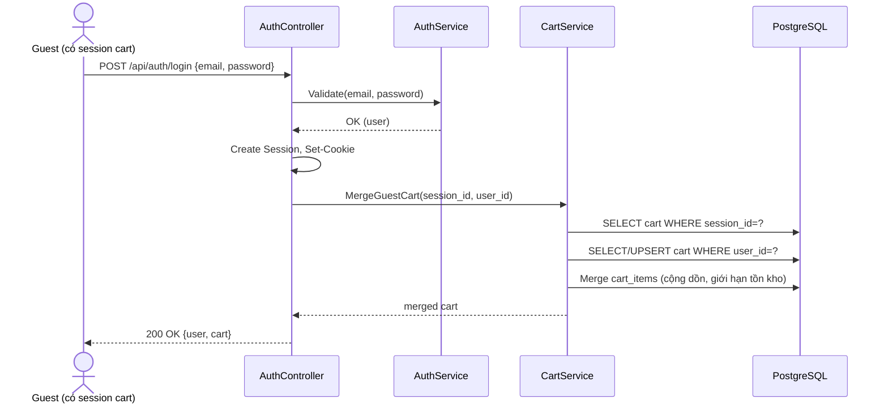

# Task 07 — Cart

> Trích từ `docs/test/SRS.md`, Chương 5.6 (FR-CART), 6 (BR liên quan), 7.3 (UC-02), 9.2 (Guest Session), 13.6-13.8 (DB), 15.4 (API), 22 (Validation), 26 (Acceptance Criteria).
> Nguồn tham chiếu: [Phụ lục B, mục 7](../SRS.md#phụ-lục-b--development-task-breakdown)

## Mục tiêu

`CartController`, `CartService` (bao gồm logic merge cart khi login — FR-CART-007), ghi `cart_activity_logs`.

## Design Decision liên quan

> **DD-02 (Giỏ hàng Guest):** giỏ hàng luôn lưu ở DB (kể cả của Guest). Session/Cookie chỉ dùng để **định danh** giỏ hàng của Guest (giữ `session_id`). Khi Guest đăng nhập, giỏ hàng Session được **merge** vào giỏ hàng của User.

## Functional Requirements

| ID | Mô tả | Actor | Priority |
|---|---|---|---|
| FR-CART-001 | Thêm sản phẩm vào giỏ hàng (sản phẩm phải Active và còn tồn kho) | Guest, User | M |
| FR-CART-002 | Xem giỏ hàng hiện tại (danh sách item, tổng số lượng, tạm tính) | Guest, User | M |
| FR-CART-003 | Tăng số lượng 1 item trong giỏ (không vượt tồn kho) | Guest, User | M |
| FR-CART-004 | Giảm số lượng 1 item trong giỏ (tối thiểu 1, giảm về 0 → xóa item) | Guest, User | M |
| FR-CART-005 | Xóa 1 item khỏi giỏ hàng | Guest, User | M |
| FR-CART-006 | Xóa toàn bộ giỏ hàng | Guest, User | M |
| FR-CART-007 | Khi Guest đăng nhập, giỏ hàng Session được merge vào giỏ hàng User (DD-02) | System | M |
| FR-CART-008 | Giỏ hàng Guest tự động dọn dẹp sau 7 ngày không hoạt động — **[Assumption]** | System | S |

## Business Rules

| ID | Quy tắc |
|---|---|
| BR-01 | Không cho thêm sản phẩm đã Inactive hoặc hết hàng vào giỏ hàng |
| BR-02 | Số lượng trong giỏ không được vượt quá tồn kho hiện tại của sản phẩm |
| BR-11 | Khi sản phẩm bị xóa (soft delete) hoặc chuyển Inactive, các `cart_items` tham chiếu tới sản phẩm đó vẫn giữ nguyên trong DB nhưng bị đánh dấu "không khả dụng" khi hiển thị giỏ hàng; User phải tự xóa item đó, hệ thống không tự xóa — **[Recommendation]** |
| BR-12 | Một giỏ hàng (`cart`) chỉ thuộc về đúng 1 trong 2: 1 User hoặc 1 Session Guest, không thể đồng thời cả hai |
| BR-13 | Khi Guest (có giỏ hàng) đăng nhập vào 1 tài khoản User đã có giỏ hàng sẵn, hệ thống merge theo `product_id`: cộng dồn số lượng, giới hạn theo tồn kho hiện tại |

## Use Case

### UC-02: Thêm sản phẩm vào giỏ hàng (Guest/User)

| | |
|---|---|
| **Actor** | Guest, User |
| **Goal** | Thêm 1 sản phẩm vào giỏ hàng |
| **Preconditions** | Sản phẩm đang Active và còn tồn kho > 0 |
| **Main Flow** | 1. Actor chọn sản phẩm, nhấn "Thêm vào giỏ" 2. Frontend gọi `POST /api/cart/items` 3. Nếu Guest chưa có Session/cart, backend tạo mới `session_id` + `cart` record 4. Backend kiểm tra tồn kho, thêm/cập nhật `cart_items` 5. Backend ghi 1 dòng vào `cart_activity_logs` 6. Trả về giỏ hàng đã cập nhật |
| **Alternative Flow** | Sản phẩm đã có trong giỏ → cộng dồn số lượng (không vượt tồn kho) |
| **Exception Flow** | Sản phẩm Inactive/hết hàng → HTTP 409, thông báo "Sản phẩm hiện không khả dụng" |
| **Postconditions** | `cart_items` được cập nhật, tổng số lượng giỏ hàng hiển thị mới |

## Guest Session (nền tảng định danh giỏ hàng — cấu hình chi tiết ở Task 03)

- Guest chưa đăng nhập được cấp 1 Session chỉ để giữ `session_id` định danh giỏ hàng
- Cookie tương ứng: `couppa.session` (HttpOnly, chỉ là GUID ngẫu nhiên)
- Khi Guest đăng nhập, `session_id` cũ được dùng 1 lần để merge giỏ hàng (BR-13), sau đó Cookie session được thay bằng Cookie auth

### Sequence Diagram — Merge Cart khi Login (được `AuthService` gọi vào — xem [Task 03](03-authentication.md))

## Database (chi tiết đầy đủ ở [Task 01](01-database.md))

- `carts` — `user_id` nullable + `session_id` nullable, CHECK đúng 1 trong 2 khác NULL (BR-12)
- `cart_items` — unique `(cart_id, product_id)`, `quantity` CHECK > 0, FK CASCADE khi xóa cart
- `cart_activity_logs` — **[Assumption A-03]**, append-only, phục vụ [Task 11 — Reports](11-reports.md) (thống kê "thêm giỏ nhiều nhất")

## API Specification

#### GET /api/cart
- **Auth required**: Không bắt buộc đăng nhập (Guest dùng Session cookie) | **Role**: Guest, User
- **Response 200**: `{ "items": [...], "totalQuantity": 5, "subtotal": 1250000 }`

#### POST /api/cart/items
- **Request**: `{ "productId": 10, "quantity": 1 }`
- **Response 201**: giỏ hàng sau cập nhật
- **Validation**: quantity > 0; sản phẩm phải Active & còn tồn kho (BR-01, BR-02)
- **Error cases**: 404 (sản phẩm không tồn tại), 409 (sản phẩm Inactive/hết hàng, hoặc quantity vượt tồn kho)
- **Side effect**: ghi `cart_activity_logs` (action='add')

#### PUT /api/cart/items/{id}
- **Request**: `{ "quantity": 3 }`
- **Response 200**: giỏ hàng sau cập nhật
- **Validation**: quantity ≥ 1 (giảm về 0 → dùng DELETE thay vì PUT); không vượt tồn kho
- **Error cases**: 404 (item không tồn tại hoặc không thuộc giỏ hiện tại), 409 (vượt tồn kho)

#### DELETE /api/cart/items/{id}
- **Response 200**: giỏ hàng sau cập nhật
- **Error cases**: 404
- **Side effect**: ghi `cart_activity_logs` (action='remove')

#### DELETE /api/cart
- **Response 200**: `{ "success": true }` (xóa toàn bộ `cart_items` của giỏ hiện tại)

## Data Validation

| Trường | Frontend Validation | Backend Validation |
|---|---|---|
| Cart quantity | number, min=1 | so sánh với `stock_quantity` hiện tại tại thời điểm ghi (BR-02) |

## Acceptance Criteria

**FR-CART-001 – Add Product To Cart**
> Given sản phẩm đang Active và còn tồn kho
> When User/Guest thêm sản phẩm vào giỏ
> Then hệ thống thêm sản phẩm vào cart và cập nhật cart quantity.

**FR-CART-001 (Exception)**
> Given sản phẩm Inactive hoặc hết hàng
> When User/Guest cố thêm sản phẩm vào giỏ
> Then hệ thống trả về 409 và không tạo/sửa cart_items.

**FR-CART-007 – Merge Cart On Login**
> Given Guest có giỏ hàng với 2 sản phẩm (session cart) và đăng nhập vào tài khoản User đã có sẵn 1 sản phẩm trùng trong giỏ
> When đăng nhập thành công
> Then giỏ hàng User sau merge có 3 dòng sản phẩm phân biệt, số lượng sản phẩm trùng được cộng dồn (không vượt tồn kho).

## Việc cần làm

1. `CartController`: 5 endpoint GET/POST/PUT/DELETE item/DELETE cart
2. `CartService`:
   - Lấy-hoặc-tạo cart hiện tại theo `session_id` (Guest) hoặc `user_id` (User)
   - Validate BR-01, BR-02 khi thêm/sửa số lượng
   - `MergeGuestCart(sessionId, userId)` — logic merge theo `product_id`, cộng dồn, giới hạn tồn kho (BR-13), được gọi từ [Task 03 — Authentication](03-authentication.md)
   - Ghi `cart_activity_logs` mỗi lần add/remove
3. Hosted Service dọn dẹp cart Guest quá 7 ngày không hoạt động (FR-CART-008 — **[Assumption]**)
4. Xử lý hiển thị item có `product.is_deleted=true` hoặc `is_active=false` là "không khả dụng" khi trả về giỏ hàng (BR-11)

## Done khi

- [ ] Guest thêm sản phẩm vào giỏ khi chưa có cookie session → hệ thống tự tạo session + cart
- [ ] Thêm sản phẩm Inactive/hết hàng → 409
- [ ] Thêm số lượng vượt tồn kho → 409
- [ ] Giảm số lượng về 0 qua PUT → được từ chối, hướng dẫn dùng DELETE (theo spec)
- [ ] Test merge cart: Guest có 2 sản phẩm, đăng nhập vào User đã có 1 sản phẩm trùng → sau merge có 3 dòng, số lượng trùng được cộng dồn không vượt tồn kho
- [ ] Mỗi lần add/remove đều có 1 dòng mới trong `cart_activity_logs`
