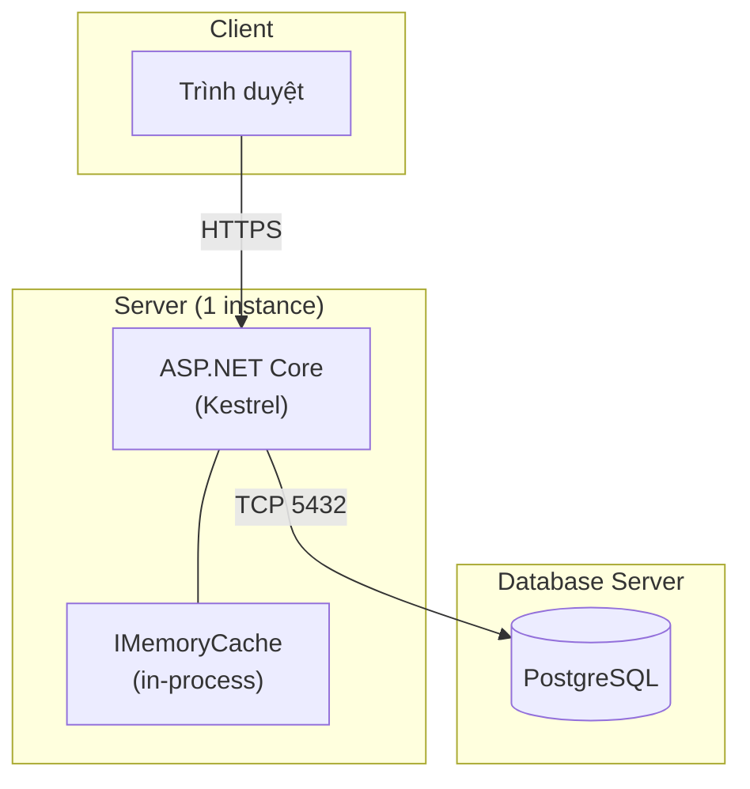

# Task 15 — Deployment

> Trích từ `docs/test/SRS.md`, Chương 24 (Deployment Architecture), 2.4 (Operating Environment), 2.5 (Constraints).
> Nguồn tham chiếu: [Phụ lục B, mục 15](../SRS.md#phụ-lục-b--development-task-breakdown)

## Mục tiêu

Đóng gói, cấu hình HTTPS local, viết hướng dẫn chạy demo. Task cuối cùng trước khi bảo vệ đồ án.

## Deployment Architecture

- **[Assumption]** Triển khai demo trên 1 máy/1 VM duy nhất (hoặc localhost khi bảo vệ đồ án), không dùng container orchestration (Kubernetes) — có thể dùng Docker Compose đơn giản để chạy PostgreSQL cho tiện demo
- HTTPS: dùng self-signed certificate hoặc `dotnet dev-certs` cho môi trường demo/local
- Không yêu cầu CDN, load balancer, hay multi-region

## Operating Environment

- Server: Linux hoặc Windows, .NET 8+ runtime
- Database: PostgreSQL 14+
- Trình duyệt hỗ trợ: Chrome, Edge, Firefox, Safari (2 phiên bản gần nhất)
- Không yêu cầu cài đặt phía client ngoài trình duyệt

## Constraints

- Đồ án sinh viên: giới hạn thời gian, không triển khai hạ tầng phức tạp (không microservices, không message queue)
- Một instance backend duy nhất (không load-balancing nhiều node) — **[Assumption]**

## NFR liên quan

| ID | Yêu cầu |
|---|---|
| NFR-AVAIL-01 | Hệ thống chạy ổn định trong phiên demo liên tục ≥ 30 phút không cần restart |

## Việc cần làm

1. Viết `docker-compose.yml` cho PostgreSQL (tiện demo, không cần cài đặt DB thủ công)
2. Cấu hình HTTPS local qua `dotnet dev-certs https --trust`
3. Cấu hình biến môi trường (connection string, cache TTL nếu cần override) qua `appsettings.json` / `appsettings.Development.json`
4. Viết script/README hướng dẫn: clone → chạy migration + seed ([Task 01](01-database.md)) → chạy backend → chạy frontend → truy cập demo
5. Kiểm thử chạy liên tục ≥ 30 phút không lỗi, không cần restart (NFR-AVAIL-01)

## Done khi

- [ ] `docker-compose up` khởi động được PostgreSQL sẵn sàng cho backend kết nối
- [ ] Backend chạy HTTPS local không lỗi certificate
- [ ] README đủ chi tiết để người khác (giảng viên/hội đồng) tự chạy được demo từ đầu
- [ ] Chạy demo liên tục 30 phút (thao tác Public + Admin xen kẽ) không phát sinh lỗi hoặc cần restart
